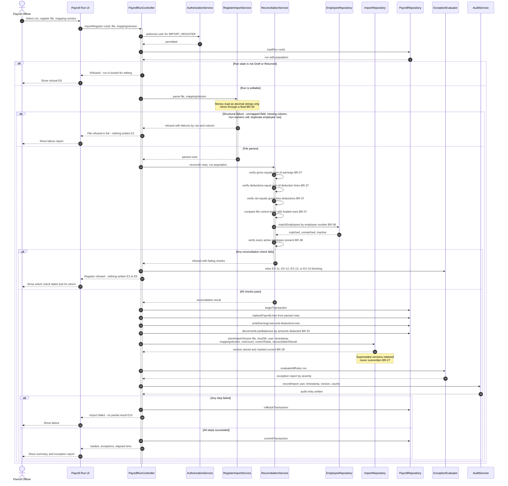
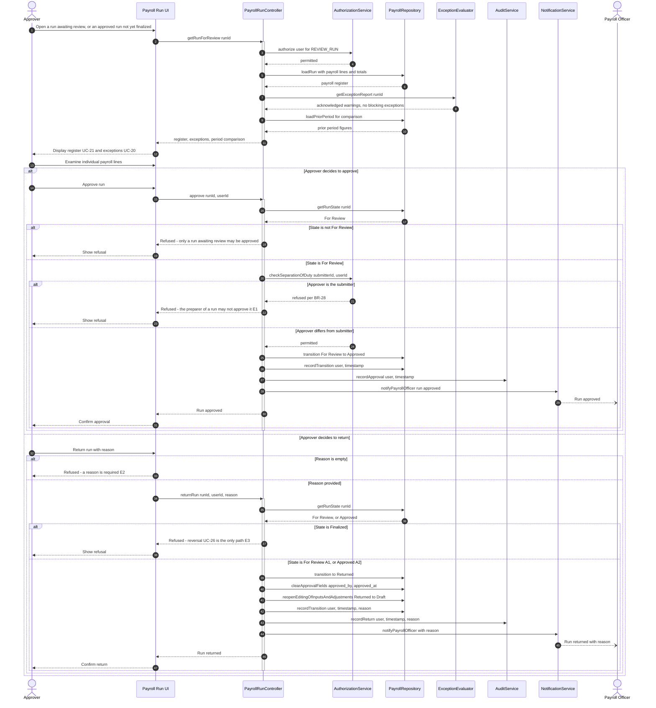
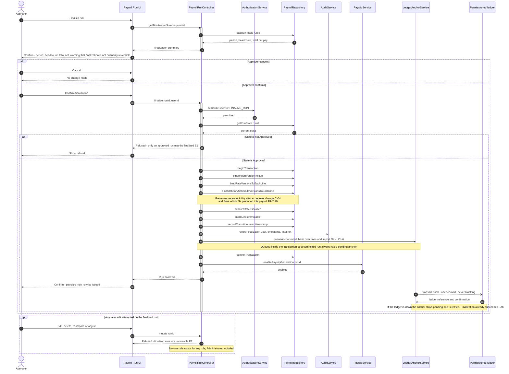
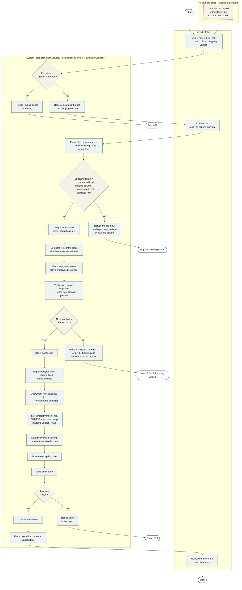
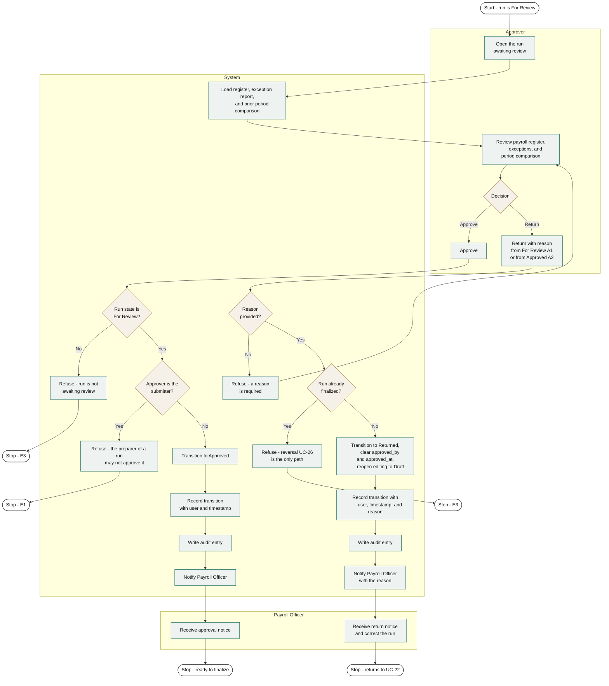
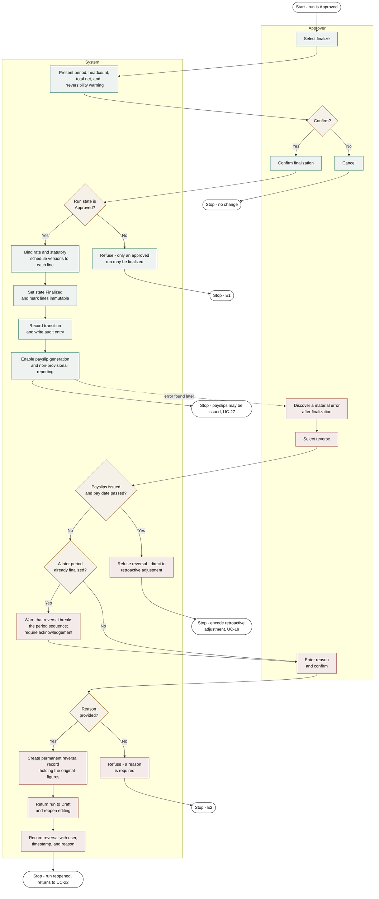
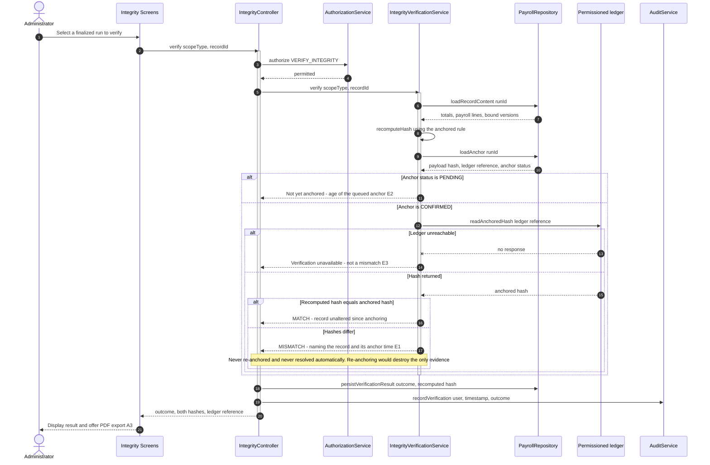
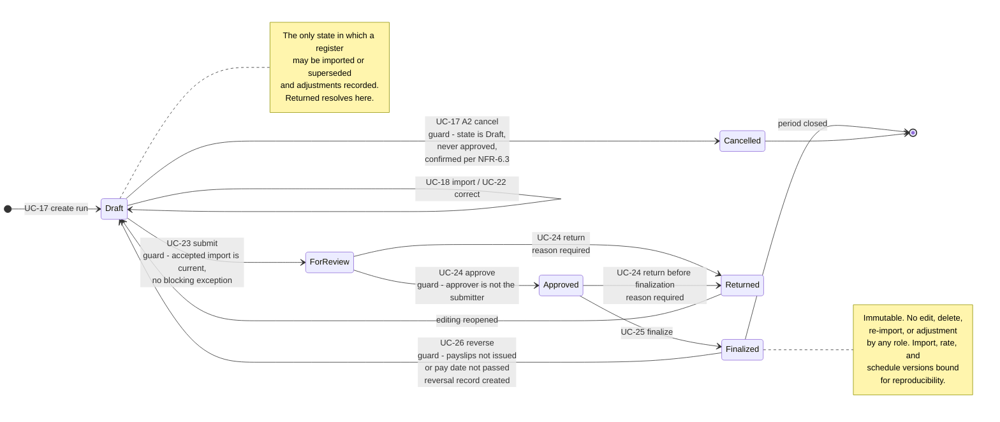

# Behavioral Diagrams

**Project:** Payroll Management System
**Document:** Sequence, Activity, and State Machine Diagrams
**Version:** 1.2
**Date:** August 30, 2026
**Baseline:** B2 — frozen August 30, 2026 · see [baseline.md](./baseline.md)
**Traces to:** [Use Case Model](./use-case-model.md) → [Functional Requirements Specification](./functional-requirements-specification.md) → [Problem-to-Requirements Matrix](./problem-requirements-matrix.md)
**Change:** [CR-01](./change-request-cr-01.md) — payroll computation retained by the accounting office

---

## Document control

| | |
|---|---|
| Sequence diagrams | 4 (UC-18, UC-24, UC-25, UC-31) |
| Activity diagrams | 3 (UC-18, UC-24, UC-25 with UC-26) |
| State machine diagrams | 1 (payroll run lifecycle) |
| Use cases modelled | Fully — UC-18, UC-24, UC-25, UC-26, UC-31. As guarded transitions in Figure 7 — UC-17 (main and A2 cancel), UC-22, UC-23. Included — UC-I6 within Figures 3 and 8, UC-I7 within Figures 1 and 4. |
| Participants specified | 17 |

> ✧ **What changed in 1.2.** Figures 1 and 4 were redrawn: `UC-18` no longer computes a payroll, it imports and reconciles one. `ComputationEngine` is gone from every diagram; `RegisterImportService`, `ReconciliationService`, `WorksheetExportService`, and `ImportRepository` take its place. **Figure 7's state model is unchanged** — the same six states and six transitions frozen in B1, with two transition labels and two notes reworded to name import rather than computation. Figure 3 gained one step, `bindImportVersionToRun`. Figures 2, 5, 6, and 8 are unchanged.

---

# 1. About these diagrams

## 1.1 Why these use cases

The use case model specifies thirty-one use cases. Five are modelled here: four carry nearly all the risk in the payroll cycle, and the fifth is the integrity check that proves the rest were not altered.

| Use case | Why it is modelled |
|---|---|
| **✧ UC-18 Import computed payroll register** | Where the money **enters**. It has two total-refusal gates, two included use cases, and ten exception flows — every one of them a way a register can be wrong or incomplete. It is no longer where the payroll is calculated; it is where the system decides whether to trust a calculation it did not perform. If any diagram in the manuscript earns its page, it is still this one. |
| **UC-24 Approve or return payroll run** | Where the separation of duty is enforced. BR-28 — the preparer may not approve — is a control that exists only as a runtime check, so it must be visible in the model. |
| **UC-25 Finalize payroll run** | Where the record becomes immutable. Everything about reproducibility (C-04) and period locking (FR-4.5) happens in this one transition. |
| **UC-26 Reverse finalized payroll run** | The only way out of `Finalized`, and the one path that must leave permanent evidence. Modelled in the activity view alongside UC-25 (Figure 6). |
| **UC-31 Verify payroll record integrity** | Where the system is asked to prove a stored record has not changed. Its three outcomes must stay distinct — a mismatch, a pending anchor, and an unreachable ledger mean different things (Figure 8). |

The remaining twenty-six use cases are adequately specified by their main success scenarios in the use case model. Drawing all of them would produce volume, not clarity.

## 1.2 What each diagram type shows

| Diagram | Question it answers | Emphasis |
|---|---|---|
| **Sequence** | Which components talk to each other, in what order, and what each returns | Interaction between objects over time |
| **Activity** | What steps occur, who performs each, and where the flow branches | Control flow across actors |
| **State machine** | What states a payroll run can hold and which transitions are legal | Lifecycle constraints |

The sequence and activity diagrams for one use case describe the same behavior from two angles. They are deliberately consistent: every alternate and exception flow in the use case specification appears in both.

## 1.3 Notation

Diagrams are written in Mermaid so they render in the repository.

**Sequence diagrams** — solid arrows are calls, dashed arrows are returns. `alt` / `else` marks mutually exclusive paths, `opt` an optional one, and `loop` a repetition. Activation bars show when a participant is executing.

**Activity diagrams** — Mermaid has no native UML activity notation, so these are drawn as flowcharts with one labelled lane per actor. Diamonds are decisions, rounded ends are start and stop nodes. This is a faithful representation of control flow; the redraw for Chapter III should use proper UML swimlanes with the same content.

> **For the manuscript.** As with the use case diagrams, these need vector redraws at the department's required figure format. The content is authoritative; the redraw is formatting.

## 1.4 Participants

The sequence diagrams name components, not classes. Their boundaries follow the module structure of FRS §2.2, and the design documentation may realize each as one or several classes.

✧ **`ComputationEngine` no longer exists.** It was the component that executed BR-01 through BR-23, and [CR-01](./change-request-cr-01.md) removed the work it did. Four components replace it, and the split is deliberate: parsing a file, judging whether to trust it, storing its provenance, and producing the worksheet it was computed from are four separable responsibilities with four separable failure modes, where computation was one.

| Participant | Responsibility | Realizes |
|---|---|---|
| `Payroll Run UI` | ✧ Screens for creating runs, exporting worksheets, importing registers, reviewing, and transitioning | M4, M5 |
| `PayrollRunController` | ✧ Orchestrates a run's intake and state transitions | M4, M5 |
| `RegisterImportService` | ✧ Parses a register file through its column mapping, reading money as decimal strings — FR-2.8, BR-40, BR-41 | M4 |
| `ReconciliationService` | ✧ Verifies row arithmetic, control totals, employee matching, and completeness — UC-I7, FR-2.9, BR-37, BR-38 | M4 |
| `WorksheetExportService` | ✧ Assembles and writes the payroll input worksheet — FR-2.11, UC-32 | M4 |
| `ImportRepository` | ✧ Persists import versions, source files, hashes, and reconciliation results — FR-2.10, BR-39 | M4 |
| `EmployeeRepository` | Retrieves employee records and dated compensation profiles | M2 |
| `AttendanceRepository` | Retrieves the attendance and leave summary for a cut-off | M3 |
| `StatutoryScheduleService` | ✧ Selects the schedule in force and derives employer shares for remittance reporting — UC-I5 | M1, M7 |
| `ExceptionEvaluator` | ✧ Evaluates the live exception rules of FR-4.1 — UC-I4 | M5 |
| `PayrollRepository` | Persists runs, lines, earnings, deductions, and transitions | M7 |
| `AuthorizationService` | Enforces the FR-6.2 permission matrix and BR-28 — UC-I3 | M1 |
| `AuditService` | Writes append-only audit entries — UC-I2 | M1 |
| `NotificationService` | Informs an actor that a run awaits their action | M5 |
| `PayslipService` | Generates payslips from finalized runs | M6 |
| `LedgerAnchorService` | Queues and transmits integrity anchors — UC-I6 | M1 |
| `IntegrityVerificationService` | Recomputes hashes and compares them with the ledger — UC-31 | M1 |

---

# 2. Sequence diagrams

## 2.1 ✧ UC-18 — Import computed payroll register

**✧ Redrawn by CR-01.** In baseline B1 this figure showed the arithmetic of a payroll being produced, line by line, in the order BR-13 fixed. That arithmetic now happens in the accounting office's spreadsheet, where no diagram in this baseline can reach it. What the figure shows instead is the system deciding whether to accept the result — and refusing it in full if it cannot.

Every branch below corresponds to a flow in the use case specification: E1 to the structural refusal, E2 to E5 to the reconciliation failures, E9 to the state guard, and E10 to the rollback.

**Figure 1.** *✧ Sequence — UC-18 Import computed payroll register*

**Reading the diagram.** ✧ Three things carry the design, and all three are different from what carried it in B1.

**Refusal is total, and it happens twice.** There are two gates — the structural parse and the reconciliation — and each refuses the *entire file*, writing nothing. The alternative, accepting the good rows and reporting the bad ones, would leave a payroll run that is neither the register the accounting office produced nor a complete payroll, and no later reader could tell which. This is why `beginTransaction` appears only after both gates pass.

**The provenance is stored with the figures, in the same transaction.** `storeImportVersion` carries the source file, its SHA-256 hash, the acting user, and the mapping version alongside the payroll lines it produced. In B1 the equivalent step stored the rate and schedule *versions* that a computation had used; the question has changed from *what rules produced this figure* to *what file did this figure come from*, and it is now the first question an auditor asks.

**The one thing this sequence never does is compute.** There is no arithmetic anywhere in it except comparison. `ReconciliationService` adds columns only to check that someone else's addition agrees, and a disagreement of one centavo refuses the file rather than correcting it. The system is not permitted to be right about a figure the accounting office got wrong — it is only permitted to notice, and only when the error makes the register disagree with itself.

---

## 2.2 UC-24 — Approve or return payroll run

**Figure 2.** *Sequence — UC-24 Approve or return payroll run*

**Reading the diagram.** The `checkSeparationOfDuty` call at step 20 is the entire control that BR-28 describes, and it is worth pointing at directly during a defense. In the client's current process this control does not exist: the same person prepares the worksheet, checks it, and passes it on, and nothing but habit prevents the check from being skipped. Here the refusal is structural — the system compares the submitter's account to the approver's and refuses when they match, whatever the user's intent.

Note also that a return is not a rejection of data but a state transition carrying a reason, recorded and notified. The client's current loop — steps H → I → F on their flowchart — leaves no trace of who sent work back or why.

**One return handler, two entry states.** The return branch is entered from `For Review` (UC-24 A1) and from `Approved` (UC-24 A2), and it does the same thing in both: the run moves to `Returned`, and `Returned` reopens to `Draft`. There is no direct `For Review → Draft` path — a run sent back is a returned run, whichever state it was sent back from, which is the rule FRS FR-4.4 states and Figure 7 draws.

The `clearApprovalFields` call is the one step whose effect differs between the two. Returning from `Approved` withdraws a signature, and the run must stop displaying an approver or the register would show an approval that no longer stands; returning from `For Review` clears columns that were never populated, and the call does nothing. It is written unconditionally rather than guarded because the handler is shared and the outcome — no approver on a run that is open for editing — must hold on both paths.

Nothing is lost by clearing. The approval, the return, both acting users, and the return reason are already rows in `RUN_TRANSITION`, which is append-only. The run record answers *what is true now*; the transition history answers *what happened*. Keeping those two questions in separate tables is what lets the first be cleared without losing the second.

---

## 2.3 UC-25 — Finalize payroll run

**Figure 3.** *Sequence — UC-25 Finalize payroll run*

**Reading the diagram.** ✧ The three `bind` calls are the ones to explain, and CR-01 added the first of them.

`bindImportVersionToRun` fixes **which file** this payroll came from. Once the figures originate in a spreadsheet outside the system, that is the first thing an auditor asks and the only thing no other record can answer. The anchor queued four steps later covers the import hash together with the payroll lines, so altering the retained source file afterward is reported as a mismatch by UC-31.

`bindRateVersionsToEachLine` and `bindStatutoryScheduleVersionsToEachLine` fix **what reference data** was in force. When SSS publishes a new contribution table next year, every finalized run keeps showing the figures it was finalized with, and a payslip reprinted in 2029 for a 2026 period reproduces the 2026 amounts exactly. A spreadsheet whose formula references a contribution table silently reports different numbers the moment that table is edited — which, since CR-01, is a property of the accounting office's workbook rather than of this system, and one more reason the import version is bound here.

The trailing `opt` fragment is not a flow the user takes — it documents that the refusal has no override. Panels ask who can bypass it. The answer is nobody, and the diagram says so.

---

# 3. Activity diagrams

## 3.1 ✧ UC-18 — Import computed payroll register

✧ **Redrawn by CR-01.** The B1 version of this figure was a loop: select a payroll line, compute nine things in a fixed order, save it, repeat. The loop is gone. What replaces it is a gate sequence — two refusal points that either admit the whole register or admit none of it — followed by a single set-based write.

**Figure 4.** *✧ Activity — UC-18 Import computed payroll register*

✧ **Three stop states write nothing.** `E1`, `E2 to E5`, and `E10` all terminate with the run exactly as it was. Only one path reaches `Commit transaction`, and it passes both gates first. In B1 this figure had a single rollback at the end because a computation could only fail once it had begun; an import can fail before it has any right to begin, and drawing those refusals as separate terminal states is the point of the redraw.

**The lane at the top is not a system lane.** `Accounting office` is drawn outside with dashed edges because no swimlane in this system contains it, and the diagram would be dishonest without it — the register does not appear from nowhere, and the step that produces it is the one the client decided to keep.

## 3.2 UC-24 — Approve or return payroll run

**Figure 5.** *Activity — UC-24 Approve or return payroll run*

**Reading the diagram.** The three lanes are the point. Work crosses from Payroll Officer to Approver and back, and every crossing is a recorded transition rather than a verbal handoff. Decision `D3` sits in the System lane, not the Approver's — the separation of duty is not a policy the Approver is asked to observe but a check the system performs.

`E3` clears the approval fields in the same step that reopens editing, so the two never disagree: a run that can be edited is never a run that shows an approver. `E4` writes the transition immediately after, preserving the approval that was withdrawn. `E7` is the guard that separates a return from a reversal — once a run is finalized, sending it back is no longer a return at all, and UC-26 takes over with its own record and its own reason.

---

## 3.3 UC-25 — Finalize payroll run, with the UC-26 reversal branch

**Figure 6.** *Activity — UC-25 Finalize payroll run, with the UC-26 reversal branch*

**Reading the diagram.** The reversal branch is drawn in a different tone because it is the exceptional path, entered only when a finalized run proves wrong. Decision `R3` is the gate that matters: once payslips are issued and the pay date has passed, reversal is refused and the only correction is a retroactive adjustment in the open period (BR-24). This is deliberate. Rewriting a period whose payslips employees already hold would make the payslip and the record disagree — precisely the inconsistency problem P3 describes.

Note that `R6` creates a reversal record holding the original figures. Nothing is erased. A reversed run leaves more evidence than an unreversed one.

---

## 2.4 UC-31 — Verify payroll record integrity

**Figure 8.** *Sequence — UC-31 Verify payroll record integrity*

**Reading the diagram.** Three outcomes, deliberately distinct. `MATCH` says the record is byte-for-byte what it was when anchored. `MISMATCH` says it is not. **Neither of the two failure branches says `MISMATCH` when it does not mean it** — a pending anchor (E2) and an unreachable ledger (E3) are absence of evidence, not evidence of alteration, and a system that conflated them would cry wolf during every ledger restart.

The `persistVerificationResult` call runs on every path, including the successful one. A verification history that recorded only failures could not answer the first question an auditor asks, which is not *"did it fail?"* but *"when was this last checked?"*

Note what the diagram does **not** contain: any write to the payroll record. Verification is read-only in every branch, which is why the FR-6.2 matrix can grant it to the Approver and the Viewer without widening anyone's ability to change payroll.

---

# 4. Payroll run state machine

UC-18, UC-24, and UC-25 above are transitions in one lifecycle. This diagram is the constraint they all obey, and it is the companion figure to the transition table in FRS §FR-4.4. UC-31 is not a transition — verification reads a run without moving it, which is why it appears nowhere on this diagram.

**Figure 7.** *State machine — payroll run lifecycle*

✧ **This is the one modelled artifact CR-01 did not disturb.** Six states, six transitions, every guard in the same place — the lifecycle a payroll run obeys is independent of whether the figures in it were computed by the system or received from the accounting office. Two transition labels were reworded (`compute` became `import`, and the submit guard now names an accepted import rather than a completed computation), and two notes were updated. **No state was added, removed, split, or merged.** It was the most heavily verified figure in baseline B1 and it survives the change intact, which is worth saying plainly: the approval, separation-of-duty, and period-lock controls this diagram enforces are exactly as strong after the change as before it.

**Reading the diagram.** Every guard on this diagram is a control that the client's current process lacks entirely, because a worksheet has no states. The three that matter most:

- **✧ Draft → For Review** requires a current accepted import and no unresolved blocking exception. Work cannot reach a reviewer half-finished — and a run holding no register at all cannot be submitted (AC-2.6.4).
- **For Review → Approved** requires that the approver differ from the submitter (BR-28).
- **Both return arrows land in `Returned`**, never directly in `Draft`. A run a reviewer sent back carries its reason and is visibly distinct from a draft that was never submitted; `Returned → Draft` is the reopening, not the return.
- **Finalized → Draft** is guarded by whether payslips have gone out, and always leaves a reversal record.

`Finalized` has exactly one outgoing transition other than closure, and it is guarded and evidenced. That is the formal statement of FR-4.5.

**On `Cancelled`.** The transition into it is specified as UC-17 alternate flow A2, not as a use case of its own, because abandoning a draft is a variation on creating one — the same actor, the same screen, the opposite outcome. Its guard is triple: the run must be in `Draft`, must never have been approved, and the Payroll Officer must confirm (NFR-6.3). Nothing enters `Cancelled` from any other state; a run that has reached an approver is returned (UC-24) or reversed (UC-26) instead, so that no work an approver has seen can disappear without a return reason. `Cancelled` is terminal and the row is retained — the constraint in data model §5.1 excludes cancelled runs from the uniqueness of period, population, and run type, which is what frees the period for a replacement run while the abandoned attempt and its reason stay in `RUN_TRANSITION`.

---

# 5. Traceability

**Table 1.** *Diagram coverage*

| Figure | Type | Use case | Flows represented | FRS trace |
|---|---|---|---|---|
| 1 | Sequence | ✧ UC-18, UC-I7 | Main, E1, E2, E3, E4, E5, E9, E10 | FR-2.5, 2.6, 2.8, 2.9, 2.10 |
| 2 | Sequence | UC-24 | Main, A1, A2, E1, E2, E3 | FR-4.4 (including the clearing of `approved_by` and `approved_at` on return) |
| 3 | Sequence | UC-25, UC-I6 | Main, E1, E2, the import-version binding, and the anchor queued at finalization | FR-4.4, FR-4.5, FR-6.3, ✧ FR-2.10 |
| 4 | Activity | ✧ UC-18, UC-I7 | Main, A1, A2, A3, E1 – E10 (complete) | FR-2.5, 2.6, 2.8 – 2.10, FR-4.1 |
| 5 | Activity | UC-24 | Main, A1, A2, E1, E2, E3 | FR-4.4, FR-6.2 |
| 6 | Activity | UC-25, UC-26 | UC-25 main, E1, E2; UC-26 main, A1, E1, E2, E3 | FR-4.5 |
| 7 | State machine | UC-17 (main and A2), 18, 22, 23, 24, 25, 26 | All legal transitions and their guards, including cancellation and both return paths | FR-4.4, FR-4.5, ✧ FR-2.6 |
| 8 | Sequence | UC-31, UC-I6 | Main, A3, E1, E2, E3 | FR-6.3, FR-6.1 |

**Coverage.** ✧ The figures above model **twenty-eight of the thirty-two** alternate and exception flows defined by UC-18, UC-24, UC-25, UC-26, and UC-31. UC-18, UC-24, and UC-26 are complete. The count rose by four because CR-01 gave UC-18 ten exception flows in place of six — every additional one a distinct way a register can be wrong — and Figure 4 draws all of them. The same four flows as in baseline B1 are not drawn, for the same reasons:

| Not drawn | Why |
|---|---|
| UC-25 **A1** — finalize by department | The main flow, executed once per departmental run. Every step, guard, and record is identical; only the number of runs differs. A diagram would reproduce Figure 3 with a loop around it and say nothing Figure 3 does not already say |
| UC-31 **A1** — verify the audit chain | The same three outcomes as Figure 8, over a different input. The chain walk is a loop around one comparison; the comparison is what Figure 8 already draws |
| UC-31 **A2** — verify an entire period | Figure 8 executed once per run, with the results summarized. No new branch |
| UC-31 **E4** — record not found | A single refusal with no branching, and the specification states its one subtlety in a sentence: an anchor whose record has vanished is reported as a mismatch, not as a missing record |

Every flow that *branches* — every alternate that does something different and every exception that refuses — is drawn. The four omissions either repeat a drawn flow over different input or are single-step refusals fully stated in the use case.

Where a flow appears in more than one figure, the branch conditions are identical: Figures 2 and 5 model the same five UC-24 flows, and ✧ Figures 1 and 4 agree on every UC-18 branch they share — both gates, both total refusals, and the rollback. Figure 4 additionally separates the two refusal points into distinct terminal states, which the sequence view nests inside its `alt` blocks and cannot show as clearly.

**Business rules made visible.** ✧ BR-37 (exact reconciliation, no tolerance), BR-38 (employee matching and completeness), BR-39 (import versioning and retention), BR-40 (decimal-string parse path, never a float), BR-20 (employer shares), BR-23 (loan balance decrement), BR-24 (reversal versus retroactive adjustment), BR-25 (net pay floor), BR-26 (audit in the same transaction), and BR-28 (separation of duty) all appear as concrete steps or guards rather than as prose the reader must take on trust.

✧ **BR-13 no longer appears in any figure**, because the computation order it fixed now happens in a spreadsheet no diagram in this baseline can reach. It is retired in FRS §7.8, and the absence is deliberate rather than an omission.

---

# 6. Notes for Chapter III

1. **Figures 1–8 need vector redraws** at the department's required format. Content is authoritative; the redraw is formatting only. The activity diagrams should use proper UML swimlanes — the lanes here are a Mermaid approximation.

2. **Pair each sequence diagram with its activity diagram.** They answer different questions and a panel will ask both. The sequence diagram shows the components; the activity diagram shows who does what and where the flow branches.

3. **✧ Figure 1 is still the centrepiece, and it now answers a different question.** It contains the answer to the restated P2 in a single view: two total-refusal gates, the provenance capture, and the all-or-nothing transaction. It is no longer the diagram that explains why Excel had to go — Excel did not go. It is the diagram that explains what the system does about a payroll it did not compute. Show it beside Figure 4, whose three write-nothing stop states make the refusal behavior unmistakable.

4. **Figure 7 is the cheapest to explain and the hardest to argue with.** A worksheet has no states, therefore no guards, therefore no enforceable separation of duty and no period lock. The state machine makes that contrast structural rather than rhetorical.

5. **✧ Two of the three remaining design artifacts now exist.** The entity relationship diagram is the [data model](./data-model.md), and the system architecture is the [system architecture](./system-architecture.md), whose §5 places the 15 participants of §1.4 into four layers alongside the further components the modelled use cases did not need. What remains is the class model — which follows from those components and the 39 entities — and a data flow diagram if the department requires one.

6. **✧ A data flow diagram is now worth more than it was.** The system's boundary has a round trip through it: data leaves as a worksheet, is transformed outside, and returns as a register. That is precisely the shape a DFD renders well and a use case diagram renders awkwardly — Figure 5 of the use case model needed an out-of-boundary box and a departure from strict UML to say it. If the department requires a DFD at all, this baseline is the one where it earns its place.
