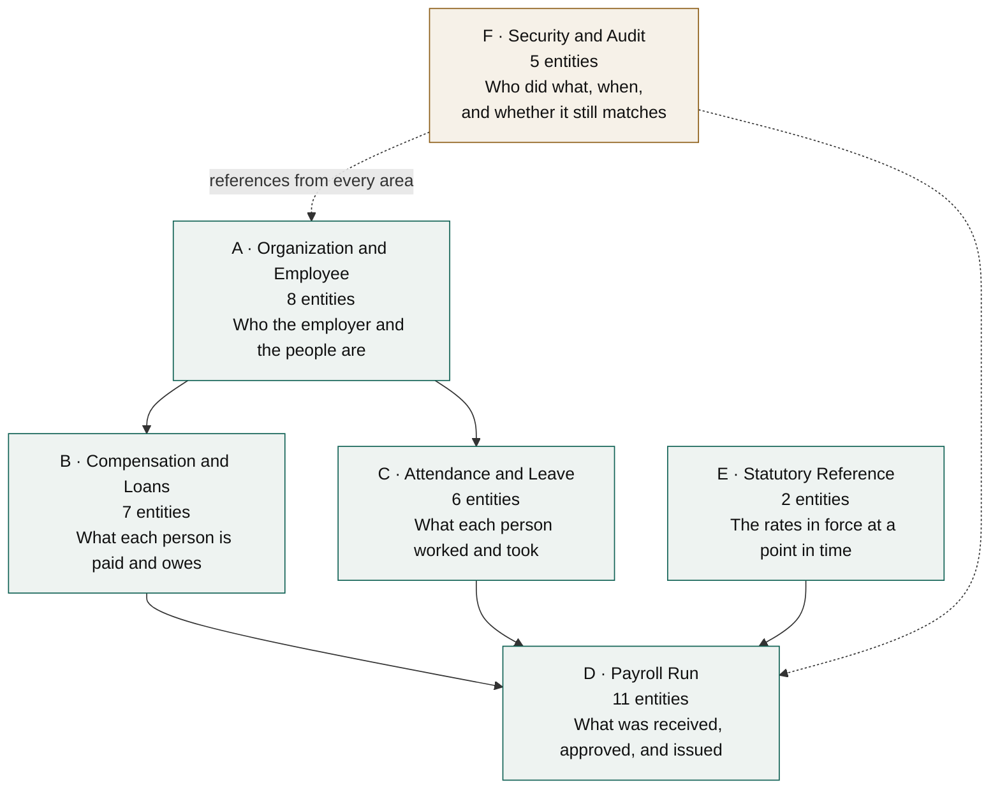
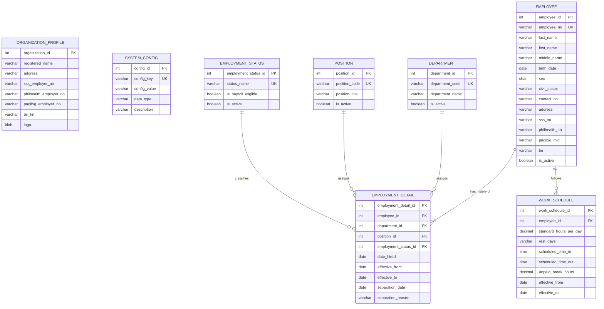
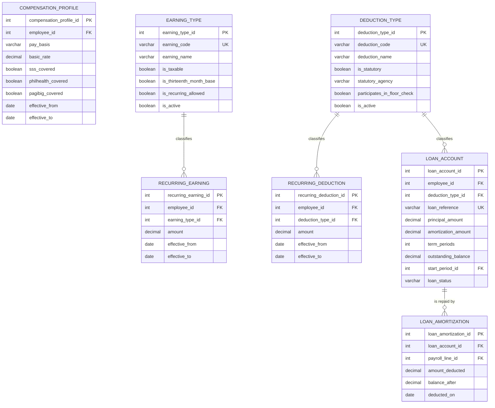
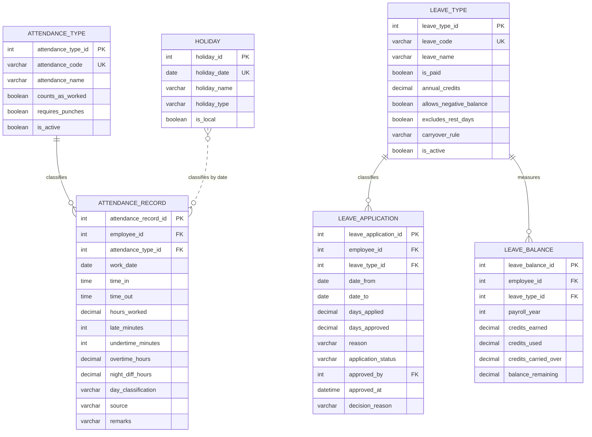
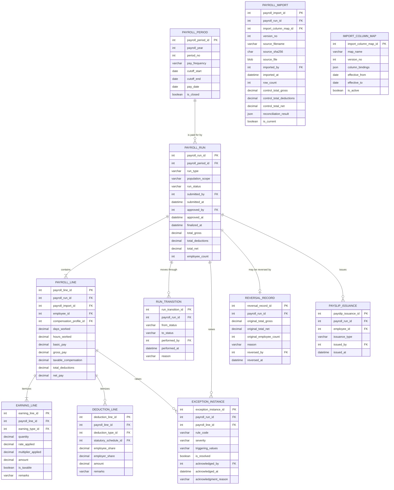
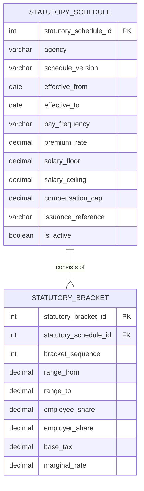
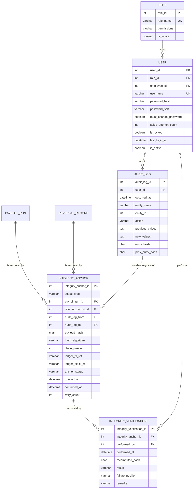

# Data Model

**Project:** Payroll Management System
**Document:** Entity-Relationship Diagram and Entity Specifications
**Version:** 1.2
**Date:** August 30, 2026
**Baseline:** B2 — frozen August 30, 2026 · see [baseline.md](./baseline.md)
**Traces to:** [FRS §8](./functional-requirements-specification.md) → [Use Case Model](./use-case-model.md) → [Behavioral Diagrams](./behavioral-diagrams.md)
**Change:** [CR-01](./change-request-cr-01.md) — payroll computation retained by the accounting office

---

## Document control

| | |
|---|---|
| Entities | 39 (27 from FRS §8.1, 12 added — see §1.3) |
| Relationships | 53 |
| Subject areas | 6 |
| Diagrams | 8 |
| Normal form | Third normal form, with two declared exceptions (§6.2) |

> ✧ **What changed in 1.2.** The client decided the accounting office continues to compute. Two entities were added — `PAYROLL_IMPORT` and `IMPORT_COLUMN_MAP` — to carry the provenance of figures that now originate outside the system. `PAYROLL_LINE` gained `payroll_import_id` and lost `is_computed` and `is_stale`. **No entity was dropped.** `STATUTORY_SCHEDULE` and `STATUTORY_BRACKET` survive in reduced scope, for remittance employer shares only. `COMPENSATION_PROFILE` lost `day_factor_used` and its derived rate columns with `BR-02`, and §6.2 no longer explains a payroll line's figures as values the system derived — they are **imported**, and the sums over their children are a check on them rather than a way of producing them.

---

# 1. About this model

## 1.1 Purpose

This document is the logical data model realizing DR-1.6: *one authoritative record per employee, referenced by the attendance, leave, payroll, and payslip modules, with no module keeping its own copy.* It defines every entity, its attributes, its keys, and its relationships.

It is a **logical** model. Column types are indicative, and the physical schema — the choice of DBMS, index strategy beyond §7.3, partitioning, and storage parameters — belongs to the implementation.

## 1.2 Notation

Diagrams use crow's foot notation, rendered as Mermaid ER diagrams.

| Symbol | Reading |
|---|---|
| `\|\|──o{` | One to zero-or-many |
| `\|\|──\|{` | One to one-or-many (the child is mandatory) |
| `\|\|──o\|` | One to zero-or-one |
| `\|\|──\|\|` | One to exactly one |

Key markers in the diagrams: `PK` primary key, `FK` foreign key, `UK` unique key. Where an attribute is both a primary and a foreign key, the diagram shows `PK` and the composition is stated in the entity's specification table.

## 1.3 Relationship to FRS §8.1

✧ The FRS inventoried 26 entity rows, one of which — `User / Role` — names two entities. All 27 appear here unchanged; `PAYROLL_IMPORT` and `IMPORT_COLUMN_MAP` were added to that inventory by [CR-01](./change-request-cr-01.md).

Twelve entities marked **⊕** are added. Each is demanded by a requirement the FRS already states but did not carry into its inventory. None introduces new scope.

| ⊕ Entity | Required by | What breaks without it |
|---|---|---|
| `ORGANIZATION_PROFILE` | FR-0.3 | Employer numbers and logo have nowhere to live; remittance reports cannot be produced without re-entry. |
| `SYSTEM_CONFIG` | FR-0.3, C-01 | ✧ Net pay floor, retention period, and exception thresholds would have to be hardcoded, violating C-01. |
| `EMPLOYMENT_STATUS` | FR-0.4 | FR-0.4 names it as a maintained reference list; `EMPLOYMENT_DETAIL` must reference it. |
| `EARNING_TYPE` | FR-0.4, BR-12 | ✧ The taxability and 13th-month-inclusion flags have no home, and the payslip cannot state which earnings are taxable. |
| `DEDUCTION_TYPE` | FR-0.4, BR-25 | The statutory and floor-check flags have no home. |
| `ATTENDANCE_TYPE` | FR-1.3, UC-14 A1 | Official business and field work cannot be distinguished from ordinary attendance. |
| `STATUTORY_BRACKET` | FR-2.3 | A schedule is described as brackets; without a child entity a schedule holds no content. |
| `PAYROLL_IMPORT` ✧ | FR-2.10, BR-39 | The provenance of every payroll figure — which file, which hash, which user, which mapping — has nowhere to live, and FR-6.3 can anchor a run without being able to say what the run was built from. |
| `IMPORT_COLUMN_MAP` ✧ | FR-2.8, BR-41, C-01 | The accounting office's column layout would have to be fixed in source code, so a renamed column would be a code change rather than a configuration change. |
| `EXCEPTION_INSTANCE` | FR-4.1 | Warning acknowledgments must be recorded and audited, and blocking state must survive a session. |
| `REVERSAL_RECORD` | FR-4.5, UC-26 | The specification requires a permanent reversal record holding the original figures. |
| `PAYSLIP_ISSUANCE` | FR-3.1, FR-3.4 | Generation and reprint events must be recorded with user and timestamp. |
| `INTEGRITY_ANCHOR` | FR-6.3, BR-36 | A hash queued in the payroll transaction and confirmed against the ledger afterward has nowhere else to live; without it, anchoring could not be transactional and could not survive a ledger outage. |
| `INTEGRITY_VERIFICATION` | FR-6.3, AC-6.3.7 | Verification must be attributable and its history readable, including the checks that passed. |

## 1.4 Global conventions

These apply to every entity and are not repeated in the specifications below.

| Convention | Rule |
|---|---|
| **Surrogate keys** | Every entity has a single-column integer surrogate primary key named `<entity>_id`. Natural keys (employee number, username) are enforced as unique constraints, not as primary keys. |
| **Audit columns** | Every entity carries `created_at`, `created_by`, `updated_at`, `updated_by`. `created_by` and `updated_by` reference `USER`. |
| **Soft delete** | Entities referenced by payroll records carry `is_active` and are never physically deleted (BR-33, BR-07). |
| **Money** | Every monetary column is `DECIMAL(13,2)`. Binary floating-point types are not used (BR-01, C-02, DR-2.3). |
| **Rates and hours** | Multipliers are `DECIMAL(6,4)`; hours are `DECIMAL(7,2)`; minutes are integers. |
| **Dates** | Business dates are `DATE`. Event timestamps are `DATETIME`. |
| **Delete rule** | Every foreign key is `ON DELETE RESTRICT`. No cascade delete exists anywhere in the model (§7.2). |

---

# 2. Subject areas

**Figure 1.** *Subject area map*

✧ **Area D grew by two entities under CR-01.** `PAYROLL_IMPORT` and `IMPORT_COLUMN_MAP` sit here rather than in Area E, although a column mapping is reference data by nature, because both exist solely to answer questions about a payroll run: *which file produced it* and *how was that file read*. Detached from a run they mean nothing. Area D's description changed with them — it holds what was **received**, approved, and issued, no longer what was computed.

Area F grew by two entities when the integrity layer was added. `INTEGRITY_ANCHOR` and `INTEGRITY_VERIFICATION` sit here rather than in Area D because they are *about* payroll records without being payroll records — they hold no figure, no name, and no rate, only hashes and outcomes. Deleting every row in both would lose the evidence that payroll was unaltered and would not lose one centavo of payroll.

The model flows in one direction. Areas A, B, and C hold inputs maintained continuously. Area E holds dated reference data maintained on circular. Area D consumes all four and never writes back to them. Area F observes everything.

That one-directional flow is what DR-1.6 buys: a payroll run reads employee data, it does not copy it, so nothing can drift out of sync.

✧ **One arrow into Area D now originates outside the model entirely.** Since CR-01, the figures on a payroll line arrive in a file produced by the accounting office rather than being derived from Areas A, B, C, and E. Those areas still feed the run — they populate the input worksheet the accounting office computes on (FR-2.11), and they supply the employee identities every imported row must match (BR-38) — but they no longer *determine* what a payroll line contains. `PAYROLL_IMPORT` is what makes that external origin a recorded fact rather than an unexamined assumption: every figure in Area D traces to a named file, a stored hash, and the user who loaded it.

**Subject areas are not modules.** These six areas group *data* by what it describes and how it is written; the seven modules of FRS §2.2 group *functions* by who performs them from which screen. The two need not coincide and here they do not. ✧ Area E remains the clearest case: the statutory schedules it holds are maintained by the Administrator from M1 (UC-05) and consumed by the remittance reports of M7 (FR-2.3), yet as data they are neither — they are dated reference data whose lifecycle is independent of any payroll run, which is why they form an area of their own. Read a module name to find the screen; read an area name to find the table.

---

# 3. Master entity-relationship diagram

Attributes are omitted here so the relationship structure is legible. Every entity is specified in full in §5.

```mermaid
erDiagram
    ORGANIZATION_PROFILE ||--o{ PAYROLL_PERIOD : "defines calendar for"
    DEPARTMENT ||--o{ EMPLOYMENT_DETAIL : "assigns"
    POSITION ||--o{ EMPLOYMENT_DETAIL : "assigns"
    EMPLOYMENT_STATUS ||--o{ EMPLOYMENT_DETAIL : "classifies"
    EMPLOYEE ||--|{ EMPLOYMENT_DETAIL : "has history of"
    EMPLOYEE ||--o{ WORK_SCHEDULE : "follows"
    EMPLOYEE ||--o| USER : "may hold account"

    EMPLOYEE ||--|{ COMPENSATION_PROFILE : "is paid under"
    EMPLOYEE ||--o{ RECURRING_EARNING : "receives"
    EMPLOYEE ||--o{ RECURRING_DEDUCTION : "is charged"
    EMPLOYEE ||--o{ LOAN_ACCOUNT : "owes"
    EARNING_TYPE ||--o{ RECURRING_EARNING : "classifies"
    DEDUCTION_TYPE ||--o{ RECURRING_DEDUCTION : "classifies"
    LOAN_ACCOUNT ||--o{ LOAN_AMORTIZATION : "is repaid by"

    EMPLOYEE ||--o{ ATTENDANCE_RECORD : "logs"
    ATTENDANCE_TYPE ||--o{ ATTENDANCE_RECORD : "classifies"
    EMPLOYEE ||--o{ LEAVE_APPLICATION : "files"
    EMPLOYEE ||--o{ LEAVE_BALANCE : "holds"
    LEAVE_TYPE ||--o{ LEAVE_APPLICATION : "classifies"
    LEAVE_TYPE ||--o{ LEAVE_BALANCE : "measures"

    PAYROLL_PERIOD ||--o{ PAYROLL_RUN : "is paid for by"
    PAYROLL_RUN ||--|{ PAYROLL_LINE : "contains"
    PAYROLL_RUN ||--o{ PAYROLL_IMPORT : "is loaded from"
    PAYROLL_IMPORT ||--o{ PAYROLL_LINE : "produced"
    IMPORT_COLUMN_MAP ||--o{ PAYROLL_IMPORT : "was read by"
    USER ||--o{ PAYROLL_IMPORT : "imported"
    EMPLOYEE ||--o{ PAYROLL_LINE : "is paid through"
    COMPENSATION_PROFILE ||--o{ PAYROLL_LINE : "priced"
    PAYROLL_LINE ||--|{ EARNING_LINE : "itemizes"
    PAYROLL_LINE ||--o{ DEDUCTION_LINE : "itemizes"
    EARNING_TYPE ||--o{ EARNING_LINE : "classifies"
    DEDUCTION_TYPE ||--o{ DEDUCTION_LINE : "classifies"
    PAYROLL_LINE ||--o{ LOAN_AMORTIZATION : "deducts"

    STATUTORY_SCHEDULE ||--|{ STATUTORY_BRACKET : "consists of"
    STATUTORY_SCHEDULE ||--o{ DEDUCTION_LINE : "sourced employer share for"

    PAYROLL_RUN ||--o{ RUN_TRANSITION : "moves through"
    PAYROLL_RUN ||--o{ EXCEPTION_INSTANCE : "raises"
    PAYROLL_LINE ||--o{ EXCEPTION_INSTANCE : "raises"
    PAYROLL_RUN ||--o| REVERSAL_RECORD : "may be reversed by"
    PAYROLL_RUN ||--o{ PAYSLIP_ISSUANCE : "issues"
    EMPLOYEE ||--o{ PAYSLIP_ISSUANCE : "receives"

    ROLE ||--o{ USER : "grants"
    USER ||--o{ RUN_TRANSITION : "performs"
    USER ||--o{ LEAVE_APPLICATION : "approves"
    USER ||--o{ EXCEPTION_INSTANCE : "acknowledges"
    USER ||--o{ PAYSLIP_ISSUANCE : "generates"
    USER ||--o{ AUDIT_LOG : "acts in"
    PAYROLL_RUN ||--o{ INTEGRITY_ANCHOR : "is anchored by"
    REVERSAL_RECORD ||--o{ INTEGRITY_ANCHOR : "is anchored by"
    AUDIT_LOG ||--o{ INTEGRITY_ANCHOR : "bounds a segment of"
    INTEGRITY_ANCHOR ||--o{ INTEGRITY_VERIFICATION : "is checked by"
    USER ||--o{ INTEGRITY_VERIFICATION : "performs"

    HOLIDAY }o..o{ ATTENDANCE_RECORD : "classifies by date"
```

**Figure 2.** *✧ Master entity-relationship diagram — 39 entities, 53 relationships*

`HOLIDAY` relates to `ATTENDANCE_RECORD` by date rather than by foreign key, shown as a dashed association. ✧ A holiday classifies a worked day in the input worksheet the accounting office computes on (FR-2.11) but does not own the attendance record, and attendance exists for dates that are not holidays.

✧ **Three relationships were added and two were reworded by CR-01.**

The additions all converge on `PAYROLL_IMPORT`: a run **is loaded from** one or more imports, an import **produced** a set of payroll lines, and a column map **was read by** an import. Together they make the origin of every figure in Area D a matter of record. Note the cardinality on the first: a run may hold *several* imports, of which exactly one is current — superseded versions are retained, never overwritten (BR-39), which is why this is `o{` and not `o|`.

The rewordings are corrections of fact rather than of style. `PAYROLL_PERIOD ||--o{ PAYROLL_RUN` was labelled *is computed by*; nothing computes a run now, so it reads **is paid for by**. `STATUTORY_SCHEDULE ||--o{ DEDUCTION_LINE` was labelled *computed*; the schedule no longer computes any deduction, and the foreign key survives only to record which schedule version produced a **derived employer share** for remittance reporting (FR-2.3, BR-20). On a deduction line whose employer share was imported rather than derived, that key is null — which is itself the record that no derivation took place.

`SYSTEM_CONFIG ||--o{ COMPENSATION_PROFILE : "supplies day factor"` was **removed**. The day factor was BR-02's input, BR-02 is retired, and the system no longer derives a rate from anything. This is the only relationship CR-01 deleted.

---

# 4. Subject area diagrams

## 4.1 Area A — Organization and Employee

**Figure 3.** *Area A — Organization and Employee*

`EMPLOYEE` holds identity only. Everything that changes over an employment — department, position, status — lives in `EMPLOYMENT_DETAIL` as dated rows, so a transfer creates a record rather than overwriting one. This is what allows a payroll run from two years ago to report the department the employee actually belonged to at the time.

## 4.2 Area B — Compensation and Loans

**Figure 4.** *Area B — Compensation and Loans*

`COMPENSATION_PROFILE` is a dated version chain, never an overwrite (BR-08).

`LOAN_AMORTIZATION` links a loan to the specific payroll line that deducted it, which is what makes the loan ledger reconcile to the payroll register down to the centavo (AC-1.2.3).

## 4.3 Area C — Attendance and Leave

**Figure 5.** *Area C — Attendance and Leave*

`ATTENDANCE_RECORD` stores both the raw punches and the derived figures — hours worked, late minutes, overtime, night differential. Storing the derivation is deliberate: it lets the exception report and the payroll line explain themselves without recomputing, and it means a later change to a work schedule does not silently restate history.

`source` records whether the row arrived by import or manual encoding, which is how AC-1.3.4 measures the 90% import target.

## 4.4 Area D — Payroll Run

**Figure 6.** *Area D — Payroll Run*

This area is the reason the whole model exists, and three choices in it carry the weight.

✧ `PAYROLL_LINE` holds `payroll_import_id` — the single most important column CR-01 added. It names the file the line's figures came from. Without it the model would hold a payroll whose origin is unrecorded, which is the condition the client's current process is already in and the one the restated P2 exists to end.

`PAYROLL_LINE` also holds `compensation_profile_id` — not a copy of the rate, a reference to the exact dated version in force for the cut-off. `DEDUCTION_LINE` holds `statutory_schedule_id` for a narrower reason since CR-01: it records which schedule version produced a **derived employer share**, and is null where the share was imported. Together with `payroll_import_id` they satisfy C-04 and DR-2.2.

`EARNING_LINE` stores `quantity`, `rate_applied`, `multiplier_applied`, **and** `amount`. ✧ The first three are imported alongside the fourth and explain it. The system does not verify that quantity times rate times multiplier equals amount — that is the accounting office's arithmetic, and BR-37 checks only that the amounts sum to the totals. What these columns buy is that a payslip or register breakdown can account for every centavo **as the accounting office computed it**, without the system having to reproduce the computation (AC-4.2.3).

✧ `is_stale` and `is_computed` were **removed** from `PAYROLL_LINE`. Both existed to track a line whose inputs had changed since it was last computed. Nothing is computed, so nothing goes stale: a line is either the current import's or it has been superseded wholesale by a later one (BR-39). A boolean that can never become true is worse than no column, because a reader assumes it means something.

**`run_type` participates in the uniqueness of a run.** A pay period may carry more than one run without ambiguity, provided the runs differ in type: the regular run, and beside it the 13th-month or final-pay run that UC-17 A1 describes. This is why the unique constraint in §5.1 is `payroll_period_id + population_scope + run_type` rather than the first two columns alone — the narrower key would have refused exactly the special runs the use case permits. Which earning types a special run receives in its imported register follows from `run_type`; no attribute enumerates them, because the run type already determines the answer and a second place to state it would be a second place to get it wrong.

**Cancelled runs are excluded from the unique key.** The constraint applies `where not cancelled`, so a run abandoned in `Draft` (UC-17 A2) stops holding its period, population, and run type and a replacement can be created. The cancelled row itself is kept — `Cancelled` is a terminal status in `run_status`, not a deletion — so the abandoned attempt and the reason for it remain in `RUN_TRANSITION`.

**Every return lands in `RETURNED`.** Both return paths — from `FOR_REVIEW` and from `APPROVED` — set `run_status` to `RETURNED`, which then reopens to `DRAFT` for correction (FRS FR-4.4). There is no transition from `FOR_REVIEW` straight to `DRAFT`. The distinction is worth the extra state: a run a reviewer sent back carries a return reason in `RUN_TRANSITION` and can be listed and counted separately, while a run that reads `DRAFT` was either never submitted or has already been picked up for correction.

**`approved_by` and `approved_at` describe the run's present state, not its history.** They are populated on approval and cleared when an approved run is returned before finalization (FRS FR-4.4), so a run in `RETURNED` never reads as approved by anyone. Nothing is lost by clearing them: the approval, the return, the acting users, and the return reason are all rows in `RUN_TRANSITION`, which is append-only and is the authority on what happened to a run. The two columns on `PAYROLL_RUN` are a convenience for display and for the separation-of-duty check in §5.2 — that check compares `approved_by` with `submitted_by` only while `run_status = 'APPROVED'`, which is precisely when the columns are populated.

## 4.5 Area E — Statutory Reference

**Figure 7.** *Area E — Statutory Reference*

One table shape serves all four agencies. SSS and withholding tax use the bracket rows; PhilHealth uses `premium_rate` with `salary_floor` and `salary_ceiling`; Pag-IBIG uses bracket rows with `compensation_cap`. Columns not applicable to an agency are null.

The alternative — a table per agency — was rejected because it makes `UC-I5 Apply statutory schedule` four code paths instead of one, and a fifth agency would then require a code change, violating C-01.

`issuance_reference` records the circular or revenue regulation the schedule came from. When a panel asks where a number came from, the answer is in the row.

## 4.6 Area F — Security and Audit

**Figure 8.** *Area F — Security and Audit*

`USER.employee_id` is nullable: an Administrator may be an external IT contact who is not an employee. `USER` rows are never deleted (AC-0.2.2) so that `AUDIT_LOG.user_id` always resolves to a name, including for deactivated accounts (AC-6.1.4).

**`PAYROLL_RUN` and `REVERSAL_RECORD` appear here as attribute-free stubs.** They belong to Area D and are drawn in full there; they are shown in this view because two of `INTEGRITY_ANCHOR`'s three scope references point at them, and a diagram of the integrity layer that hid what it anchors would be a diagram of nothing. They are not counted in Area F's five entities.

`AUDIT_LOG` is append-only. It has no `updated_at` and no `is_active`, because nothing ever updates or deactivates an audit entry (BR-27).

**`entry_hash` and `prev_entry_hash` chain the audit log** (BR-35). Each entry stores a hash of its own content and the hash of the entry before it, so deleting or altering any entry breaks the chain at that point and every entry after it fails to verify. This is the mechanism behind AC-6.1.5 and AC-6.3.4. Note what it does *not* do: it does not prevent the alteration. `AUDIT_LOG` is protected from the application by grants (§5.2) and from everyone else by detectability — and detectability is the honest limit of what any in-database mechanism can offer.

**`INTEGRITY_ANCHOR` is the outbox and the receipt in one row.** `anchor_status` moves `PENDING → CONFIRMED`, and the row is written *in the same transaction as the payroll action it covers* (UC-I6 step 3) while `ledger_tx_ref` is filled afterward. That split is the whole reason payroll never waits for the ledger: the commit that finalizes a run also commits the promise to anchor it, and the transmission is someone else's problem a moment later. `retry_count` makes a stalled anchor visible rather than silent.

`scope_type` says what is being anchored, and exactly one scope reference is populated to match it: `RUN` uses `payroll_run_id`, `REVERSAL` uses `reversal_record_id`, and `AUDIT_SEGMENT` uses the `audit_log_from`/`audit_log_to` pair (§5.2). A nullable foreign key per scope is used rather than one polymorphic column, so that referential integrity still holds in all three cases — which NFR-6.4 requires, and which a `scope_ref_id` holding an integer of unknown provenance could not give.

**A reversal is anchored in its own right, not through its run.** `REVERSAL_RECORD` carries the original totals and the reason (FR-4.5, BR-24), and it is written *after* the run it reverses was already anchored. Anchoring it against `payroll_run_id` would attach a second hash to a record whose own anchor must never be rewritten (BR-36), and the reversal's contents would go unattested. It gets its own foreign key and its own anchor row.

**`INTEGRITY_VERIFICATION` records every check, including the ones that passed.** A verification log that holds only failures cannot answer *"was this run ever checked?"* — and that is the question an auditor asks first. `result` is `MATCH`, `MISMATCH`, or `UNVERIFIABLE`; the third covers a record not yet anchored or a ledger that could not be reached, which UC-31 E2 and E3 are careful to distinguish from a mismatch.

---

# 5. Entity specifications

## 5.1 Keys and constraints

**Table 1.** *Primary, unique, and foreign keys*

| Entity | Primary key | Unique constraints | Foreign keys |
|---|---|---|---|
| `ORGANIZATION_PROFILE` | `organization_id` | — | — |
| `SYSTEM_CONFIG` | `config_id` | `config_key` | — |
| `DEPARTMENT` | `department_id` | `department_code` | — |
| `POSITION` | `position_id` | `position_code` | — |
| `EMPLOYMENT_STATUS` | `employment_status_id` | `status_name` | — |
| `EMPLOYEE` | `employee_id` | `employee_no` | — |
| `EMPLOYMENT_DETAIL` | `employment_detail_id` | `employee_id + effective_from` | `employee_id`, `department_id`, `position_id`, `employment_status_id` |
| `WORK_SCHEDULE` | `work_schedule_id` | `employee_id + effective_from` | `employee_id` |
| `COMPENSATION_PROFILE` | `compensation_profile_id` | `employee_id + effective_from` | `employee_id` |
| `EARNING_TYPE` | `earning_type_id` | `earning_code` | — |
| `DEDUCTION_TYPE` | `deduction_type_id` | `deduction_code` | — |
| `RECURRING_EARNING` | `recurring_earning_id` | `employee_id + earning_type_id + effective_from` | `employee_id`, `earning_type_id` |
| `RECURRING_DEDUCTION` | `recurring_deduction_id` | `employee_id + deduction_type_id + effective_from` | `employee_id`, `deduction_type_id` |
| `LOAN_ACCOUNT` | `loan_account_id` | `loan_reference` | `employee_id`, `deduction_type_id`, `start_period_id` |
| `LOAN_AMORTIZATION` | `loan_amortization_id` | `loan_account_id + payroll_line_id` | `loan_account_id`, `payroll_line_id` |
| `ATTENDANCE_TYPE` | `attendance_type_id` | `attendance_code` | — |
| `ATTENDANCE_RECORD` | `attendance_record_id` | `employee_id + work_date` | `employee_id`, `attendance_type_id` |
| `HOLIDAY` | `holiday_id` | `holiday_date` | — |
| `LEAVE_TYPE` | `leave_type_id` | `leave_code` | — |
| `LEAVE_APPLICATION` | `leave_application_id` | — | `employee_id`, `leave_type_id`, `approved_by` |
| `LEAVE_BALANCE` | `leave_balance_id` | `employee_id + leave_type_id + payroll_year` | `employee_id`, `leave_type_id` |
| `PAYROLL_PERIOD` | `payroll_period_id` | `payroll_year + period_no` | — |
| `PAYROLL_RUN` | `payroll_run_id` | `payroll_period_id + population_scope + run_type` where not cancelled | `payroll_period_id`, `submitted_by`, `approved_by` |
| `PAYROLL_LINE` | `payroll_line_id` | `payroll_run_id + employee_id` | `payroll_run_id`, `payroll_import_id`, `employee_id`, `compensation_profile_id` |
| `PAYROLL_IMPORT` | `payroll_import_id` | `payroll_run_id + version_no`; `payroll_run_id` where `is_current` | `payroll_run_id`, `import_column_map_id`, `imported_by` |
| `IMPORT_COLUMN_MAP` | `import_column_map_id` | `map_name + version_no` | — |
| `EARNING_LINE` | `earning_line_id` | — | `payroll_line_id`, `earning_type_id` |
| `DEDUCTION_LINE` | `deduction_line_id` | — | `payroll_line_id`, `deduction_type_id`, `statutory_schedule_id` |
| `STATUTORY_SCHEDULE` | `statutory_schedule_id` | `agency + effective_from` | — |
| `STATUTORY_BRACKET` | `statutory_bracket_id` | `statutory_schedule_id + bracket_sequence` | `statutory_schedule_id` |
| `RUN_TRANSITION` | `run_transition_id` | — | `payroll_run_id`, `performed_by` |
| `EXCEPTION_INSTANCE` | `exception_instance_id` | — | `payroll_run_id`, `payroll_line_id`, `acknowledged_by` |
| `REVERSAL_RECORD` | `reversal_record_id` | `payroll_run_id` | `payroll_run_id`, `reversed_by` |
| `PAYSLIP_ISSUANCE` | `payslip_issuance_id` | — | `payroll_run_id`, `employee_id`, `issued_by` |
| `ROLE` | `role_id` | `role_name` | — |
| `USER` | `user_id` | `username` | `role_id`, `employee_id` |
| `AUDIT_LOG` | `audit_log_id` | `entry_hash` | `user_id` |
| `INTEGRITY_ANCHOR` | `integrity_anchor_id` | `payload_hash`; `scope_type + payroll_run_id` where not null; `scope_type + reversal_record_id` where not null | `payroll_run_id`, `reversal_record_id`, `audit_log_from`, `audit_log_to` |
| `INTEGRITY_VERIFICATION` | `integrity_verification_id` | — | `integrity_anchor_id`, `performed_by` |

## 5.2 Check constraints

Constraints enforced at the database level, satisfying NFR-6.4.

| Entity | Constraint | Enforces |
|---|---|---|
| `EMPLOYEE` | `birth_date < CURRENT_DATE` | FR-1.5 date logic |
| `EMPLOYMENT_DETAIL` | `separation_date IS NULL OR separation_date >= date_hired` | FR-1.5 |
| `EMPLOYMENT_DETAIL` | `effective_to IS NULL OR effective_to > effective_from` | Dated-version integrity |
| `COMPENSATION_PROFILE` | `basic_rate >= 0`, `pay_basis IN ('MONTHLY','DAILY','HOURLY')` | FR-1.5 |
| `COMPENSATION_PROFILE` | No overlapping `effective_from`–`effective_to` per employee | BR-08 |
| `ATTENDANCE_RECORD` | `time_out IS NULL OR time_out > time_in` | UC-13 E4 |
| `ATTENDANCE_RECORD` | `late_minutes >= 0`, `undertime_minutes >= 0`, `hours_worked >= 0` | BR-04 |
| `LEAVE_APPLICATION` | `date_to >= date_from` | UC-15 E3 |
| `LEAVE_APPLICATION` | `days_approved <= days_applied` | UC-16 A2 |
| `LEAVE_APPLICATION` | No overlapping approved range per employee | UC-15 E2 |
| `PAYROLL_PERIOD` | `cutoff_end > cutoff_start`, `pay_date >= cutoff_end` | BR-34 |
| `PAYROLL_PERIOD` | No overlap and no gap within a `payroll_year` | BR-34 |
| `PAYROLL_RUN` | `run_status IN ('DRAFT','FOR_REVIEW','APPROVED','RETURNED','FINALIZED','CANCELLED')` | FR-4.4 |
| `PAYROLL_RUN` | `approved_by <> submitted_by` when `run_status = 'APPROVED'` | **BR-28 — separation of duty** |
| `PAYROLL_LINE` | `net_pay = gross_pay - total_deductions` | **✧ AC-2.5.2, AC-2.5.5, BR-37 — reconciliation enforced by the database, not only by the importer** |
| `PAYROLL_LINE` | `gross_pay = SUM(EARNING_LINE.amount)` for the line | ✧ BR-18, BR-37 |
| `PAYROLL_LINE` | `total_deductions = SUM(DEDUCTION_LINE.amount)` for the line | ✧ AC-2.4.4, BR-37 |
| `PAYROLL_LINE` | `payroll_import_id` not null | ✧ DR-2.2 — every payroll line names the import that produced it |
| `PAYROLL_IMPORT` | At most one row per `payroll_run_id` with `is_current = true` | **✧ BR-39 — exactly one current version** |
| `PAYROLL_IMPORT` | `source_sha256` not null, 64 hexadecimal characters | ✧ BR-39, AC-2.10.4 |
| `PAYROLL_IMPORT` | No `UPDATE` permitted except `is_current`; no `DELETE` | **✧ BR-39, BR-27 — a superseded import is retained, never rewritten** |
| `IMPORT_COLUMN_MAP` | No overlapping `effective_from`–`effective_to` per `map_name` | ✧ BR-41 |
| `EARNING_LINE` | `amount >= 0` | BR-01 |
| `DEDUCTION_LINE` | `amount >= 0` | BR-01 |
| `STATUTORY_SCHEDULE` | No overlapping `effective_from`–`effective_to` per `agency` | **BR-14, AC-2.3.2** |
| `STATUTORY_BRACKET` | Contiguous `range_from`–`range_to`, no gap or overlap within a schedule | UC-05 E2 |
| `LOAN_ACCOUNT` | `outstanding_balance >= 0`, `amortization_amount > 0` | BR-23 |
| `LOAN_AMORTIZATION` | `amount_deducted <= ` prior `balance_after` | **BR-23 — no over-deduction** |
| `USER` | Exactly one `role_id`, not null | AC-0.2.3 |
| `AUDIT_LOG` | No `UPDATE` or `DELETE` permitted on the table | **BR-27 — append-only** |
| `AUDIT_LOG` | `prev_entry_hash` equals the `entry_hash` of the preceding row; null only for the first row | **BR-35 — chained audit trail** |
| `INTEGRITY_ANCHOR` | `anchor_status IN ('PENDING','CONFIRMED','FAILED')` | FR-6.3 |
| `INTEGRITY_ANCHOR` | `scope_type IN ('RUN','REVERSAL','AUDIT_SEGMENT')` | FR-6.3 |
| `INTEGRITY_ANCHOR` | Exactly one scope reference is populated, matching `scope_type`: `RUN` → `payroll_run_id`; `REVERSAL` → `reversal_record_id`; `AUDIT_SEGMENT` → the pair `audit_log_from`/`audit_log_to`. All other scope columns are null | **Scope integrity, NFR-6.4** |
| `INTEGRITY_ANCHOR` | No `UPDATE` permitted except `anchor_status`, `ledger_tx_ref`, `ledger_block_ref`, `confirmed_at`, `retry_count`; no `DELETE` | **BR-36 — an anchored hash is never rewritten** |
| `INTEGRITY_VERIFICATION` | `result IN ('MATCH','MISMATCH','UNVERIFIABLE')` | AC-6.3.2 – 6.3.4 |
| `INTEGRITY_VERIFICATION` | No `UPDATE` or `DELETE` permitted on the table | Append-only verification history |

✧ The constraints in bold are the ones a panel should be shown. Each is a control the client's spreadsheet cannot express at all: a worksheet cannot refuse to let the preparer sign as approver, cannot prevent two contribution tables from claiming the same month, cannot stop a loan from over-deducting past zero, cannot retain the version of itself that was superseded, and cannot refuse to hold a row whose net pay disagrees with its own columns.

✧ **The three `PAYROLL_LINE` reconciliation constraints carry more weight since CR-01.** They express BR-37 at the database level, which means a row that does not reconcile cannot be stored *even if the import logic is wrong*. When the system computed its own figures these constraints checked its own arithmetic and could only ever fail on a defect. They now check arithmetic performed in a spreadsheet the system has never seen, and NFR-6.4's requirement that invalid data be rejected by the database rather than only by the application is the difference between a second line of defence and none.

## 5.3 Enumerated values

| Attribute | Permitted values |
|---|---|
| `COMPENSATION_PROFILE.pay_basis` | `MONTHLY`, `DAILY`, `HOURLY` |
| `PAYROLL_RUN.run_status` | `DRAFT`, `FOR_REVIEW`, `APPROVED`, `RETURNED`, `FINALIZED`, `CANCELLED` |
| `PAYROLL_RUN.run_type` | `REGULAR`, `THIRTEENTH_MONTH`, `FINAL_PAY`, `SPECIAL` |
| `PAYROLL_PERIOD.pay_frequency` | `SEMI_MONTHLY`, `MONTHLY` — pending OI-02, now a calendar setting only |
| `ATTENDANCE_RECORD.day_classification` | `ORDINARY`, `REST_DAY`, `SPECIAL_NON_WORKING`, `REGULAR_HOLIDAY`, `REST_DAY_SPECIAL`, `REST_DAY_REGULAR_HOLIDAY` |
| `ATTENDANCE_RECORD.source` | `IMPORT`, `MANUAL` |
| `LEAVE_APPLICATION.application_status` | `PENDING`, `APPROVED`, `RETURNED`, `CANCELLED` |
| `STATUTORY_SCHEDULE.agency` | `SSS`, `PHILHEALTH`, `PAGIBIG`, `BIR` |
| `EXCEPTION_INSTANCE.severity` | `BLOCKING`, `WARNING` |
| `EXCEPTION_INSTANCE.rule_code` | ✧ `EX-01` – `EX-08`, `EX-10` – `EX-14` — `EX-09` retired by CR-01 and not reused |
| `PAYSLIP_ISSUANCE.issuance_type` | `ORIGINAL`, `REPRINT` |
| `AUDIT_LOG.action` | ✧ `CREATE`, `UPDATE`, `DELETE`, `IMPORT`, `EXPORT`, `APPROVE`, `FINALIZE`, `REVERSE`, `LOGIN` — `COMPUTE` retired with the computation it recorded |
| `ROLE.role_name` | `ADMINISTRATOR`, `PAYROLL_OFFICER`, `APPROVER`, `VIEWER` |
| `INTEGRITY_ANCHOR.scope_type` | `RUN`, `REVERSAL`, `AUDIT_SEGMENT` |
| `INTEGRITY_ANCHOR.anchor_status` | `PENDING`, `CONFIRMED`, `FAILED` |
| `INTEGRITY_ANCHOR.hash_algorithm` | `SHA-256` — recorded per row so the algorithm can be changed for future anchors without invalidating past ones |
| `INTEGRITY_VERIFICATION.result` | `MATCH`, `MISMATCH`, `UNVERIFIABLE` |

## 5.4 SYSTEM_CONFIG required keys

`SYSTEM_CONFIG` is a key-value table so that C-01 holds: changing any of these is data maintenance, not a code change.

| Key | Type | Used by |
|---|---|---|
| `STANDARD_HOURS_PER_DAY` | decimal | ✧ BR-03 — deriving hours worked for the input worksheet |
| `NET_PAY_FLOOR` | decimal | BR-25, EX-03 |
| `GROSS_VARIANCE_THRESHOLD_PCT` | decimal | EX-07 |
| `OVERTIME_HOURS_THRESHOLD` | decimal | EX-08 |
| `FAILED_LOGIN_LIMIT` | int | BR-31 |
| `SESSION_TIMEOUT_MINUTES` | int | BR-32 |
| `RECORD_RETENTION_YEARS` | int | DR-2.1 — pending OI-10 |
| `AUDIT_SEGMENT_INTERVAL_HOURS` | int | FR-6.3 — how often an audit segment is closed and anchored |
| `ANCHOR_RETRY_LIMIT` | int | FR-6.3 — retries before a pending anchor is reported as stalled |
| `ACTIVE_IMPORT_COLUMN_MAP` ✧ | varchar | FR-2.8, BR-41 — the mapping version applied by default at import |

✧ **Six keys were removed by CR-01**: `DAY_FACTOR`, `NIGHT_DIFF_START`, `NIGHT_DIFF_END`, `NIGHT_DIFF_RATE`, and the `OT_MULTIPLIER_<classification>` family. Every one of them was a *rate the system applied* — the day factor for BR-02, the night period and rate for BR-17, the premium multipliers for BR-15 and BR-16. All four rules are retired and the accounting office holds those parameters now. `STANDARD_HOURS_PER_DAY` survives because BR-03 still uses it to derive hours worked from raw times for the input worksheet, which is attendance, not pay.

---

# 6. Normalization

## 6.1 Third normal form

The model is in third normal form. The design decisions that get it there:

| Normal form | What was done |
|---|---|
| **1NF** | No repeating groups. An employee's allowances are rows in `RECURRING_EARNING`, not columns `allowance_1`, `allowance_2`. A payroll line's deductions are rows in `DEDUCTION_LINE`, not a fixed set of columns per agency. |
| **2NF** | No partial dependency on a composite key. `LEAVE_BALANCE` is keyed on employee, leave type, and year, and every non-key attribute depends on all three. |
| **3NF** | No transitive dependency. `EMPLOYEE` does not store `department_name`; it reaches the department through `EMPLOYMENT_DETAIL` → `DEPARTMENT`. `PAYROLL_LINE` does not store the employee's name or the department name; both are reached by join. |

The FRS acceptance criterion AC-1.6.2 — *no employee attribute is duplicated in a second table in a way that permits divergence* — is satisfied by this: `EMPLOYEE` is the only place a name or a government number exists.

## 6.2 Two declared denormalizations

Both are deliberate, both are justified by a stated requirement, and a panel will ask about them.

**1. ✧ Figures are stored on `PAYROLL_LINE` and `ATTENDANCE_RECORD` that are also obtainable from their children.**

`PAYROLL_LINE` stores `gross_pay`, `total_deductions`, and `net_pay`, each of which also sums from the child lines. `ATTENDANCE_RECORD` stores `hours_worked`, `late_minutes`, and `overtime_hours`, all derivable from the punches and the schedule.

*Justification.* ✧ The two cases differ since CR-01, and only the second is a denormalization in the usual sense. `PAYROLL_LINE`'s figures are **imported**, not derived: they are stored because that is how they arrived, and the sums over the child lines are a *check* on them (BR-37, §5.2), not an alternative way of producing them. The system could not re-derive them on read even if it wanted to — it never held the arithmetic. `ATTENDANCE_RECORD`'s hours are genuinely derivable, and are stored rather than re-derived because C-04 requires a finalized run to keep displaying the figures it was accepted with: hours re-derived on read in 2029 would reflect the 2029 work schedule, restating a 2026 period — exactly the failure the spreadsheet has. The check constraints in §5.2 keep the stored totals consistent with their children, so neither can drift.

**2. `PAYROLL_RUN` stores run totals.**

`total_gross`, `total_deductions`, `total_net`, and `employee_count` are aggregates over `PAYROLL_LINE`.

*Justification.* NFR-5.5 requires any register or report to display within one minute. Re-aggregating thousands of lines on every register open, report generation, and dashboard load would not meet it. ✧ The totals are written at import, rewritten in full by any superseding import (BR-39), and fixed at finalization, after which they are immutable along with the run.

## 6.3 Deliberate version chains

Three entities are dated version chains rather than mutable rows: `COMPENSATION_PROFILE`, `EMPLOYMENT_DETAIL`, and `STATUTORY_SCHEDULE`. A change creates a row with a new `effective_from` and closes the previous row's `effective_to`.

This is what BR-08 and BR-14 require, and it is the structural reason AC-1.2.4 holds — a rate change effective mid-year does not alter the figures of any already-finalized run.

---

# 7. Integrity, retention, and performance

## 7.1 How DR-1.6 is realized

| AC | Realization |
|---|---|
| AC-1.6.1 — Employee identity in exactly one table | `EMPLOYEE` is the sole holder of name, birth date, and government numbers. Twelve entities reference it by `employee_id`; none copies it. |
| AC-1.6.2 — No divergent duplication | Verified by §6.1: no employee attribute appears in a second table. |
| AC-1.6.3 — Referential integrity enforced by the database | Every foreign key in Table 1 is declared with `ON DELETE RESTRICT`; §5.2 lists the check constraints. |

## 7.2 Delete rules

There is no cascade delete anywhere in this model. Every foreign key is `ON DELETE RESTRICT`.

| Rule | Consequence |
|---|---|
| BR-07 | An employee with any payroll, attendance, or leave record cannot be deleted — only deactivated. |
| BR-27 | No payroll record or audit entry is ever deleted by any system function. |
| BR-33 | A reference entry in use may be deactivated but not deleted. |
| AC-0.2.2 | User accounts are deactivated, never deleted, so audit entries always resolve. |

A cascade delete anywhere would let one action silently destroy payroll history. The absence of cascades is the enforcement.

## 7.3 Indexes required by the non-functional requirements

| Index | Serves |
|---|---|
| `PAYROLL_LINE (payroll_run_id, employee_id)` | Register display, UC-21 |
| `PAYROLL_LINE (employee_id, payroll_run_id)` | Employee payroll history, UC-29, NFR-5.5 |
| `ATTENDANCE_RECORD (employee_id, work_date)` | ✧ Worksheet assembly and import-time exception checks, UC-32, UC-18 |
| `PAYROLL_RUN (payroll_period_id, run_status)` | Pending-run queues, UC-24 |
| `EARNING_LINE (payroll_line_id)`, `DEDUCTION_LINE (payroll_line_id)` | Payslip and breakdown rendering, UC-27 |
| `STATUTORY_SCHEDULE (agency, effective_from, effective_to)` | ✧ Schedule selection, UC-I5 — executed only where a remittance report must derive an employer share the register did not carry (FR-2.3) |
| `AUDIT_LOG (occurred_at)`, `AUDIT_LOG (user_id, occurred_at)`, `AUDIT_LOG (entity_name, entity_id)` | Audit browsing and filtering, UC-06 |
| `EXCEPTION_INSTANCE (payroll_run_id, severity, is_resolved)` | Submission gate check, UC-23 |
| `EMPLOYEE (employee_no)`, `EMPLOYEE (last_name, first_name)` | Employee search, UC-08, UC-29 |

`AUDIT_LOG` grows fastest — one row per state change, so a period covering 100 employees writes several hundred rows. Its indexes and a retention plan under DR-2.1 are the two things that keep NFR-5.5 true in year three.

## 7.4 Retention

| Requirement | Realization |
|---|---|
| DR-2.1 | `SYSTEM_CONFIG.RECORD_RETENTION_YEARS` sets the period. No archival deletion is implemented; records remain online and retrievable throughout (OI-10). |
| DR-2.2 | `PAYROLL_LINE.compensation_profile_id` and `DEDUCTION_LINE.statutory_schedule_id` bind each line to the versions used, satisfying C-04. |
| DR-2.3 | All monetary columns are `DECIMAL(13,2)` per BR-01. |
| DR-2.4 | Deletion is implemented as `is_active = false` for every entity referenced by a payroll record. |

---

# 8. Traceability

**Table 2.** *Entity coverage of the data requirements*

| Requirement | Entities realizing it |
|---|---|
| DR-1.6 Normalized database | ✧ All 39 — verified in §6.1 and §7.1 |
| DR-2.1 Retention and reproducibility | `SYSTEM_CONFIG.RECORD_RETENTION_YEARS`, plus the §7.4 retention rule over Area D |
| DR-2.2 ✧ Version reference on payroll lines | ✧ `PAYROLL_LINE.payroll_import_id`, `PAYROLL_LINE.compensation_profile_id`, `DEDUCTION_LINE.statutory_schedule_id`, `PAYROLL_IMPORT.import_column_map_id` |
| DR-2.3 Decimal type for money | The `DECIMAL(13,2)` convention in §1.4, enforced on every monetary column |
| DR-2.4 Deletion as deactivation | `is_active` on every entity referenced by a payroll record (§1.4), plus the §7.2 delete rules |
| FR-0.2 User account management | `USER`, `ROLE` |
| FR-0.3 Organization profile and calendar | `ORGANIZATION_PROFILE`, `PAYROLL_PERIOD`, `SYSTEM_CONFIG` |
| FR-0.4 Reference data maintenance | `DEPARTMENT`, `POSITION`, `EMPLOYMENT_STATUS`, `EARNING_TYPE`, `DEDUCTION_TYPE`, `ATTENDANCE_TYPE`, `LEAVE_TYPE`, `HOLIDAY` |
| FR-1.5 Validation at point of entry | *Structural* — the check constraints of §5.2 and the unique keys of §5.1 |
| FR-1.1 Employee master file | `EMPLOYEE`, `EMPLOYMENT_DETAIL`, `DEPARTMENT`, `POSITION`, `EMPLOYMENT_STATUS` |
| FR-1.2 Compensation profile | `COMPENSATION_PROFILE`, `RECURRING_EARNING`, `RECURRING_DEDUCTION`, `LOAN_ACCOUNT`, `LOAN_AMORTIZATION` |
| FR-1.3 Attendance intake | `ATTENDANCE_RECORD`, `ATTENDANCE_TYPE`, `WORK_SCHEDULE`, `HOLIDAY` |
| FR-1.4 Leave administration | `LEAVE_TYPE`, `LEAVE_APPLICATION`, `LEAVE_BALANCE` |
| FR-2.3 ✧ Statutory schedules for remittance | `STATUTORY_SCHEDULE`, `STATUTORY_BRACKET`, `DEDUCTION_LINE.employer_share`, `DEDUCTION_LINE.statutory_schedule_id` |
| FR-2.4 Adjustments | `EARNING_LINE`, `DEDUCTION_LINE`, `DEDUCTION_TYPE`, `LOAN_AMORTIZATION` |
| FR-2.5 ✧ Net pay integrity check | `PAYROLL_LINE`, and the three reconciliation constraints of §5.2 |
| FR-2.6 Payroll run | `PAYROLL_PERIOD`, `PAYROLL_RUN` |
| FR-2.8 ✧ Register import | `PAYROLL_IMPORT`, `IMPORT_COLUMN_MAP`, `PAYROLL_LINE`, `EARNING_LINE`, `DEDUCTION_LINE` |
| FR-2.9 ✧ Reconciliation and completeness | `PAYROLL_IMPORT.reconciliation_result`, `PAYROLL_IMPORT.control_total_*`, `EXCEPTION_INSTANCE`, and the §5.2 constraints |
| FR-2.10 ✧ Import versioning | `PAYROLL_IMPORT.version_no`, `source_sha256`, `source_file`, `imported_by`, `imported_at`, `is_current` |
| FR-2.11 ✧ Input worksheet export | *No entity of its own* — the worksheet is assembled by query from Areas A, B, and C and is not stored. Its production is recorded in `AUDIT_LOG` |
| FR-3.1 – 3.4 Payslips | `PAYROLL_LINE`, `EARNING_LINE`, `DEDUCTION_LINE`, `PAYSLIP_ISSUANCE`, `ORGANIZATION_PROFILE` |
| FR-4.1 Exception report | `EXCEPTION_INSTANCE` |
| FR-4.2 Payroll register | `PAYROLL_RUN`, `PAYROLL_LINE` |
| FR-4.3 ✧ Targeted correction | `PAYROLL_IMPORT` (supersession), `EARNING_LINE`, `DEDUCTION_LINE` (adjustment lines) |
| FR-4.4 Approval workflow | `PAYROLL_RUN.run_status`, `RUN_TRANSITION` |
| FR-4.5 Period locking | `PAYROLL_RUN.finalized_at`, `REVERSAL_RECORD` |
| FR-5.1 – 5.3 Records and reporting | All of Area D, plus `ORGANIZATION_PROFILE` for employer numbers |
| FR-6.1 Audit trail | `AUDIT_LOG` |
| FR-6.2 Role-based access | `ROLE`, `USER` |
| FR-6.3 Ledger-anchored integrity | `INTEGRITY_ANCHOR`, `INTEGRITY_VERIFICATION`, `AUDIT_LOG.entry_hash`, `AUDIT_LOG.prev_entry_hash` |
| NFR-6.4 Integrity constraints | §5.2 |
| NFR-6.5 Security | `USER.password_hash`, `password_salt`, `failed_attempt_count`, `is_locked` |

✧ Every one of the 45 requirement items is accounted for. FR-0.1 is realized by `USER.password_hash`, `password_salt`, `failed_attempt_count`, `is_locked`, and `last_login_at`.

**The six with no persistent structure of their own** are named here rather than left to inference: ✧ NFR-2.12 (transcription fidelity) and NFR-6.6 (ISO/IEC 25010 evaluation) are measurements; NFR-3.5 (issuance turnaround) and NFR-5.5 (retrieval performance) are timings — though §7.3 specifies the indexes that make NFR-5.5 achievable; NFR-5.4 (backup and restore) is an operational procedure over the whole schema rather than a structure within it; and NFR-6.3 (confirmation and reversal) is an interaction rule, whose one persistent trace is `REVERSAL_RECORD`, already listed under FR-4.5.

✧ **FR-2.11 is the one requirement in this table realized by no entity at all**, and the omission is deliberate. The input worksheet is a *view* of data the model already holds — employee, compensation, attendance, leave — assembled at export time and never stored. Storing it would create a second copy of employee data that could drift from the first, which is precisely what DR-1.6 forbids. What *is* stored is the fact that it was produced, in `AUDIT_LOG`, so a register can be matched to the worksheet it came from.

Six of the ten entities added beyond the FRS §8.1 inventory exist to serve FR-0.3 and FR-0.4 — `ORGANIZATION_PROFILE` and `SYSTEM_CONFIG` for the organization profile and calendar, and `EMPLOYMENT_STATUS`, `EARNING_TYPE`, `DEDUCTION_TYPE`, and `ATTENDANCE_TYPE` for the maintained reference lists. FR-0.2 is served by `USER` and `ROLE`, which the FRS inventory already named. These were the least visible rows in this table and are now the most explicit, because a reader checking whether the model covers the specification will look for exactly them.

---

# 9. Open items affecting this model

Carried from FRS §11. Each changes a column or a constraint, not the model's shape.

| OI | Effect on the data model |
|---|---|
| **OI-02** Pay frequency | ✧ Fixes the permitted values of `PAYROLL_PERIOD.pay_frequency`. No longer affects any statutory or rate column. |
| **OI-03** Day factor | ✧ **Closed by CR-01.** `SYSTEM_CONFIG.DAY_FACTOR` and every derived rate column are removed — the system derives no rate. |
| **OI-04** Biometric export format | Determines the import mapping onto `ATTENDANCE_RECORD`; may add a `device_reference` column. |
| **OI-05** Pay basis mix | ✧ Confirms whether all three `pay_basis` values are needed on the compensation profile and in the exported worksheet. |
| **OI-12** ✧ Register column layout | Determines the `column_bindings` content of `IMPORT_COLUMN_MAP` and the canonical field list. **It changes no table and no constraint** — this is exactly what the entity was added to absorb. |
| **OI-13** ✧ Employer shares in the register | Decides whether `DEDUCTION_LINE.statutory_schedule_id` is populated often or rarely. If the register always carries employer shares, `STATUTORY_SCHEDULE` and `STATUTORY_BRACKET` become unused and may be dropped; if it never does, they are essential. Either way the schema is the same. |
| **OI-06** Bank transmittal layout | May require an `EMPLOYEE.bank_account_no` column and a bank reference entity. |
| **OI-09** Multi-level approval | If more than one approval level is required, `PAYROLL_RUN.approved_by` becomes a child entity rather than a column. This is the one open item that changes structure. |
| **OI-10** Retention period | Sets `SYSTEM_CONFIG.RECORD_RETENTION_YEARS`. |

**OI-09 is the one to resolve early.** A single approver is a column; multiple approval levels is a table. Changing it after implementation is a migration, not a configuration.

✧ **OI-12 and OI-13 deliberately do not appear in that sentence.** Both were open when this version was frozen, and neither changes the model's shape — OI-12 lands entirely inside `IMPORT_COLUMN_MAP.column_bindings`, and OI-13 only changes how often a nullable foreign key is populated. That was the design intent: the two questions the client had not yet answered were made into data rather than structure, so that answering them later is configuration, not a migration.

---

# 10. Notes for Chapter III

1. **Figures 1–8 need vector redraws.** Figure 2 is the one the manuscript requires as *the* ERD; Figures 3–8 belong in an appendix or as supporting figures where the department allows them.

2. **Present Figure 2 with the three bolded constraints from §5.2.** The diagram shows the structure; the constraints show the control. `approved_by <> submitted_by`, non-overlapping statutory effectivity, and no loan over-deduction are three things a spreadsheet cannot enforce at all, and they are the clearest data-level answer to problem P6.

3. **§6.2 is the section to rehearse.** Panels reliably ask why a figure obtainable from its children is stored anyway. ✧ Since CR-01 the answer splits, and saying so is the stronger answer: a payroll line's figures are stored because they were **imported** — the system never held the arithmetic to reproduce them — while an attendance record's hours are stored under C-04, so that a finalized run keeps displaying what it was accepted with after a work schedule changes. Neither answer is "for performance"; that one belongs to the run totals alone.

4. **The version-chain pattern in §6.3 is worth one slide.** It is the structural difference between this system and the client's worksheets, where editing a rate silently restates history.

5. **The system architecture now exists** — see [system architecture](./system-architecture.md). ✧ Its §4 places this model at the Data layer beneath a Persistence layer of repositories, and its §6.2 and §6.4 name the mechanisms that make `payroll_import_id`, `compensation_profile_id`, `statutory_schedule_id`, and the `DECIMAL(13,2)` convention hold in running code rather than only on paper. What remains for a complete design chapter is the class diagram — which follows from the architecture's components combined with these 39 entities — and a data flow diagram if the department requires one.
