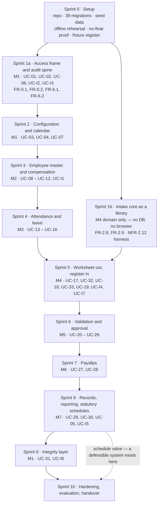

# Implementation Plan

**Project:** Payroll Management System
**Version:** 1.1
**Date:** August 30, 2026
**Built on:** Baseline B2 — see [baseline.md](./baseline.md)
**Change:** [CR-01](./change-request-cr-01.md) — payroll computation retained by the accounting office
**Status:** Working document. **Not part of the frozen baseline.**

---

# 1. About this plan

Baseline B2 fixed *what* the system is: 45 requirement items, 33 primary use cases, 39 entities, 38 components, 18 architectural decisions, and a technology stack with no remaining choices. This plan fixes *the order in which it gets built*, and nothing else.

It adds no requirement, changes no design decision, and is not baselined. If this document and B2 ever disagree, **B2 is right and this document is stale.**

It answers four questions:

1. What gets built first, and why that rather than the obvious order.
2. What has to be true before any feature code is written.
3. Which client answers gate which increment, and how late each one can safely arrive.
4. How anyone can tell that an increment is actually finished rather than nearly finished.

> **✧ Rewritten for CR-01.** Version 1.0 of this plan was organized around a single premise: that `ComputationEngine` was the most dangerous thing in the project and everything else should be sequenced around proving it early. The client's decision removed the engine. The premise had to be re-derived rather than patched, because the answer changed — see §2.

---

# 2. The sequencing principle

Two orders compete, and picking one blindly is how build schedules go wrong.

**Dependency order** is how the modules stack: M1 → M2 → M3 → M4 → M5 → M6 → M7. Nothing exports a worksheet without employees, nothing approves without an imported run, nothing reports without stored records. This order is real and cannot be ignored.

**Risk order** puts the most dangerous thing first. ✧ In baseline B1 that was `ComputationEngine`: it carried the majority of the business rules and NFR-2.7, and if the arithmetic was wrong the project failed regardless of how polished everything else was.

**✧ The most dangerous thing is now the intake boundary**, and it is dangerous in a different way. It is not that the logic is hard — reconciliation is addition and comparison. It is that:

- **The system can no longer detect most errors at all.** FR-2.9 catches a register that disagrees with itself. It cannot catch one that is uniformly wrong, and no amount of care in this build will change that (CR-01 risk **R1**). What the build *can* get wrong is failing to catch the errors that are catchable.
- **The precision risk moved and its guard was removed.** Architecture §6.4: the `(float)` slip migrated from the computation path to the parse path, where a spreadsheet library's default behaviour introduces it for you — at the same moment NFR-2.7's parallel run, the test that would have caught it, was retired. This is CR-01 risk **R5** and it is the single most consequential implementation risk in the revised baseline.
- **The one input the whole payroll enters through is still unspecified.** OI-12 — the accounting office's actual column layout — was open when B2 was frozen. AD-17 was designed so the answer is configuration rather than rework, but a sample file is still needed before FR-2.8 can be finished.

**These are reconciled by AD-04 and AD-05, re-argued.** `RegisterImportService` and `ReconciliationService` take values and return values; neither reaches for a database and neither knows a browser exists. They can be built and proved against fixture registers **before the screens and tables that will eventually feed them exist**. So dependency order governs the delivery increments, and risk is pulled forward by running the intake core as a parallel track in the very first sprint — the same shape as version 1.0, aimed at a different component.

## 2.1 What is deliberately not built first

| Not first | Why not |
|---|---|
| **Screens** | A screen is the cheapest thing here to build and the cheapest to change. Building UI first produces a convincing demo over an empty system, and the convincing demo is what hides the schedule slip until it is too late to absorb. |
| **The integrity layer** | It is additive by construction — 2 tables, 2 columns, and one component that nothing else calls. Building it in Sprint 2 costs exactly what it costs in Sprint 9 and proves nothing earlier. |
| **Reports** | `ReportService` performs no computation of its own; it reads stored data. Before there is stored data, a report is a layout exercise. |
| **✧ Statutory schedules** | In version 1.0 these were Sprint 1b work, because the computation needed them. They now feed only the remittance reports of FR-5.3, and **OI-13 may retire them entirely.** Building them early would risk building something the client's register makes unnecessary. They move to Sprint 8, beside the reports that consume them. |

---

# 3. Sprint 0 — before any feature code

Five items. Each is a day or two of work, and each one costs a week or more later if skipped.

| # | Item | Why it is here and not later |
|---|---|---|
| 0.1 | **Repository, coding standard, branch model** | Git is in the stack because architecture §8.4 claims the schema is reproducible from the repository with one command. That claim starts being true or false on day one. |
| 0.2 | ✧ **All 39 migrations, written at once** | Data model §5 specifies the schema to the constraint level — column types, keys, `CHECK` constraints, enum domains. Writing the whole schema up front costs about two days and removes the single largest source of rework. Include the three `PAYROLL_LINE` reconciliation constraints; they are the database-level half of BR-37 and they must exist before the first import is written, not after. |
| 0.3 | ✧ **Seeders for reference data, and one `IMPORT_COLUMN_MAP` row** | Departments, positions, employment statuses, earning and deduction types, leave types, holidays, and `SYSTEM_CONFIG`. Plus a first column-mapping row against the canonical template, so the import path has something to read from before OI-12 is answered. Statutory schedules are **not** seeded here — see §2.1. |
| 0.4 | **Offline deployment rehearsal** | Build the artifact — code, `vendor/`, compiled `public/build/` — on a networked machine, copy it to a machine with its network cable pulled, and run it. This is AD-16, and rehearsing it in week one instead of on installation day is the highest-value hour in this plan. |
| 0.5 | ✧ **The no-float parse proof, and the first fixture register** | One test that reads a monetary cell from a real `.xlsx` **as a float** and shows it failing, then reads the same cell as a decimal string and shows it holding — committed as the executable statement of BR-40 and AD-18. Plus the first fixture register: one period, a handful of employees, arithmetic that reconciles, saved as an actual spreadsheet file. C-02, BR-40, and NFR-2.12 all start here. |

✧ **Item 0.5 replaced the B1 plan's "BCMath proof and hand-computed payslip."** The hand-computed payslip proved the system's arithmetic. There is no system arithmetic left to prove — but the parse path is now where a centavo goes missing, and it deserves the same treatment on day one.

---

# 4. The build sequence

**Figure 1.** ✧ Increment order and dependencies.

✧ **Two things moved on this diagram.** Sprint 1b is now the intake core rather than the computation core. And `UC-05` with `UC-I5` — the statutory schedules — moved from Sprint 2 to Sprint 8, beside the remittance reports that are now their only consumer, so that an answer to OI-13 arriving late costs nothing.

## 4.1 The increments

| Sprint | Delivers | Use cases | Principal requirements | Finished when |
|---|---|---|---|---|
| **1a** | Sign-in, lockout, session timeout, user and role administration, the permission check, and the hash-chained audit log | UC-01, UC-02, UC-06, UC-I2, UC-I3 | FR-0.1, FR-0.2, FR-6.1, FR-6.2, NFR-6.5, BR-35 | A user signs in, every action they take appears in `AUDIT_LOG` with a valid `prev_entry_hash`, and a role without a grant is refused |
| **1b** ✧ | `RegisterImportService`, `ReconciliationService`, the NFR-2.12 fidelity harness, and the reconciliation-refusal suite — as a library, driven from fixture files | UC-I7 | FR-2.8, FR-2.9, BR-37, BR-38, BR-40, BR-41, C-02 | A fixture register imports to the centavo with no float in the path, **and** every seeded defective register is refused with the defect named |
| **2** ✧ | Organization profile, payroll calendar, reference lists, scheduled backup and the documented restore | UC-03, UC-04, UC-07 | FR-0.3, FR-0.4, NFR-5.4 | Pay periods for a year generate with no overlap and no gap (BR-34), and a test restore succeeds |
| **3** | Employee master file, employment detail, compensation profile, loan accounts, and entry validation | UC-08 – UC-12, UC-I1 | FR-1.1, FR-1.2, FR-1.5 | 30 employees exist with complete compensation profiles — the NFR-2.12 population |
| **4** | Attendance import from the published CSV and `.xlsx` template, exception encoding, leave filing, approval, and balances | UC-13 – UC-16 | FR-1.3, FR-1.4, SW-01, BR-09, BR-10 | A file with one bad row imports nothing at all, and reports the reject |
| **5** ✧ | Run creation, worksheet export, the intake core wired to real repositories, import versioning and supersession, adjustments, exception evaluation | UC-17, UC-32, UC-18, UC-33, UC-19, UC-I4, UC-I7 | FR-2.4, FR-2.6, FR-2.10, FR-2.11, FR-2.5 in situ | A worksheet exports, a register imports against it and matches the Sprint 1b fixtures exactly, a corrected re-import supersedes without erasing, and every stop state in behavioral Figure 4 writes nothing |
| **6** ✧ | Exception report, register review, correction by adjustment and by superseding import, the approval workflow, period locking, reversal | UC-20 – UC-26 | FR-4.1 – 4.5, BR-28, EX-01 – EX-08, EX-10 – EX-14 | All six FR-4.4 transitions work, the same user cannot both submit and approve, and the refusal comes from **both** `AuthorizationService` and the database constraint |
| **7** | Payslip generation, layout, batch export, reprint | UC-27, UC-28 | FR-3.1 – 3.4, NFR-3.5 | A complete payslip set for the 30-employee period is produced in under five minutes, and generation is refused for a run that is not `Finalized` |
| **8** ✧ | Record storage, search, the eleven-report catalogue, role-filtered retrieval, **and the dated statutory schedules the remittance reports need** | UC-29, UC-30, UC-05, UC-I5 | FR-5.1 – 5.3, FR-2.3, NFR-5.5, BR-14, BR-20 | Any past record is displayed within one minute, and every employer share on a remittance report is labelled imported or derived (AC-2.3.4) |
| **9** | Besu network, anchor contract, the transactional outbox, anchoring on finalize and on reverse, verification | UC-31, UC-I6 | FR-6.3, BR-36, AD-10 – AD-14 | Verification distinguishes its three outcomes — match, mismatch, and unverifiable — an unreachable ledger never blocks a payroll action, and altering a retained source file is reported as a mismatch (AC-2.10.5) |
| **10** | NFR evidence, ISO/IEC 25010 evaluation, user acceptance testing, deployment runbook, handover | — | NFR-6.6, NFR-2.12 final, AD-15, AD-16 | The system runs on the staging machine with its network cable pulled, installed from the artifact by following the runbook |

## 4.2 ✧ Where the seven included use cases land

They are cross-cutting, which makes them easy to defer into nonexistence. Each has a home:

| Included use case | Built in | Owned by |
|---|---|---|
| UC-I2 · Record audit entry | Sprint 1a | `AuditService` |
| UC-I3 · Authorize action | Sprint 1a | `AuthorizationService` |
| UC-I7 ✧ · Reconcile imported register | Sprint 1b, wired in Sprint 5 | `ReconciliationService` |
| UC-I1 · Validate data entry | Sprint 3 | `ValidationService` |
| UC-I4 · Evaluate exception rules | Sprint 5, surfaced as a report in Sprint 6 | `ExceptionEvaluator` |
| UC-I5 ✧ · Apply statutory schedule | Sprint 8 | `StatutoryScheduleService` |
| UC-I6 · Anchor integrity record | Sprint 9 | `LedgerAnchorService` |

## 4.3 Milestones

| | Reached | What is true |
|---|---|---|
| **M-A** ✧ | End of Sprint 1 | The riskiest thing in the project is proved. A register imports to the centavo with no float in the path, every seeded defect is refused, and every action in the system is audited. |
| **M-B** ✧ | End of Sprint 5 | The round trip works end to end: worksheet out, register in, reconciled, versioned, attributable. |
| **M-C** | End of Sprint 6 | A run can be submitted, approved, finalized, locked, and reversed, and separation of duty is enforced in two places. |
| **M-D** | End of Sprint 8 | **The minimum defensible system.** Full payroll cycle, payslips, records, reports. |
| **M-E** | End of Sprint 9 | Integrity verification against the ledger. |
| **M-F** | End of Sprint 10 | Evidence, evaluation, runbook, handover. |

## 4.4 Calendar and the schedule valve

Sprint 0 is one week; Sprints 1 – 10 are two weeks each. Run serially that is **21 weeks**. With three or four people the tracks that touch different layers overlap — 1a alongside 1b, Sprint 7 payslip layout alongside Sprint 6 approval logic, Sprint 9 ledger setup alongside Sprint 8 reports — which brings it to roughly **14 – 16 weeks**.

**If the calendar runs out, stop after M-D.** Sprint 9 is the only increment that can be dropped without leaving a hole in the system, precisely because nothing depends on it. That is a real cost — FR-6.3 is the requirement that distinguishes this project from a conventional payroll system, and ✧ CR-01 arguably made it *more* important rather than less, since it is now the mechanism proving that a figure the system did not compute has not been altered since it was received. Dropping it changes what Chapter IV can claim. But it is a choice available at week 17, and it is far better to know that now than to discover it under deadline.

---

# 5. Client answers and when each is needed

✧ **CR-01 changed this section more than any other.** In version 1.0, C-01 did most of the work: because statutory logic was data-driven, a wrong assumption cost a row rather than a rewrite. That is still true — and AD-17 extends the same protection to the register layout, which is why OI-12 blocks *finishing* Sprint 5 rather than *starting* it.

| Open item | Question | Blocks | Needed by | Default to proceed on |
|---|---|---|---|---|
| **OI-12** ✧ | Register column layout — **a sample file, not a description** | Finishing FR-2.8; the canonical field list | **Sprint 1** | The canonical template of FR-2.8, with one `IMPORT_COLUMN_MAP` row. AD-17 makes the real answer a configuration change |
| **OI-13** ✧ | Does the register carry employer shares? | Whether FR-2.3 is needed at all | **Sprint 8** | Assume **not**, and build FR-2.3 to derive them. If the register does carry them, FR-2.3 is dropped — cheap in that direction only |
| **OI-15** ✧ | Worksheet layout the accounting office wants | Polish of FR-2.11, not its existence | Sprint 5 | The column set of FR-2.11 as specified |
| **OI-14** ✧ | Is 13th-month pay computed by the accounting office? | One `run_type` and one report | Sprint 8 | Computed by the accounting office, imported as a `THIRTEENTH_MONTH` run |
| **OI-02** | Pay frequency | Payroll calendar and period generation | Sprint 2 | Semi-monthly |
| **OI-01** | Employee count and growth | Sizing and the performance test set | Sprint 2 | 200 employees |
| **OI-04** | Timekeeping device and export format | The `AttendanceImportService` parser | Sprint 4 | The published CSV template of SW-01 |
| **OI-09** | One approver, or multi-level? | The FR-4.4 state machine | **Sprint 3 at the latest** | Single approver |
| **OI-16** ✧ | Separate import permission? | One row in the FR-6.2 matrix | Sprint 5 | Import folded into the Payroll Officer's run permissions; BR-28 already separates submit from approve |
| **OI-07** | Cash, check, or ATM payroll | Payslip and transmittal wording | Sprint 7 | ATM payroll |
| **OI-06** | Bank and transmittal layout | One of the eleven FR-5.3 reports | Sprint 8 | Deferred; the other ten are unaffected |
| **OI-10** | Retention period | `RECORD_RETENTION_YEARS`, and now the retained source files (BR-39) | Sprint 8 | 10 years |
| **OI-11** | Ledger administrator and node count | **Nothing in the build.** The strength of the FR-6.3 claim | Before Chapter IV is written | Four validators, administered by the external IT contact |

✧ **`OI-03` and `OI-05` are gone from this table.** Both were week-one questions in version 1.0 because they shaped the computation core. The day factor is retired outright, and the pay-basis mix now only decides which columns appear in an exported worksheet. **CR-01 closed the two questions this plan was most urgent about, and opened two others.**

**✧ Two questions to ask in week one: OI-12 and OI-13.** The first shapes the intake core, which is Sprint 1. The second decides whether an entire requirement, two components, and two entities are built at all — and it is cheapest to know before Sprint 8, not during it.

**OI-09 remains the one that is not a configuration change.** Multi-level approval adds a state to FR-4.4 and a branch to the run lifecycle — it touches the FRS, the state machine, the `run_status` enum, and `RUN_TRANSITION`. Ask it by Sprint 3, while the answer still costs a design revision rather than a rebuild.

---

# 6. Definition of done

Three levels, because *done* means something different at each.

**A requirement is done when** every one of its acceptance criteria is observable in the running system; its business rules have unit tests; it writes the audit entries FR-6.1 requires; its FR-6.2 permission is enforced *and* demonstrated to refuse a role that lacks the grant; and it has an entry in the acceptance test script.

**An increment is done when** every use case in it walks its main success scenario and every blocking exception flow; migrations run clean from an empty database; seeders reproduce the demo state; and it is demonstrated **on the staging machine, from the artifact** — not on a developer laptop with a development server.

✧ **The project is done when** the acceptance criteria are evidenced, **the NFR-2.12 intake fidelity run agrees to the centavo in both directions across 30 employees and three periods**, **every seeded defective register is refused**, the ISO/IEC 25010 evaluation of NFR-6.6 is administered, and a person following the runbook can install the system on a machine with no internet route.

---

# 7. Testing

| Level | Covers | Runs against |
|---|---|---|
| **Unit** | ✧ `RegisterImportService`, `ReconciliationService`, `WorksheetExportService`, `ValidationService`, `ExceptionEvaluator`, `LeaveService` | No database. This is what AD-04 and AD-05 bought, re-argued in architecture §10.1. |
| **Integration** | Repositories, transaction boundaries, and every `CHECK` constraint of data model §5.2 — ✧ including the three `PAYROLL_LINE` reconciliation constraints and the BR-28 separation-of-duty constraint | A MySQL test schema |
| **Feature** | Controllers and routes, plus one **negative** test for each FR-6.2 grant | Laravel HTTP tests |
| **✧ Intake fidelity** | NFR-2.12 — 30 employees across three periods, file→database and database→file, plus a seeded-alteration pass | The Sprint 1b harness |
| **✧ Reconciliation refusal** | FR-2.9 — one seeded defect per register: centavo imbalance, wrong control total, unmatched employee, duplicate row, omitted employee | The Sprint 1b harness |
| **Performance** | NFR-3.5 five-minute payslip set, NFR-5.5 one-minute retrieval | Timed scripts on the staging machine |
| **Acceptance** | One script per use case, walked by a person in each of the four roles | Manual |
| **Evaluation** | NFR-6.6, ISO/IEC 25010 | Instrument administered to users |

**The negative permission tests are the point.** Separation of duty is the strongest claim this design makes, and a test that shows the *refusal* is what turns it from an assertion into evidence. Architecture Figure 6 shows the two places it is enforced; there should be a test at each.

✧ **The reconciliation-refusal suite is the second point.** Every check in FR-2.9 exists to refuse something, and a check that has silently stopped refusing looks exactly like a check that is passing. The seeded-alteration pass in the fidelity harness serves the same purpose from the other direction: it proves the comparison is live.

---

# 8. Ownership

For a team of three or four:

| Seat | Owns | Note |
|---|---|---|
| ✧ **Domain / intake** | `RegisterImportService`, `ReconciliationService`, `WorksheetExportService`, the exception evaluator, the fidelity and refusal harnesses | The highest-skill seat. All of Sprint 1b, and the correctness of Sprint 5. |
| **Application / persistence** | Controllers, repositories, migrations, transaction boundaries, the run lifecycle, import versioning | Owns the schema and the state machine. |
| **Presentation** | Blade and Alpine screens, payslip layout, the report catalogue, the import preview screen | Largest surface area, lowest per-item risk. |
| **Infrastructure / integrity** | Besu, the outbox, backup and restore, the deployment artifact | A shared fourth seat; on a team of three, it splits between the other two. |

✧ **Two reviewers on anything in the parse and reconciliation path.** Elsewhere, one is enough. This is the same rule version 1.0 applied to the computation path, moved to where the risk went.

---

# 9. Risks

| Risk | What it looks like | Response |
|---|---|---|
| ✧ **Float reaches money on the parse path** | Reading a spreadsheet cell without asking the library for a string; a `(float)` cast in the import mapper | Architecture §6.4 and AD-18 name this exact slip, and CR-01 **R5** explains why it is more likely now than in B1 while its old detection mechanism is gone. Sprint 0 item 0.5 is the executable statement of the rule; the fidelity harness catches a regression within a day. **Grep the parse path in every review.** |
| ✧ **Reconciliation quietly stops reconciling** | A check that always passes — a tolerance introduced to "handle rounding", a comparison against a float | BR-37 admits no tolerance, and the refusal suite fails loudly if a seeded defect is accepted. Never add a tolerance to make a real register import; a register that needs one is a register to send back. |
| ✧ **The system is described as computing payroll** | A screen labelled "Compute", a Chapter IV claim of computational accuracy, an objective that says "without spreadsheets" | The matrix, FRS §1.2, and FRS §10 all state the boundary. CR-01 **C1** and **C3** name the specific overclaims to avoid. This is a documentation risk, not a code one, and it is the easiest of all of these to commit by accident. |
| ✧ **OI-12 arrives late and the layout is exotic** | Merged cells, multi-row headers, one sheet per department | AD-17 absorbs a *renamed or reordered column*, not a structurally different file. If the real register is not one row per employee, that is a design conversation and it should happen in Sprint 1, not Sprint 5. **Get the sample file early.** |
| **Statutory logic gets hardcoded under deadline** | A conditional on a bracket boundary | C-01 is an acceptance criterion, not a preference. Brackets live in `STATUTORY_BRACKET` or the requirement is not met. ✧ Lower exposure than in B1 — the schedules now touch only remittance reporting. |
| **OI-09 comes back multi-level** | Sprint 6 rework reaching four documents | Ask by Sprint 3. It is the only open item that changes design rather than configuration. |
| **Besu consumes the schedule** | Sprint 9 overrunning into Sprint 10 | The transactional outbox means anchoring failure is invisible to payroll. If the ledger is not ready, the payroll system still works — take the M-D valve. |
| **Offline deployment discovered on installation day** | A dependency install reaching for a package repository on a machine with no route | Sprint 0 rehearsal, item 0.4. |
| **Scope drift** | A new requirement appearing in code before it appears in the matrix | Baseline change procedure, [baseline.md](./baseline.md) §5. A gap found during implementation is a baseline change, not a code change — which is exactly the route CR-01 itself took. |

---

# 10. What this produces for the manuscript

**Chapter III** is already written from B2. ✧ The one remaining design artifact is the class model, and it follows mechanically from the 38 components, the 39 entities, and the 17 participants of behavioral §1.4.

**Chapter IV** is produced by Sprints 1 through 10 and by nothing else. ✧ Its evidence is the intake fidelity results, the reconciliation refusal results, the ISO/IEC 25010 results, the acceptance test outcomes, and the performance timings — which is why the definition of done in §6 insists each is captured as it is earned rather than reconstructed at the end.

✧ **On what Chapter IV must not claim.** The parallel run is gone and nothing replaces it, because there is no system computation to compare against a manual one. NFR-2.12 evidences that a figure was carried faithfully; FR-2.9 evidences that an inconsistent register was refused. **Neither is evidence that a figure is correct**, and a register that is wrong in the accounting office's spreadsheet and internally consistent passes every test in this plan. FRS §10 states this and CR-01 **R1** explains it; write the results section from those, not around them.

**On the FR-6.3 claim.** Write it against whatever OI-11 actually settles, not against the recommendation. The honest statement is *"a finalized run cannot be altered without detection"* — not *"payroll cannot be tampered with,"* and certainly not *"payroll is on the blockchain."* Architecture §6.7 states the boundary in a table; use it verbatim, because the paraphrase is where this kind of feature gets oversold.

---

# 11. Change control

This document is not baselined. Revise it whenever the plan changes — that is what it is for.

But the direction matters. If implementation reveals that a requirement is missing, wrong, or unbuildable, **that is a baseline change and it goes through [baseline.md](./baseline.md) §5 first.** Fixing it only in code is how a verified document set stops describing the system it was written for.

✧ **CR-01 is the worked example.** A client decision arrived that removed a module. It went through §5 — authoritative document named first, change traced outward to all six documents, verification re-run, versions and change logs updated — and this plan was rebuilt afterward from the revised baseline rather than edited alongside it. That order is what kept the two consistent, and it is the order to repeat.
