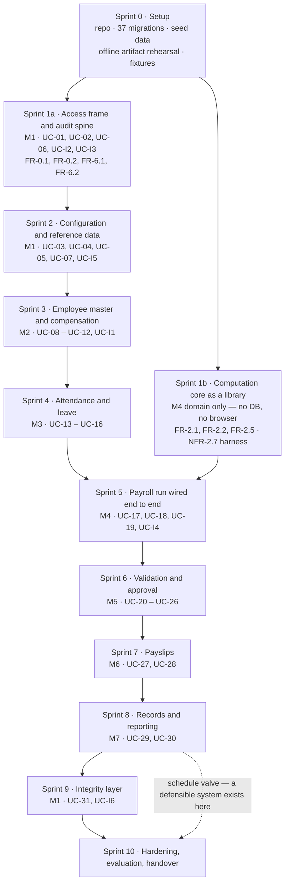

# Implementation Plan

**Project:** Payroll Management System
**Version:** 1.0
**Date:** August 30, 2026
**Built on:** Baseline B1 — see [baseline.md](./baseline.md)
**Status:** Working document. **Not part of the frozen baseline.**

---

# 1. About this plan

Baseline B1 fixed *what* the system is: 43 requirement items, 31 primary use cases, 37 entities, 35 components, 16 architectural decisions, and a technology stack with no remaining choices. This plan fixes *the order in which it gets built*, and nothing else.

It adds no requirement, changes no design decision, and is not baselined. If this document and B1 ever disagree, **B1 is right and this document is stale.**

It answers four questions:

1. What gets built first, and why that rather than the obvious order.
2. What has to be true before any feature code is written.
3. Which client answers gate which increment, and how late each one can safely arrive.
4. How anyone can tell that an increment is actually finished rather than nearly finished.

---

# 2. The sequencing principle

Two orders compete, and picking one blindly is how build schedules go wrong.

**Dependency order** is how the modules stack: M1 → M2 → M3 → M4 → M5 → M6 → M7. Nothing computes without employees, nothing approves without a computed run, nothing reports without stored records. This order is real and cannot be ignored.

**Risk order** puts the most dangerous thing first. In this system the most dangerous thing is not the ledger. It is `ComputationEngine`. It carries C-01, C-02, C-04, the majority of the 36 business rules, and NFR-2.7 — the acceptance criterion that says system output must agree *exactly* with an independently verified manual computation. If that is wrong, the project fails no matter how polished everything else is.

**These are reconciled by AD-04 and AD-05.** `ComputationEngine` takes values and returns values; it does not reach for a database and it does not know a browser exists. That means it can be built and proved against hand-computed fixtures **before the screens and tables that will eventually feed it exist**. So dependency order governs the delivery increments, and risk is pulled forward by running the computation core as a parallel track in the very first sprint.

## 2.1 What is deliberately not built first

| Not first | Why not |
|---|---|
| **Screens** | A screen is the cheapest thing here to build and the cheapest to change. Building UI first produces a convincing demo over an empty system, and the convincing demo is what hides the schedule slip until it is too late to absorb. |
| **The integrity layer** | It is additive by construction — 2 tables, 2 columns, and one component that nothing else calls. Building it in Sprint 2 costs exactly what it costs in Sprint 9 and proves nothing earlier, while consuming the weeks the computation core actually needs. |
| **Reports** | `ReportService` performs no computation of its own; it reads stored data. Before there is stored data, a report is a layout exercise. |

---

# 3. Sprint 0 — before any feature code

Five items. Each is a day or two of work, and each one costs a week or more later if skipped.

| # | Item | Why it is here and not later |
|---|---|---|
| 0.1 | **Repository, coding standard, branch model** | Git is in the stack because architecture §8.4 claims the schema is reproducible from the repository with one command. That claim starts being true or false on day one. |
| 0.2 | **All 37 migrations, written at once** | Data model §5 specifies the schema to the constraint level — column types, keys, `CHECK` constraints, enum domains. Writing the whole schema up front costs about two days and removes the single largest source of rework: discovering in Sprint 5 that a Sprint 1 table needs another column. Later increments *alter*; they do not invent. |
| 0.3 | **Seeders for reference and statutory data** | Departments, positions, employment statuses, earning and deduction types, leave types, holidays, `SYSTEM_CONFIG`, and the dated SSS / PhilHealth / Pag-IBIG / BIR schedules with their brackets. Nothing computes without these, and they are data, not code (C-01). |
| 0.4 | **Offline deployment rehearsal** | Build the artifact — code, `vendor/`, compiled `public/build/` — on a networked machine, copy it to a machine with its network cable pulled, and run it. This is AD-16. A server with no internet route cannot run `composer install`, and rehearsing that in week one instead of on installation day is the highest-value hour in this plan. |
| 0.5 | **The BCMath proof and the first fixture** | One test that shows float arithmetic failing and `bcadd` succeeding on the same figures, plus the first hand-computed payslip: one employee, one period, worked out on paper by a person and committed as a fixture. C-02 and NFR-2.7 both start here. |

---

# 4. The build sequence

**Figure 1.** Increment order and dependencies.

## 4.1 The increments

| Sprint | Delivers | Use cases | Principal requirements | Finished when |
|---|---|---|---|---|
| **1a** | Sign-in, lockout, session timeout, user and role administration, the permission check, and the hash-chained audit log | UC-01, UC-02, UC-06, UC-I2, UC-I3 | FR-0.1, FR-0.2, FR-6.1, FR-6.2, NFR-6.5, BR-35 | A user signs in, every action they take appears in `AUDIT_LOG` with a valid `prev_entry_hash`, and a role without a grant is refused |
| **1b** | `ComputationEngine`, `StatutoryScheduleService`, and the NFR-2.7 parallel-run harness — as a library, driven from fixtures | — | FR-2.1, FR-2.2, FR-2.5, C-01, C-02, BR-01 | One hand-computed payslip is reproduced to the centavo by code, with no database involved |
| **2** | Organization profile, payroll calendar, reference lists, dated statutory schedules, scheduled backup and the documented restore | UC-03, UC-04, UC-05, UC-07, UC-I5 | FR-0.3, FR-0.4, FR-2.3, NFR-5.4 | A statutory rate change is made by editing data, and a superseded schedule still resolves for an earlier date (C-01, C-04) |
| **3** | Employee master file, employment detail, compensation profile, loan accounts, and entry validation | UC-08 – UC-12, UC-I1 | FR-1.1, FR-1.2, FR-1.5 | 30 employees exist with complete compensation profiles — the NFR-2.7 population |
| **4** | Attendance import from the published CSV and `.xlsx` template, exception encoding, leave filing, approval, and balances | UC-13 – UC-16 | FR-1.3, FR-1.4, SW-01, BR-09, BR-10 | A file with one bad row imports nothing at all, and reports the reject |
| **5** | Payroll run creation, the engine wired to real repositories, adjustments, exception evaluation | UC-17, UC-18, UC-19, UC-I4 | FR-2.4, FR-2.6, FR-2.1 – 2.5 in situ | A run computes from imported attendance and matches the Sprint 1b fixtures exactly |
| **6** | Exception report, register review, targeted recomputation, the approval workflow, period locking, reversal | UC-20 – UC-26 | FR-4.1 – 4.5, BR-28, EX-01 – EX-10 | All six FR-4.4 transitions work, the same user cannot both submit and approve, and the refusal comes from **both** `AuthorizationService` and the database constraint |
| **7** | Payslip generation, layout, batch export, reprint | UC-27, UC-28 | FR-3.1 – 3.4, NFR-3.5 | A complete payslip set for the 30-employee period is produced in under five minutes, and generation is refused for a run that is not `Finalized` |
| **8** | Record storage, search, the eleven-report catalogue, role-filtered retrieval | UC-29, UC-30 | FR-5.1 – 5.3, NFR-5.5 | Any past payslip, register, or report is located and displayed within one minute |
| **9** | Besu network, anchor contract, the transactional outbox, anchoring on finalize and on reverse, verification | UC-31, UC-I6 | FR-6.3, BR-36, AD-10 – AD-14 | Verification distinguishes its three outcomes — match, mismatch, and unverifiable — and an unreachable ledger never blocks a payroll action |
| **10** | NFR evidence, ISO/IEC 25010 evaluation, user acceptance testing, deployment runbook, handover | — | NFR-6.6, NFR-2.7 final, AD-15, AD-16 | The system runs on the staging machine with its network cable pulled, installed from the artifact by following the runbook |

## 4.2 Where the six included use cases land

They are cross-cutting, which makes them easy to defer into nonexistence. Each has a home:

| Included use case | Built in | Owned by |
|---|---|---|
| UC-I2 · Record audit entry | Sprint 1a | `AuditService` |
| UC-I3 · Authorize action | Sprint 1a | `AuthorizationService` |
| UC-I5 · Apply statutory schedule | Sprint 1b, wired in Sprint 2 | `StatutoryScheduleService` |
| UC-I1 · Validate data entry | Sprint 3 | `ValidationService` |
| UC-I4 · Evaluate exception rules | Sprint 5, surfaced as a report in Sprint 6 | `ExceptionEvaluator` |
| UC-I6 · Anchor integrity record | Sprint 9 | `LedgerAnchorService` |

## 4.3 Milestones

| | Reached | What is true |
|---|---|---|
| **M-A** | End of Sprint 1 | The riskiest thing in the project is proved. Code reproduces a hand-computed payslip to the centavo, and every action in the system is audited. |
| **M-B** | End of Sprint 5 | A payroll run computes end to end from imported attendance. |
| **M-C** | End of Sprint 6 | A run can be submitted, approved, finalized, locked, and reversed, and separation of duty is enforced in two places. |
| **M-D** | End of Sprint 8 | **The minimum defensible system.** Full payroll cycle, payslips, records, reports. |
| **M-E** | End of Sprint 9 | Integrity verification against the ledger. |
| **M-F** | End of Sprint 10 | Evidence, evaluation, runbook, handover. |

## 4.4 Calendar and the schedule valve

Sprint 0 is one week; Sprints 1 – 10 are two weeks each. Run serially that is **21 weeks**. With three or four people the tracks that touch different layers overlap — 1a alongside 1b, Sprint 7 payslip layout alongside Sprint 6 approval logic, Sprint 9 ledger setup alongside Sprint 8 reports — which brings it to roughly **14 – 16 weeks**.

**If the calendar runs out, stop after M-D.** Sprint 9 is the only increment that can be dropped without leaving a hole in the system, precisely because nothing depends on it. That is a real cost — FR-6.3 is the requirement that distinguishes this project from a conventional payroll system, and dropping it changes what Chapter IV can claim. But it is a choice available at week 17, and it is far better to know that now than to discover it under deadline.

---

# 5. Client answers and when each is needed

C-01 does most of the work here. Because statutory logic is data-driven, a wrong assumption usually costs **a row in `SYSTEM_CONFIG` or `STATUTORY_BRACKET`, not a rewrite**. So work proceeds on stated defaults rather than waiting.

| Open item | Question | Blocks | Needed by | Default to proceed on |
|---|---|---|---|---|
| **OI-03** | Day factor — 261, 313, 365? | The FR-2.1 basic pay formula | **Sprint 1** | 313, held in `DAY_FACTOR` |
| **OI-05** | Mix of pay bases across the workforce | Which FR-2.1 branches are live | **Sprint 1** | Monthly and daily; hourly built but unseeded |
| **OI-02** | Pay frequency | Payroll calendar and period generation | Sprint 2 | Semi-monthly |
| **OI-01** | Employee count and growth | Sizing and the performance test set | Sprint 2 | 200 employees |
| **OI-04** | Timekeeping device and export format | The `AttendanceImportService` parser | Sprint 4 | The published CSV template of SW-01 |
| **OI-09** | One approver, or multi-level? | The FR-4.4 state machine | **Sprint 3 at the latest** | Single approver |
| **OI-07** | Cash, check, or ATM payroll | Payslip and transmittal wording | Sprint 7 | ATM payroll |
| **OI-06** | Bank and transmittal layout | One of the eleven FR-5.3 reports | Sprint 8 | Deferred; the other ten are unaffected |
| **OI-10** | Retention period | `RECORD_RETENTION_YEARS` and the archive story | Sprint 8 | 10 years |
| **OI-11** | Ledger administrator and node count | **Nothing in the build.** The strength of the FR-6.3 claim | Before Chapter IV is written | Four validators, administered by the external IT contact |

**Three questions to ask in week one:** OI-03, OI-05, and OI-02. They shape the computation core, and the computation core is Sprint 1.

**OI-09 is the one that is not a configuration change.** Multi-level approval adds a state to FR-4.4 and a branch to the run lifecycle — it touches the FRS, the state machine, the `run_status` enum, and `RUN_TRANSITION`. Asking it late is the most expensive way to be late with a question. Ask it by Sprint 3, while the answer still costs a design revision rather than a rebuild.

---

# 6. Definition of done

Three levels, because *done* means something different at each.

**A requirement is done when** every one of its acceptance criteria is observable in the running system; its business rules have unit tests; it writes the audit entries FR-6.1 requires; its FR-6.2 permission is enforced *and* demonstrated to refuse a role that lacks the grant; and it has an entry in the acceptance test script.

**An increment is done when** every use case in it walks its main success scenario and every blocking exception flow; migrations run clean from an empty database; seeders reproduce the demo state; and it is demonstrated **on the staging machine, from the artifact** — not on a developer laptop with a development server.

**The project is done when** the 135 acceptance criteria are evidenced, the NFR-2.7 parallel run agrees to the centavo across 30 employees and three periods, the ISO/IEC 25010 evaluation of NFR-6.6 is administered, and a person following the runbook can install the system on a machine with no internet route.

---

# 7. Testing

| Level | Covers | Runs against |
|---|---|---|
| **Unit** | `ComputationEngine`, `ValidationService`, `ExceptionEvaluator`, `StatutoryScheduleService`, `LeaveService` | No database. This is what AD-04 and AD-05 bought. |
| **Integration** | Repositories, transaction boundaries, and every `CHECK` constraint of data model §5.2 — including the BR-28 separation-of-duty constraint | A MySQL test schema |
| **Feature** | Controllers and routes, plus one **negative** test for each FR-6.2 grant | Laravel HTTP tests |
| **Parallel run** | NFR-2.7 — 30 employees across three periods, agreeing to the centavo with an independently verified manual computation | The Sprint 1b harness |
| **Performance** | NFR-3.5 five-minute payslip set, NFR-5.5 one-minute retrieval | Timed scripts on the staging machine |
| **Acceptance** | One script per use case, walked by a person in each of the four roles | Manual |
| **Evaluation** | NFR-6.6, ISO/IEC 25010 | Instrument administered to users |

**The negative permission tests are the point.** Separation of duty is the strongest claim this design makes, and a test that shows the *refusal* is what turns it from an assertion into evidence. Architecture Figure 6 shows the two places it is enforced; there should be a test at each.

---

# 8. Ownership

For a team of three or four:

| Seat | Owns | Note |
|---|---|---|
| **Domain / computation** | `ComputationEngine`, statutory schedules, the exception evaluator, the parallel-run harness | The highest-skill seat. All of Sprint 1b, and the correctness of Sprint 5. |
| **Application / persistence** | Controllers, repositories, migrations, transaction boundaries, the run lifecycle | Owns the schema and the state machine. |
| **Presentation** | Blade and Alpine screens, payslip layout, the report catalogue | Largest surface area, lowest per-item risk. |
| **Infrastructure / integrity** | Besu, the outbox, backup and restore, the deployment artifact | A shared fourth seat; on a team of three, it splits between the other two. |

**Two reviewers on anything in the computation path.** Elsewhere, one is enough.

---

# 9. Risks

| Risk | What it looks like | Response |
|---|---|---|
| **Float reaches money** | A `(float)` cast, a stray rounding call, an arithmetic operator applied to two money values | Architecture §6.4 names this exact slip. Grep the computation path in every review; the harness catches it within a day of it landing. |
| **Statutory logic gets hardcoded under deadline** | A conditional on a bracket boundary | C-01 is an acceptance criterion, not a preference. Brackets live in `STATUTORY_BRACKET` or the requirement is not met. |
| **OI-09 comes back multi-level** | Sprint 6 rework reaching four documents | Ask by Sprint 3. It is the only open item that changes design rather than configuration. |
| **Besu consumes the schedule** | Sprint 9 overrunning into Sprint 10 | The transactional outbox means anchoring failure is invisible to payroll. If the ledger is not ready, the payroll system still works — take the M-D valve. |
| **Offline deployment discovered on installation day** | A dependency install reaching for a package repository on a machine with no route | Sprint 0 rehearsal, item 0.4. |
| **Scope drift** | A new requirement appearing in code before it appears in the matrix | Baseline change procedure, [baseline.md](./baseline.md) §5. A gap found during implementation is a baseline change, not a code change. |

---

# 10. What this produces for the manuscript

**Chapter III** is already written from B1. The one remaining design artifact is the class model, and it now follows mechanically from the 35 components, the 37 entities, and the 14 participants of behavioral §1.4.

**Chapter IV** is produced by Sprints 1 through 10 and by nothing else. Its evidence is the parallel-run output, the ISO/IEC 25010 results, the acceptance test outcomes, and the performance timings — which is why the definition of done in §6 insists each is captured as it is earned rather than reconstructed at the end.

**On the FR-6.3 claim.** Write it against whatever OI-11 actually settles, not against the recommendation. The honest statement is *"a finalized run cannot be altered without detection"* — not *"payroll cannot be tampered with,"* and certainly not *"payroll is on the blockchain."* Architecture §6.7 states the boundary in a table; use it verbatim, because the paraphrase is where this kind of feature gets oversold.

---

# 11. Change control

This document is not baselined. Revise it whenever the plan changes — that is what it is for.

But the direction matters. If implementation reveals that a requirement is missing, wrong, or unbuildable, **that is a baseline change and it goes through [baseline.md](./baseline.md) §5 first.** Fixing it only in code is how a verified document set stops describing the system it was written for.
