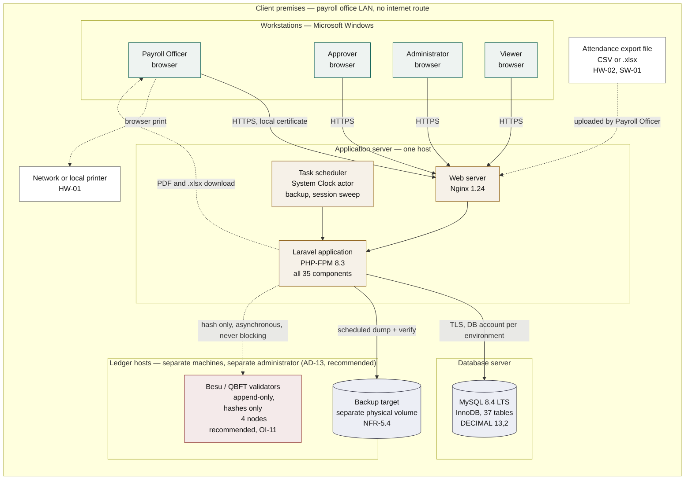
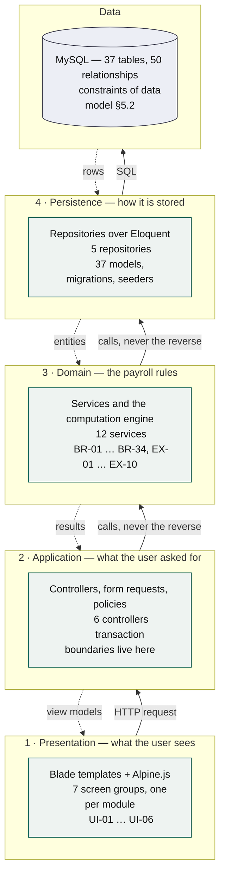
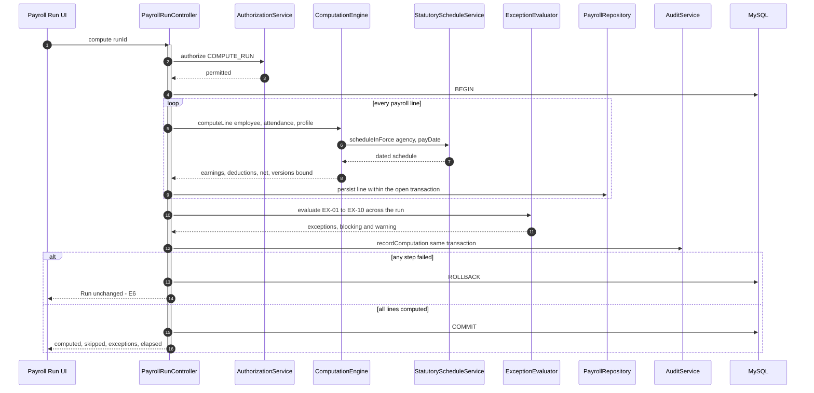
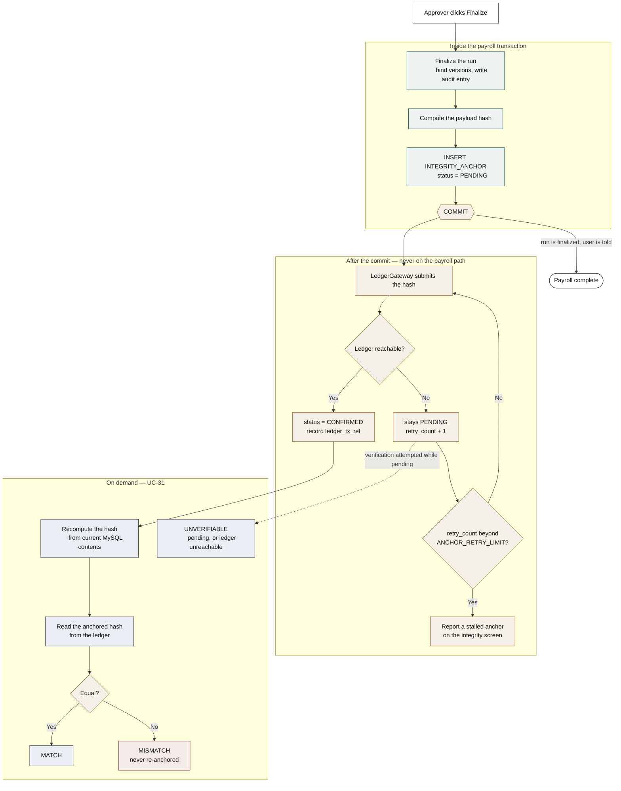
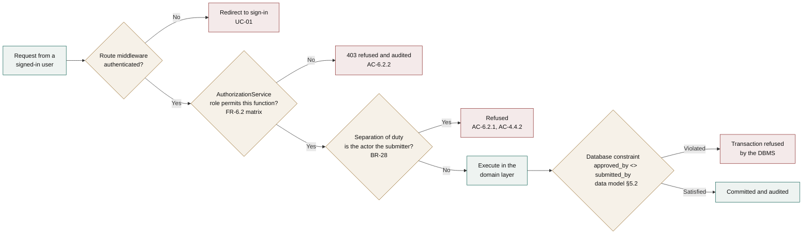

# System Architecture

**Project:** Payroll Management System
**Document:** System Architecture and Deployment Design
**Version:** 1.1
**Date:** August 30, 2026
**Baseline:** B1 — frozen August 30, 2026 · see [baseline.md](./baseline.md)
**Traces to:** [FRS](./functional-requirements-specification.md) → [Use Case Model](./use-case-model.md) → [Behavioral Diagrams](./behavioral-diagrams.md) → [Data Model](./data-model.md)

---

## Document control

| | |
|---|---|
| Architectural layers | 4 |
| Components specified | 35 (14 of them already named in behavioral §1.4) |
| Modules realized | 7 (M1 – M7, FRS §2.2) |
| Entities persisted | 37 in 6 subject areas (data model §2) |
| Architectural decisions | 16 (AD-01 … AD-16) |
| Diagrams | 6 |
| Open items closed | OI-08 |

---

# 1. About this document

## 1.1 Purpose

The FRS says *what* the system must do; the use case model says *who asks for it*; the behavioral diagrams say *in what order*; the data model says *what is stored*. This document says **where the code lives and what talks to what** — the structure that has to exist for the other four documents to be implementable.

It is the last of the design documents and the only one that commits to technology. Every choice below is traceable to a constraint or a non-functional requirement already stated in the FRS; where a choice was genuinely free, §10 records it as a decision rather than presenting it as a deduction.

## 1.2 Notation

Diagrams are Mermaid, consistent with the rest of the document set. Components are named exactly as the behavioral document names them, so that a reader moving between the two documents is following one vocabulary. Components this document introduces are marked **⊕** on first appearance, exactly as the data model marks the entities it adds beyond the FRS inventory.

## 1.3 Relationship to the behavioral document

Behavioral §1.4 names **14 participants**. Those 14 are the components the four modelled use cases needed — not the system's full inventory. This document specifies **35**, of which those 14 are a subset with their names and responsibilities unchanged.

| Layer | Components | Of which named in behavioral §1.4 |
|---|:---:|:---:|
| Presentation | 8 | 1 — `Payroll Run UI` |
| Application | 7 | 1 — `PayrollRunController` |
| Domain | 14 | 9 |
| Persistence | 6 | 3 |
| **Total** | **35** | **14** |

No participant was renamed, merged, or given a different responsibility. The 21 additions serve use cases the behavioral document did not model — attendance import, leave, reporting, backup, the reference-data screens of M1, and the presentation and persistence ends of the integrity layer.

---

# 2. Architectural drivers

An architecture is an answer to constraints. These are the ones that actually shaped it; requirements that any reasonable structure would satisfy are not listed.

| Driver | Source | Consequence for the architecture |
|---|---|---|
| **No internet connection for any function** | C-03, SW-04 | Rules out any hosted or cloud component. Every element runs inside the client's premises (§3) |
| **At least four simultaneous users** | NFR-7.1 | Rules out a single-workstation deployment. Requires a shared database with real transaction isolation (§3, §6.3) |
| **Statutory logic data-driven, never hardcoded** | C-01 | `StatutoryScheduleService` resolves schedules by effectivity date at run time; no agency rule appears in source (§6.1) |
| **Historical runs reproducible after rate changes** | C-04, DR-2.2 | Version binding at computation time, enforced in the domain layer and stored as foreign keys (§6.2) |
| **Decimal money, never binary floating point** | C-02, BR-01, DR-2.3 | `DECIMAL(13,2)` in MySQL and PHP `BCMath` in the computation path — never a PHP float (§6.4) |
| **Preparer cannot approve** | BR-28, FR-6.2, AC-6.2.1 | `AuthorizationService` is consulted at every entry point, and the rule is *also* a database constraint (§7.2) |
| **Audit written in the same transaction as the change** | BR-26, BR-27, FR-6.1 | `AuditService` participates in the caller's transaction; `AUDIT_LOG` is append-only (§6.5) |
| **Encrypted client–server communication** | CM-01 | HTTPS with a locally-issued certificate, no public CA and no internet dependency (§7.1) |
| **Operable by staff whose prior tool was Excel** | C-05, UI-01 … UI-06 | Server-rendered screens, full keyboard operation, no client installation to learn (§4.1) |
| **Backup on a defined schedule with a documented restore** | NFR-5.4, UC-07 | `BackupService` ⊕ driven by the `System Clock` actor, not by a user (§8.2) |
| **Alteration outside the application must be detectable** | FR-6.3, BR-35, BR-36 | A permissioned ledger on a separate host under separate administrative control, holding hashes only. Anchoring is asynchronous so payroll never waits for it (§6.7, §7.3) |
| **Anchoring must never delay or fail a payroll operation** | AC-6.3.5, NFR-3.5 | Transactional outbox: the anchor row commits with the payroll action, transmission happens after (§6.7) |
| **No payroll data may leave the payroll database** | AC-6.3.6 | Only hashes, record identifiers, and timestamps are transmitted. The ledger holds fingerprints, never records (§7.3) |

---

# 3. Deployment view — closing OI-08

**OI-08** asked whether the deployment target is a single workstation, a local network, or a hosted service. **The requirements already answer it**, and this document records the answer rather than choosing one.

| Candidate | Verdict |
|---|---|
| Hosted / cloud | **Excluded by C-03 and SW-04.** The system must require no internet connection for any function |
| Single workstation | **Excluded by NFR-7.1.** One workstation cannot serve four simultaneous users, and the separation of duty in BR-28 assumes a Payroll Officer and an Approver working independently |
| **Local network** | **The only candidate that survives.** It is also what FRS §2.4 already assumed. CM-01 originally made its encryption requirement conditional on this very question; with the question closed, it now applies unconditionally to every session |

What remained genuinely open was the *client style*: FRS §2.4 permits "a client–server or web application." That is **AD-01** in §10 — a browser-based application served from a LAN server.



**Figure 1.** *Deployment view — local network, no internet route*

**Reading the diagram.** Everything inside the boundary is on the client's premises and reachable only from the office LAN. There is no line leaving it, which is C-03 drawn rather than asserted.

The application server and database server are shown separately because they are separate *roles*, not necessarily separate *machines*. For a workforce of the size in OI-01 they may be the same host, and §8.1 says when they should not be. Splitting them later requires a connection-string change and no code change, which is the point of drawing them apart now.

**The ledger host is the point of the integrity layer.** It is inside the premises boundary — C-03 still holds, and no hash leaves the building — but it is deliberately *outside* the payroll database's administrative control. That separation is the entire guarantee: a database administrator who alters a payroll figure in MySQL cannot also alter the hash that proves the figure changed, because they do not administer the machine holding it. If one person administers both, FR-6.3 degrades from tamper-evidence to a checksum, which is why AD-13 and OI-11 both insist on the separation.

The line to the ledger is dashed for the same reason as the other two dashed lines: it carries no payroll data and it is not on any request path. A run finalizes whether or not that line is up.

Two lines are dashed because they are file movements rather than protocol connections: the attendance export enters as an uploaded file (HW-02 forbids the system from talking to the timekeeping device), and payslips leave as a download the browser prints (HW-01 requires no specific printer).

---

# 4. Layered architecture



**Figure 2.** *Layered architecture — dependencies point downward only*

## 4.1 What each layer may and may not do

| Layer | Holds | Must not |
|---|---|---|
| **Presentation** | Screens, form markup, client-side formatting and inline validation display (UI-03, UI-05) | Contain a payroll rule. No `BR-nn` is implemented here. Client-side validation is a convenience; the authoritative check is in the domain layer |
| **Application** | Controllers, request validation, policy checks, **transaction boundaries** | Perform arithmetic. A controller decides *whether* a computation runs and *what happens if it fails*, never *what the answer is* |
| **Domain** | Every business and computation rule, the exception rules, the statutory application, and the authorization decision | Know about HTTP or about SQL. A domain service takes and returns values, not requests or query builders |
| **Persistence** | Repositories, Eloquent models, migrations, and query construction | Contain a payroll rule. A repository retrieves and stores; it does not decide |
| **Data** | Tables, keys, and the constraints of data model §5.2 | — |

**The one rule that matters:** dependencies point downward only. The domain layer has no reference to the application layer, which is what makes the computation testable without a browser and is what NFR-2.7's parallel run depends on — the engine can be driven directly by a test harness against the same 30 employees the manual computation covers.

**Why server-rendered rather than a single-page application.** C-05 says the system must be operable by staff whose prior tool was Excel, and UI-06 requires keyboard-only data entry. Server-rendered pages with progressive enhancement give predictable tab order and native form behavior for free. A single-page application would add a build step, a second language, and an API surface the FRS never asks for — the system has no mobile client, no third-party consumer, and no offline-client requirement.

---

# 5. Component architecture

```mermaid
flowchart TB
    subgraph PRES["Presentation — 7 screen groups"]
        direction LR
        S1["Admin Screens ⊕
        M1"]
        S2["Employee Screens ⊕
        M2"]
        S3["Attendance Screens ⊕
        M3"]
        S4["Payroll Run UI
        M4, M5"]
        S5["Payslip Screens ⊕
        M6"]
        S6["Report Screens ⊕
        M7"]
        S7["Sign-in Screen ⊕
        M1"]
        S8["Integrity Screens ⊕
        M1"]
    end

    subgraph APPL["Application — 6 controllers"]
        direction LR
        C1["AdminController ⊕
        M1"]
        C2["EmployeeController ⊕
        M2"]
        C3["AttendanceController ⊕
        M3"]
        C4["PayrollRunController
        M4, M5"]
        C5["PayslipController ⊕
        M6"]
        C6["ReportController ⊕
        M7"]
        C7["IntegrityController ⊕
        M1"]
    end

    subgraph DOM["Domain — 12 services"]
        direction LR
        D1["ComputationEngine
        M4"]
        D2["StatutoryScheduleService
        M1, M4"]
        D3["ExceptionEvaluator
        M5"]
        D4["PayslipService
        M6"]
        D5["AuthorizationService
        M1"]
        D6["AuditService
        M1"]
        D7["NotificationService
        M5"]
        D8["ValidationService ⊕
        M2, M3"]
        D9["AttendanceImportService ⊕
        M3"]
        D10["LeaveService ⊕
        M3"]
        D11["ReportService ⊕
        M7"]
        D12["BackupService ⊕
        M1, M7"]
        D13["LedgerAnchorService
        M1"]
        D14["IntegrityVerificationService
        M1"]
    end

    subgraph PERS["Persistence — 5 repositories"]
        direction LR
        R1["EmployeeRepository
        M2"]
        R2["AttendanceRepository
        M3"]
        R3["PayrollRepository
        M7"]
        R4["ReferenceRepository ⊕
        M1"]
        R5["StatutoryRepository ⊕
        M1"]
        R6["LedgerGateway ⊕
        M1"]
    end

    DBX[("MySQL — 37 entities")]

    PRES --> APPL
    APPL --> DOM
    DOM --> PERS
    PERS --> DBX

    classDef known fill:#eef3f1,stroke:#0F6154,stroke-width:2px,color:#111;
    classDef added fill:#f6f1e8,stroke:#8A5A12,stroke-width:1px,color:#111;
    classDef data fill:#eceef5,stroke:#334,stroke-width:1px,color:#111;
    class S4,C4,D1,D2,D3,D4,D5,D6,D7,D13,D14,R1,R2,R3 known;
    class S1,S2,S3,S5,S6,S7,S8,C1,C2,C3,C5,C6,C7,D8,D9,D10,D11,D12,R4,R5,R6 added;
    class DBX data;
```



**Figure 3.** *Component architecture — green components are the 14 named in behavioral §1.4; amber are the 21 this document adds*

## 5.1 Component responsibilities

Only the 21 additions are specified here. The 14 in green keep the responsibilities behavioral §1.4 assigned them, unchanged and unrestated.

| ⊕ Component | Layer | Responsibility | Serves |
|---|---|---|---|
| `Sign-in Screen` | Presentation | Credential entry, lockout messaging, session expiry notice | FR-0.1, UC-01 |
| `Admin Screens` | Presentation | Users and roles, organization profile, payroll calendar, reference lists, statutory schedules, audit log, backup | FR-0.2 – 0.4, FR-2.3 †, FR-6.1, UC-02 – UC-07 |
| `Employee Screens` | Presentation | Master file, compensation profile, loan accounts | FR-1.1, FR-1.2, UC-08 – UC-12 |
| `Attendance Screens` | Presentation | Import, exception encoding, leave filing and approval | FR-1.3, FR-1.4, UC-13 – UC-16 |
| `Payslip Screens` | Presentation | Generation, batch export, reprint | FR-3.1 – 3.4, UC-27, UC-28 |
| `Report Screens` | Presentation | Report catalogue, parameters, search | FR-5.2, FR-5.3, UC-29, UC-30 |
| `AdminController` | Application | Orchestrates M1 maintenance; owns the transaction for every reference-data change | FR-0.2 – 0.4, FR-2.3 †, NFR-5.4 † |
| `EmployeeController` | Application | Orchestrates M2; owns the transaction for employee and compensation changes | FR-1.1, FR-1.2 |
| `AttendanceController` | Application | Orchestrates M3; owns the import transaction — an import is all-or-nothing | FR-1.3, FR-1.4 |
| `PayslipController` | Application | Orchestrates generation and reprint; refuses both unless the run is `Finalized` | FR-3.1 – 3.4, AC-4.4.4 |
| `ReportController` | Application | Orchestrates search and report generation; applies the role filter before the query | FR-5.2, FR-5.3, FR-6.2 |
| `ValidationService` | Domain | The authoritative implementation of UC-I1 — required fields, ranges, date logic, duplicate detection | FR-1.5, AC-1.5.1 – 4 |
| `AttendanceImportService` | Domain | Parses CSV and `.xlsx` against the published template, maps rows to employees, reports rejects without partial commit | FR-1.3, SW-01, UC-13 |
| `LeaveService` | Domain | Leave balances, overlap refusal, posting approved leave to the covering period | FR-1.4, BR-09 – BR-10, UC-15, UC-16 |
| `ReportService` | Domain | Builds the eleven reports of the FR-5.3 catalogue from stored data; performs no computation of its own | FR-5.3, AC-5.3.1 – 5 |
| `BackupService` | Domain | Scheduled dump, verification, and the documented restore path. Triggered by the `System Clock` actor | NFR-5.4 †, UC-07 |
| `ReferenceRepository` | Persistence | Departments, positions, employment statuses, earning and deduction types, leave types, holidays, system config | FR-0.4, 8 entities |
| `StatutoryRepository` | Persistence | Dated schedules and their brackets; effectivity-range queries | FR-2.3 †, 2 entities |
| `Integrity Screens` | Presentation | Verification request, result display with both hashes, pending-anchor status, PDF export of an outcome | FR-6.3, UC-31 |
| `IntegrityController` | Application | Orchestrates verification; owns the transaction that persists a verification result. Holds no hashing logic | FR-6.3, AC-6.3.7 |
| `LedgerGateway` | Persistence | The only component that speaks to the ledger. Submits a hash, reads one back, and reports unreachability as a distinct outcome rather than as a failure | FR-6.3, AC-6.3.3, AC-6.3.5 |

† These three are administered from **M1** while their effect belongs to **M4** or **M7** — the split FRS §2.2 and use-case Table 1 both record. The architecture reproduces it rather than resolving it: `Admin Screens` and `AdminController` are M1 components, and they drive `StatutoryScheduleService` and `BackupService`, whose effects land in M4 and M7.

## 5.2 Module-to-layer map

Every module of FRS §2.2 is present at every layer it needs, and no module owns a layer.

| Module | Presentation | Application | Domain | Persistence |
|---|---|---|---|---|
| **M1** System Administration | `Sign-in Screen` ⊕, `Admin Screens` ⊕, `Integrity Screens` ⊕ | `AdminController` ⊕, `IntegrityController` ⊕ | `AuthorizationService`, `AuditService`, `StatutoryScheduleService`, `BackupService` ⊕, `LedgerAnchorService`, `IntegrityVerificationService` | `ReferenceRepository` ⊕, `StatutoryRepository` ⊕, `LedgerGateway` ⊕ |
| **M2** Employee Management | `Employee Screens` ⊕ | `EmployeeController` ⊕ | `ValidationService` ⊕ | `EmployeeRepository` |
| **M3** Attendance & Leave | `Attendance Screens` ⊕ | `AttendanceController` ⊕ | `AttendanceImportService` ⊕, `LeaveService` ⊕, `ValidationService` ⊕ | `AttendanceRepository` |
| **M4** Payroll Computation | `Payroll Run UI` | `PayrollRunController` | `ComputationEngine`, `StatutoryScheduleService` | `PayrollRepository`, `EmployeeRepository`, `AttendanceRepository` |
| **M5** Validation & Approval | `Payroll Run UI` | `PayrollRunController` | `ExceptionEvaluator`, `NotificationService`, `AuthorizationService` | `PayrollRepository` |
| **M6** Payslip | `Payslip Screens` ⊕ | `PayslipController` ⊕ | `PayslipService` | `PayrollRepository` |
| **M7** Records & Reporting | `Report Screens` ⊕ | `ReportController` ⊕ | `ReportService` ⊕, `BackupService` ⊕ | `PayrollRepository` |

---

# 6. How the architecture satisfies the hard requirements

Six requirements are not satisfiable by any structure. Each needed a specific mechanism, and each is named here so the panel can be shown the mechanism rather than told it exists.

## 6.1 C-01 — statutory logic that a rate change does not recompile

`StatutoryScheduleService` receives a pay date and an agency and returns the schedule whose effectivity range contains that date. **No SSS bracket, PhilHealth rate, Pag-IBIG cap, or BIR band appears anywhere in source code.** All of it is rows in `STATUTORY_SCHEDULE` and `STATUTORY_BRACKET`, maintained through `Admin Screens` by the Administrator (UC-05).

The test is AC-2.3.1: a new schedule can be entered and take effect with no source modification. The architecture makes that structurally true rather than a matter of discipline — the computation engine has no branch on agency values because it never sees one.

## 6.2 C-04 — runs that stay reproducible after the rates change

Version binding happens **once, at computation time, inside the domain layer**. `ComputationEngine` writes `PAYROLL_LINE.compensation_profile_id` and `DEDUCTION_LINE.statutory_schedule_id` as it computes, and `PayrollRunController` fixes them at finalization (behavioral Figure 3, `H3`).

Nothing recomputes on read. A payslip reprinted three years later (UC-28) renders stored values through `PayslipService`; it does not re-run the engine. This is why AC-2.3.3 and AC-5.1.3 can both pass, and why superseding a schedule is safe.

## 6.3 NFR-7.1 — four users without lost updates

| Concern | Mechanism |
|---|---|
| Two users editing one employee | Optimistic locking on the row version; the second save is refused with a reload prompt, never silently merged |
| Two users computing one run | The run's state is read inside the transaction that changes it. `Draft → For Review` is a guarded update, so the second submission finds the state already moved and is refused (AC-4.4.1) |
| A computation and a correction colliding | `is_stale` is set inside the correcting transaction. The engine reads the stale set at the start of its own transaction, so a correction arriving mid-run is picked up by the next recomputation rather than half-applied to this one |
| Approve and finalize racing | `PAYROLL_RUN.run_status` is checked and updated in one statement under `SERIALIZABLE` isolation for transition operations; every other read uses `REPEATABLE READ` |

## 6.4 C-02 — decimal arithmetic end to end

PHP has no native decimal type, and this is the single most likely place for a correct design to be undone in implementation.

| Stage | Rule |
|---|---|
| Storage | `DECIMAL(13,2)` for money, `DECIMAL(6,4)` for multipliers, `DECIMAL(7,2)` for hours (data model §1.4) |
| Retrieval | Eloquent casts money columns to string, **never to float** |
| Computation | `ComputationEngine` uses `BCMath` throughout; PHP's native arithmetic operators are not used on a monetary value |
| Rounding | Half-up to two decimals at each step defined by BR-01, not once at the end |
| Display | Two decimals, thousands separator, right-aligned (UI-03) |

**A single `(float)` cast anywhere in this path defeats BR-01 and NFR-2.7.** The parallel run of 30 employees across three periods is the test that would catch it, and it is worth running early rather than at acceptance.

## 6.5 BR-26, BR-27 — audit that cannot drift from the change

`AuditService` does not open its own transaction. It enlists in the caller's, so an audit row and the change it records commit together or roll back together — there is no window in which one exists without the other.

`AUDIT_LOG` is append-only, enforced at the database rather than in the application: the application's MySQL account holds `INSERT` and `SELECT` on that table and **not** `UPDATE` or `DELETE` (data model §5.2). An application bug cannot rewrite history, which is the property BR-27 is actually asking for.

## 6.6 UC-18 — all-or-nothing computation

`PayrollRunController` opens one transaction for the whole run. A failure at employee 61 of 120 rolls back all 120 (UC-18 E6). A run is never left half-computed, because a half-computed run is one the Payroll Officer would have to reconcile by hand — the exact work the system exists to remove.



**Figure 4.** *A compute request through the layers — the architectural view of behavioral Figure 1*

**Reading the diagram.** This is the same interaction behavioral Figure 1 models, drawn to show *which layer* each participant sits in rather than the full flow detail. Two things are visible here that the behavioral view does not emphasize: the transaction opens in the **application** layer and closes there, and every arrow points downward through the layers of Figure 2 — the engine never calls the controller back.

## 6.7 FR-6.3 — tamper-evidence without touching the payroll path

The integrity layer is additive. **No payroll component changed to accommodate it**, and the MySQL schema gained two tables (`INTEGRITY_ANCHOR`, `INTEGRITY_VERIFICATION`) and two columns on `AUDIT_LOG` — nothing was altered or removed. The anchoring behaviour is specified once as included use case **UC-I6** and invoked from UC-25 and UC-26; verification is **UC-31**.

### What is anchored, and when

| Event | Anchored content | Trigger |
|---|---|---|
| Run finalized (UC-25 → UC-I6) | Hash over the run's totals, its payroll lines, and the version references bound to them | The run becomes immutable (BR-36) |
| Reversal created (UC-26 → UC-I6) | Hash of the reversal record and its original figures | The reversal record is written |
| Audit segment closed | Root hash over entries written since the previous anchor | `SYSTEM_CONFIG.AUDIT_SEGMENT_INTERVAL_HOURS` on the scheduler |

Nothing is anchored while it can still legitimately change. A `Draft` run is not anchored; anchoring it would produce a stream of hashes recording nothing but ordinary work in progress.

### The outbox, and why anchoring is not in the transaction path

```
BEGIN
  ... finalize the run, bind versions, write the audit entry ...
  INSERT INTO INTEGRITY_ANCHOR (payload_hash, anchor_status = 'PENDING', ...)
COMMIT                     <-- payroll is done here; the user is told so
                           <-- everything below is after the fact
LedgerGateway submits the hash
  on success  -> anchor_status = 'CONFIRMED', ledger_tx_ref recorded
  on failure  -> stays PENDING, retry_count incremented, retried later
```



**Figure 5.** *Anchor lifecycle — queued in the transaction, transmitted after it, verified on demand*

**Reading the diagram.** The `COMMIT` node has two outgoing edges, and the distinction between them is the whole design. One goes to *Payroll complete* — the Approver is told the run is finalized and the payroll process is over. The other goes to the ledger, and **nothing downstream of it can affect the first.** A ledger that is unreachable loops through retry and eventually reports a stalled anchor on a screen; it never reaches back into the payroll path.

Two properties fall out of this shape, and both are requirements:

- **A committed payroll action always has an anchor row** (`AC-6.3.1`), because the row commits in the same transaction. A rolled-back action leaves none.
- **The ledger can be down and payroll still works** (`AC-6.3.5`). Nothing on the finalize path waits for a network call to another machine. This is also why NFR-3.5's five-minute payslip window is unaffected: anchoring is not on it.

Writing the anchor *synchronously* would have inverted both — a ledger outage would have blocked finalization, making the integrity layer a new single point of failure in the payroll process it exists to protect. **That is the trade AD-12 records, and it is the one architectural mistake this feature invites.**

### What the layer does and does not give you

| | |
|---|---|
| **Detects** | A payroll figure changed directly in MySQL; a finalized run deleted; an audit entry altered or removed; a doctored backup restored over a good one |
| **Does not prevent** | Any of the above. FR-6.3 makes them *provable after the fact*; FR-6.2 and BR-27 are what prevent them through the application |
| **Does not detect** | A wrong figure entered correctly through the application. That is a data-entry error, and FR-4.1's exception rules are what catch it |

The last row matters at a defense. A ledger proves a record has not changed **since it was anchored**. It says nothing about whether the record was right when written, and claiming otherwise would be the easiest thing in this design to overstate.

---

# 7. Security architecture

## 7.1 Transport and access

| Control | Implementation | Satisfies |
|---|---|---|
| Encrypted client–server traffic | HTTPS with a certificate issued by a local authority or self-signed and installed on the four workstations. No public CA, no internet dependency | CM-01, C-03 |
| No public exposure | The server binds to the LAN interface only. No port forwarding, no dynamic DNS, no remote access path | C-03, NFR-6.5 |
| Password storage | `bcrypt` via Laravel's hasher, salted per user. `USER.password_hash` and `password_salt` | NFR-6.5, AC-0.1.4 |
| Session timeout | Idle timeout from `SYSTEM_CONFIG.SESSION_TIMEOUT_MINUTES`, swept by the scheduler — the `System Clock` actor | BR-32, NFR-6.5 |
| Failed-login lockout | Counter in `USER.failed_attempt_count` against `SYSTEM_CONFIG.FAILED_LOGIN_LIMIT` | BR-31 |
| Individual accounts | No shared account exists; `USER.username` is unique and every audit row names one | NFR-6.5, FR-6.1 |
| Database credentials | Held server-side only. A browser never holds a database credential — a property the desktop alternative in AD-01 would not have given us | NFR-6.5 |

## 7.2 Authorization — enforced twice, deliberately



**Figure 6.** *Authorization chain — application check and database constraint*

**Why the check is duplicated.** AC-6.2.2 requires that a function absent from a role's permissions be *refused if invoked directly*, not merely hidden. Hiding a control is a presentation concern and is not a security control; `AuthorizationService` refusing the call is. The database constraint behind it is the backstop: even a defect in the application layer cannot commit a run whose approver equals its submitter, because the DBMS will not accept the row.

This is the strongest single argument the design makes against the spreadsheet it replaces. **A worksheet cannot refuse to let the preparer sign as approver.** Here it is refused twice, and the second refusal does not depend on the application being correct.

## 7.3 The ledger, and the trust boundary it draws

| Property | Choice | Why |
|---|---|---|
| **Type** | Permissioned, on-premises, no public network | C-03 and SW-04 forbid an internet dependency. A public chain is not available to this system at any price (AD-10) |
| **Platform** | Hyperledger Besu, QBFT consensus | Recognizable as a ledger, Ethereum-tooled, and operable by one office. Fabric's multi-organization machinery would go unused here (AD-14) |
| **Nodes** | Four validators — **a recommended baseline, pending OI-11** | Four is the smallest count tolerating one Byzantine validator (3f+1, f=1). At roughly 400 anchor writes a year, node count is driven entirely by the trust argument, never by throughput |
| **Contents** | Hashes, record identifiers, timestamps. Nothing else | AC-6.3.6. Payroll data is personal data; putting it on an append-only store that by design cannot be corrected or erased would be a serious mistake, not a feature (AD-11) |
| **Placement** | A separate host from the application and database servers | So that compromising the payroll database does not also compromise the evidence about it (AD-13) |
| **Administration** | A different administrator from the payroll DBA — **recommended, pending OI-11** | The whole guarantee. Same person on both, and the layer proves nothing an ordinary checksum would not. The recommendation is the external IT contact of FRS §2.3 |
| **Access from the app** | One component, `LedgerGateway` ⊕, write-and-read only | No component can delete or amend an anchor, because the gateway exposes no such call |

**Where the guarantee actually comes from.** Not from cryptography — a hash chain inside MySQL would be equally cryptographic and equally worthless against someone who controls MySQL. It comes from **the hashes living somewhere the payroll administrator does not control.** Everything else in §7.3 is in service of that one sentence.

### What is settled, and what is not

| | |
|---|---|
| **Settled** | The platform (Besu with QBFT, AD-14), that the ledger runs on-premises with no internet route (AD-10), that only hashes are written (AD-11), and that anchoring is asynchronous (AD-12) |
| **Recommended, awaiting the client** | Four validators, and the ledger hosts administered by the external IT contact with the payroll database account excluded. This is the arrangement that makes FR-6.3 a control against a determined insider, and it requires no new hire — only a separation of credentials that already exist |
| **Unaffected either way** | The design. `LedgerGateway` ⊕ is the only component that touches the ledger, and it addresses a network endpoint. Node count, node placement, and administrator identity are deployment configuration; none of them appears in any component, table, or interface |

**This is why OI-11 does not block the build.** It can be answered after the integrity layer is written and tested, because the answer changes a configuration file and an operations runbook, not a line of application code.

**What it does change is the claim.** With administrative separation, FR-6.3 detects alteration by anyone, a database administrator included. Without it, FR-6.3 detects accidental corruption, failed restores, and application defects. Both are real; only one should be written in Chapter IV, and which one is not this document's to decide.

---

# 8. Deployment and operations

## 8.1 Sizing and separation

The application and database roles may share one host. They should be separated when any of the following becomes true:

- The employee count from OI-01 grows beyond a few hundred, making report queries contend with request handling
- The retention period from OI-10 makes the database large enough that backup duration interferes with the working day
- The client's IT policy requires the database on a managed server

Separation is a configuration change. No component in Figure 3 knows which host the database is on.

## 8.2 Backup and restore — NFR-5.4

| | |
|---|---|
| **Trigger** | Scheduler on the application host, acting as the `System Clock` actor (use-case §2.1). Not a user action |
| **Content** | Full logical dump of all 37 tables, plus the uploaded attendance files retained for audit. The ledger is backed up separately by its own host — a backup that contained both the records and the evidence about them would defeat the separation AD-13 exists for |
| **Destination** | A physical volume separate from the database's own storage. A backup on the same disk is not a backup |
| **Verification** | Each dump is restored to a scratch schema and row-counted against the source. An unverified backup is an assumption, and NFR-5.4's verification method requires a demonstrated restore |
| **Restore** | Documented procedure, exercised at least once before acceptance, performed by the Administrator through UC-07 |
| **Retention** | Governed by `SYSTEM_CONFIG.RECORD_RETENTION_YEARS`, pending OI-10 (DR-2.1) |
| **Integrity after restore** | A restore is exactly the event FR-6.3 exists to check. After any restore, run UC-31 across the restored periods before returning the system to use: a restored backup that verifies is proven current, and one that does not is proven stale or altered. This turns the restore procedure from a hope into a test |

## 8.3 Environments

Development, a staging copy for the parallel run of NFR-2.7, and production. The parallel run needs staging to hold real employee data, so **staging carries the same access controls as production** — it is not a relaxed environment, and the same four roles apply to it.

## 8.4 Schema management

Every schema change is an Eloquent migration under version control. The 37 tables, their 50 relationships, the check constraints of data model §5.2, and the seed data for the reference lists are all reproducible from the repository with one command. This is what lets the panel be shown a schema that provably matches the data model rather than one that drifted from it.

---

# 9. Technology stack

Every selection below is fixed. Where two products would both have served, the alternative is named with what changing to it would cost, so a later substitution is a known quantity rather than a rediscovery.

## 9.1 The stack

| Layer | Selection | Version | Why this one |
|---|---|---|---|
| **Server OS** | Ubuntu Server LTS | 24.04 | The reference platform for the rest of this stack, and the one its documentation assumes. Windows Server is a drop-in substitute (AD-15) |
| **Web server** | Nginx | 1.24+ | Standard PHP-FPM pairing. Apache 2.4 with `mod_php` or FPM serves identically here; nothing in the application depends on either |
| **Runtime** | PHP | 8.3 | Required extensions: **bcmath** (C-02, non-negotiable), `pdo_mysql`, `mbstring`, `intl`, `zip`, `gd`, `openssl` |
| **Framework** | Laravel | 11.x | AD-02 |
| **ORM** | Eloquent | bundled | 37 models, migrations, seeders (§8.4) |
| **Views** | Blade + Alpine.js | Alpine 3.x | AD-06. Server-rendered, progressive enhancement |
| **Asset build** | Vite | bundled | **Build time only.** Compiled CSS and JS are deployed as files; no Node runtime and no CDN on the server (C-03, AD-16) |
| **Database** | MySQL | 8.4 LTS | AD-03. InnoDB, `utf8mb4`, `DECIMAL(13,2)` for money. MariaDB 11.4 is compatible with every feature used here |
| **Money arithmetic** | BCMath | bundled with PHP | §6.4. No native float appears in the computation path |
| **PDF** | DomPDF via `barryvdh/laravel-dompdf` | 3.x | Pure PHP with no external binary to install or keep patched on an offline server. Payslips and reports are simple table layouts, which is what DomPDF does well (SW-02) |
| **Spreadsheet** | PhpSpreadsheet | 2.x | Reads the `.xlsx` and CSV attendance template (SW-01) and writes tabular exports (SW-02) |
| **Queue** | Laravel queue, `database` driver | bundled | Carries anchor transmission and retries (§6.7). The database driver avoids adding Redis for a workload of roughly 400 jobs a year |
| **Scheduler** | Laravel scheduler, invoked by system cron | bundled | The `System Clock` actor: backup, session sweep, audit-segment close (AD-09) |
| **Password hashing** | Bcrypt via Laravel's hasher | bundled | NFR-6.5, AC-0.1.4 |
| **Ledger** | Hyperledger Besu, QBFT | 24.x | AD-14. Installed from the official distribution as a systemd service — no container runtime required |
| **Ledger contract** | Solidity anchor contract | 0.8.x | One function, `anchor(bytes32 payloadHash, string calldata ref)`. Free gas; there is no economics on a private network |
| **Ledger client** | JSON-RPC over HTTP from `LedgerGateway` ⊕ | — | One HTTP call and one response. A full web3 library would be a dependency carried for two methods |
| **Testing** | PHPUnit | bundled | Plus the NFR-2.7 parallel-run harness, which drives `ComputationEngine` directly (AD-04, AD-05) |
| **Version control** | Git | — | Migrations and seeders under version control are what make §8.4's claim checkable |

## 9.2 Deliberately not in the stack

Naming what was left out is as useful as naming what went in, because each of these is something a reviewer may expect to see.

| Not used | Why not |
|---|---|
| **Redis / Memcached** | Four users and ~400 background jobs a year. The database queue and cache drivers are sufficient, and every service added is a service the client must keep running |
| **Docker / Kubernetes** | One application host and one ledger host, handed over to a small office. Native packages and systemd units are what its administrator can already read and repair |
| **A JavaScript SPA framework** | AD-06. No mobile client, no third-party API consumer, no offline-client requirement |
| **Node.js on the server** | Vite runs at build time. Shipping a Node runtime to production would add an attack surface and a patching obligation for nothing |
| **Any CDN or external package source at run time** | C-03 and SW-04. See §9.3 |
| **A public certificate authority** | §7.1. Certificates are issued locally |

## 9.3 The consequence of C-03 that is easiest to miss

**A server with no internet route cannot run `composer install` or `npm install`.** This is the most common way an otherwise correct offline deployment fails on installation day.

| | |
|---|---|
| **Dependencies** | Resolved and installed during build, on a machine that does have network access. The `vendor/` directory and the compiled `public/build/` assets are part of the deployed artifact, not something the server fetches |
| **Deployment artifact** | A single versioned archive: application code, `vendor/`, compiled assets, and migrations. It is copied to the server and unpacked |
| **Updates** | A new archive, built the same way. The server never reaches out |
| **Besu and system packages** | Downloaded and staged with the same discipline, or installed from a local package mirror the client's IT contact maintains |

This is **AD-16**, and it belongs in the deployment runbook rather than only here — it is a step that gets discovered at the worst possible moment otherwise.

---

# 10. Architectural decisions

Where the requirements determined the answer, §2 and §3 say so. These sixteen were genuine choices. **AD-10 through AD-14 concern the integrity layer**, and **AD-15 and AD-16 the platform it all runs on (§9).** AD-12 and AD-13 are the two that decide whether it is worth having, and **AD-13 is the only decision in this document still awaiting client validation** (OI-11).

| ID | Decision | Alternative considered | Why |
|---|---|---|---|
| **AD-01** | Browser-based application served from a LAN server | Windows desktop client with a shared database | One deployment point and one update path for four workstations; no database credential leaves the server; CM-01 satisfied by HTTPS. Cost: keyboard-only operation (UI-06) and printing (HW-01) need deliberate attention rather than coming free |
| **AD-02** | Laravel 11 on PHP 8.3 | ASP.NET Core, Django, Spring Boot | Eloquent maps cleanly onto the 37 entities; migrations make §8.4 achievable; the stack is well supported locally, which matters for a system the client must maintain after handover |
| **AD-03** | MySQL 8.4 LTS with InnoDB | PostgreSQL, SQL Server Express | `DECIMAL(13,2)`, real foreign keys, and transactional DDL-free migrations are all that NFR-6.4 requires, and the client's environment is more likely to have MySQL administration available |
| **AD-04** | Four layers with downward-only dependencies | Domain-driven design with aggregates; transaction script | The payroll rules are substantial enough to need a domain layer and simple enough not to need aggregates. The decisive factor is NFR-2.7: the engine must be drivable by a test harness with no HTTP and no database |
| **AD-05** | Repository interfaces over Eloquent, not Eloquent directly in services | Active Record used throughout | Keeps `ComputationEngine` free of persistence concerns so the parallel run can drive it with fixtures. Cost: five thin classes that add no behavior |
| **AD-06** | Server-rendered Blade with Alpine.js | React or Vue single-page application | No mobile client, no third-party API consumer, and no offline-client requirement exists. An SPA would add a build pipeline and an API surface no requirement asks for, against C-05 |
| **AD-07** | `BCMath` for every monetary operation | Native PHP arithmetic with rounding discipline | BR-01 and C-02 forbid binary floating point. Discipline is not a mechanism; a library that has no float path is |
| **AD-08** | Authorization enforced in the application **and** as a database constraint | Application-layer enforcement alone | AC-6.2.1 and BR-28 are the design's strongest control. The backstop holds even if the application is wrong |
| **AD-09** | Scheduled work runs on the application host as the `System Clock` actor | An external cron or a manual procedure | Keeps backup and session sweeping inside the system boundary where the use case model already placed them (UC-07), and keeps them auditable |
| **AD-10** | Permissioned on-premises ledger | Public blockchain with periodic anchoring; hash chain in MySQL alone | A public chain requires internet access, which C-03 and SW-04 forbid outright. A hash chain inside MySQL is defeated by whoever controls MySQL, which is the exact threat FR-6.3 addresses. A permissioned node on a separate host is the only option that satisfies both |
| **AD-11** | Hashes only on the ledger, never payroll data | Encrypted payroll records on the ledger | Payroll data is personal data. An append-only store is by construction one you cannot correct or erase, which is the opposite of what personal data requires. Hashes carry the evidence without carrying the data (AC-6.3.6) |
| **AD-12** | Asynchronous anchoring via a transactional outbox | Synchronous write to the ledger inside the payroll transaction | Synchronous anchoring would let a ledger outage block finalization, making the integrity layer a new point of failure in the process it protects. The outbox keeps the guarantee (`AC-6.3.1`) without the coupling (`AC-6.3.5`) |
| **AD-13** | Ledger hosts administered by someone other than the payroll DBA — **recommended, pending client validation (OI-11)** | One administrator for everything | The guarantee comes from separation of control, not from cryptography. Same administrator on both, and FR-6.3 detects accident but not intent. The recommendation is the external IT contact of FRS §2.3, which needs no new hire — only a separation of credentials that already exist |
| **AD-15** | Ubuntu Server 24.04 LTS on the application and ledger hosts | Windows Server | Ubuntu is the platform this stack's documentation assumes, and it keeps the ledger host's service management identical to the application host's. **Windows Server changes nothing in the application** — same PHP, same Laravel, same MySQL, same Besu — only the runbook, the service definitions, and who is comfortable administering it. Confirm with the client's IT contact alongside OI-11; nothing waits on it |
| **AD-16** | Dependencies resolved at build time and shipped in the artifact | `composer install` on the server; a local package mirror | C-03 leaves the server with no route to Packagist or npm. Building elsewhere and deploying a complete artifact is the option that needs no infrastructure the client must maintain. A local mirror is the alternative if the client's IT prefers it, and costs a service to run (§9.3) |
| **AD-14** | Hyperledger Besu with QBFT consensus | Hyperledger Fabric; a minimal signed append-only log | Fabric's channels, MSPs, and orderers exist for multi-organization consortia — the case A-04 explicitly rules out — and would be machinery installed and handed over unused. A minimal signed log gives the same guarantee for this threat model but invites the objection that it is not a ledger at all. Besu is the middle: recognizable, Ethereum-tooled, and light enough for one office to operate. Node count is deployment configuration, not architecture — see §7.3 |

---

# 11. Traceability

**Table 1.** *Requirement to architectural element*

| Requirement | Realized by |
|---|---|
| FR-0.1 Authentication | `Sign-in Screen` ⊕, session middleware, `USER` credential columns (§7.1) |
| FR-0.2 – 0.4 Accounts, profile, reference data | `Admin Screens` ⊕, `AdminController` ⊕, `ReferenceRepository` ⊕ |
| FR-1.1 – 1.2 Employee and compensation | `Employee Screens` ⊕, `EmployeeController` ⊕, `EmployeeRepository` |
| FR-1.3 Attendance intake | `AttendanceImportService` ⊕, PhpSpreadsheet, `AttendanceRepository` (SW-01) |
| FR-1.4 Leave administration | `LeaveService` ⊕, `AttendanceRepository` |
| FR-1.5 Validation at entry | `ValidationService` ⊕ (authoritative) + inline display in Presentation (UI-05) |
| FR-2.1 – 2.2, 2.5 Computation | `ComputationEngine` with `BCMath` (§6.4) |
| FR-2.3 Statutory tables † | `StatutoryScheduleService`, `StatutoryRepository` ⊕, `Admin Screens` ⊕ (§6.1) |
| FR-2.4 Adjustments | `ComputationEngine`, `PayrollRepository` |
| FR-2.6 Payroll run lifecycle | `PayrollRunController` transaction boundary (§6.6) |
| FR-3.1 – 3.4 Payslips | `PayslipService`, `PayslipController` ⊕, DomPDF (SW-02) |
| FR-4.1 Exception report | `ExceptionEvaluator` (EX-01 … EX-10) |
| FR-4.2 – 4.3 Register and recomputation | `Payroll Run UI`, `PayrollRepository`, `is_stale` (§6.3) |
| FR-4.4 – 4.5 Approval and locking | `PayrollRunController`, `AuthorizationService`, `run_status` guarded updates (§6.3) |
| FR-5.1 – 5.3 Records and reporting | `ReportService` ⊕, `ReportController` ⊕, `PayrollRepository` |
| FR-6.1 Audit trail | `AuditService` enlisted in the caller's transaction (§6.5) |
| FR-6.2 Role-based access | `AuthorizationService` + database constraint (§7.2, Figure 6) |
| FR-6.3 Ledger-anchored integrity | `LedgerAnchorService`, `IntegrityVerificationService`, `LedgerGateway` ⊕, `Integrity Screens` ⊕, `IntegrityController` ⊕, `INTEGRITY_ANCHOR`, `INTEGRITY_VERIFICATION` (§6.7, §7.3) |
| DR-1.6, DR-2.2 – 2.4 | Persistence layer, migrations, version binding (§6.2, §8.4) |
| DR-2.1 Retention | `SYSTEM_CONFIG.RECORD_RETENTION_YEARS`, backup retention (§8.2) |
| NFR-2.7 Accuracy | Domain layer drivable without HTTP or database (AD-04, AD-05) |
| NFR-3.5 Issuance turnaround | Batch generation in `PayslipService`; server-side PDF rather than per-client rendering |
| NFR-5.4 Backup † | `BackupService` ⊕ on the scheduler (§8.2) |
| NFR-5.5 Retrieval performance | Indexes of data model §7.3; server-side pagination in `ReportController` ⊕ |
| NFR-6.3 Confirmation and reversal | UI-04 confirmation pattern; `REVERSAL_RECORD` through `PayrollRunController` |
| NFR-6.4 Database integrity | Constraints of data model §5.2, created by migration (§8.4) |
| NFR-6.5 Security | §7.1 in full |
| NFR-6.6 ISO/IEC 25010 evaluation | Not an architectural element — a verification activity |
| NFR-7.1 Concurrency | §6.3 in full |
| NFR-7.2 – 7.4 Quality expectations | Presentation layer conventions; ungated by FRS §5 |
| C-01 … C-05 | §6.1, §6.4, §3, §6.2, §4.1 respectively |
| UI-01 … UI-06 | Presentation layer; Blade layout carries user, role, and period context (UI-01) |
| HW-01 – HW-02 | Browser print (§3); file upload only, no device connection (§3) |
| SW-01 – SW-04 | PhpSpreadsheet, DomPDF, bank layout pending OI-06, no internet route (§3) |
| CM-01 – CM-02 | HTTPS on the LAN (§7.1); email out of scope |

**Coverage.** Every requirement item that has an architectural realization has one. NFR-6.6 is a verification activity and NFR-7.2 – 7.4 are ungated expectations, both marked as such rather than given an artificial element.

---

# 12. Open items affecting this architecture

| ID | Question | What it changes here |
|---|---|---|
| ~~**OI-08**~~ | ~~Deployment target~~ | ✅ **Closed by this document.** Local network, browser client, one application server (§3, AD-01) |
| **OI-01** | Employee count and growth | §8.1 sizing, and whether the application and database roles share a host |
| **OI-04** | Timekeeping device and export format | `AttendanceImportService` ⊕ parser; SW-01 template |
| **OI-06** | Bank and transmittal layout | One `ReportService` ⊕ output format |
| **OI-09** | One approver or multi-level | If multi-level, `PayrollRunController` gains a second approval state and FR-4.4's state machine changes. **The single item on this list that would alter the architecture rather than configure it** |
| **OI-10** | Retention period | §8.2 backup retention; `SYSTEM_CONFIG.RECORD_RETENTION_YEARS` |
| **OI-11** | Ledger node count and administrator — **platform now settled as Besu/QBFT (AD-14)** | §7.3. Four validators under the external IT contact are recommended and await client validation. **The answer decides how strong a claim FR-6.3 can make**, not what gets built: administration separated from MySQL gives tamper-evidence against a determined insider; one administrator for both gives detection of accidental corruption. Both are defensible; only one should be claimed |

---

# 13. Notes for Chapter III

1. **Figures 1 – 6 need vector redraws** at the department's required format, as with every other diagram in the set. Content is authoritative; the redraw is formatting.

2. **Figure 6 is the one to present with the FR-6.2 permission matrix.** The matrix says who may do what; Figure 6 shows the two places that answer is enforced. Together they are the separation-of-duty argument, and it is the strongest argument the design makes.

3. **Figure 1 answers the deployment question a panel will ask** — *"is this on the internet?"* — with a boundary that has no line crossing it.

4. **The class model is now derivable and is the remaining design artifact.** It follows from the 35 components here, the 37 entities of the data model, and the 14 participants of behavioral §1.4. A data flow diagram, if the department requires one, follows from Figures 1 and 4.

5. **Be precise about what the ledger proves.** The honest claim is *"a finalized run cannot be altered without detection"* — not *"payroll cannot be tampered with"* and certainly not *"payroll is on the blockchain."* §6.7 states the boundary in a table; use it verbatim rather than paraphrasing, because the paraphrase is where this kind of feature gets oversold. OI-11 decides which of the two claims in §7.3 applies; write Chapter IV against the arrangement the client actually agreed to, not the one recommended here.

6. **Write the parallel-run harness early.** AD-04 and AD-05 exist to make `ComputationEngine` drivable without a browser or a database. NFR-2.7 needs 30 employees across three periods agreeing to the centavo, and §6.4 names the one implementation slip — a stray `(float)` — that would break it. A harness built in the first sprint turns that from an acceptance risk into a daily check.
