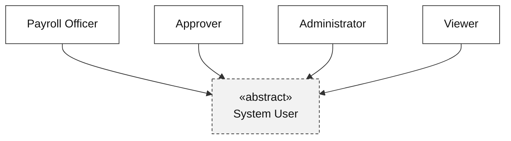
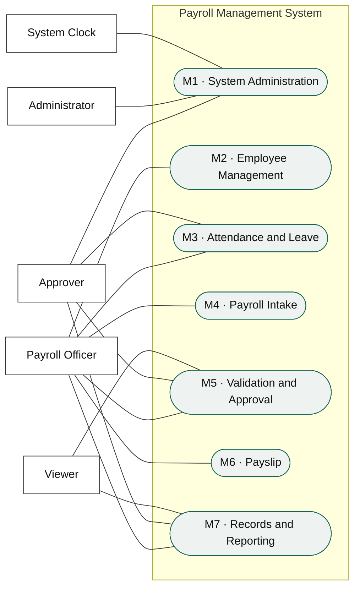
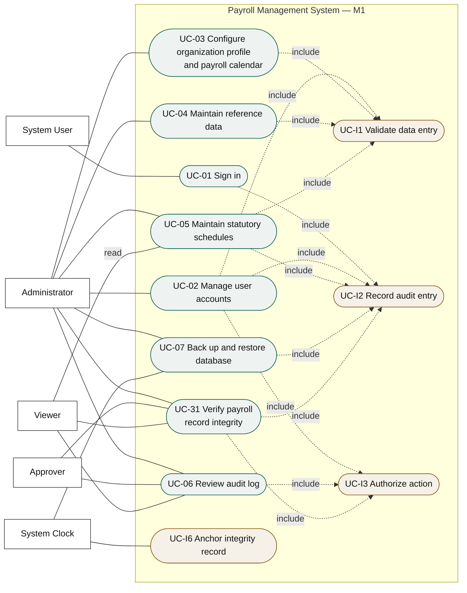
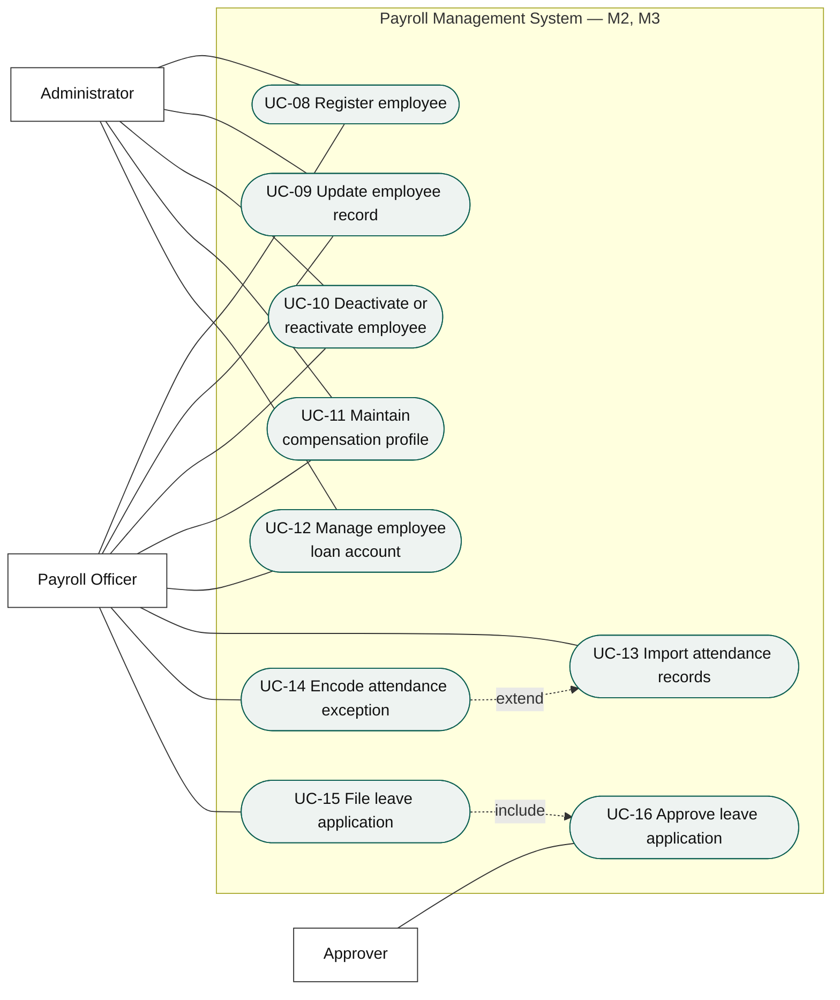
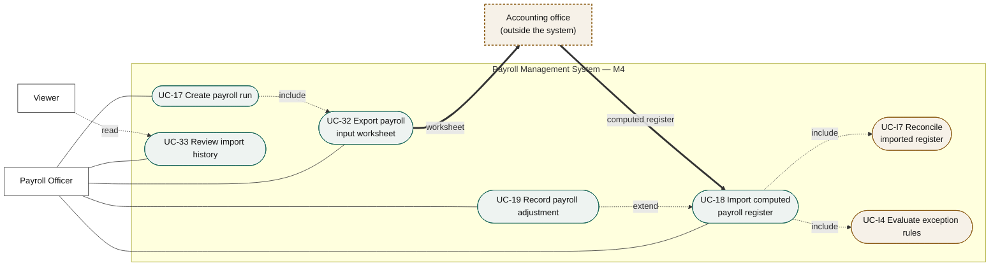
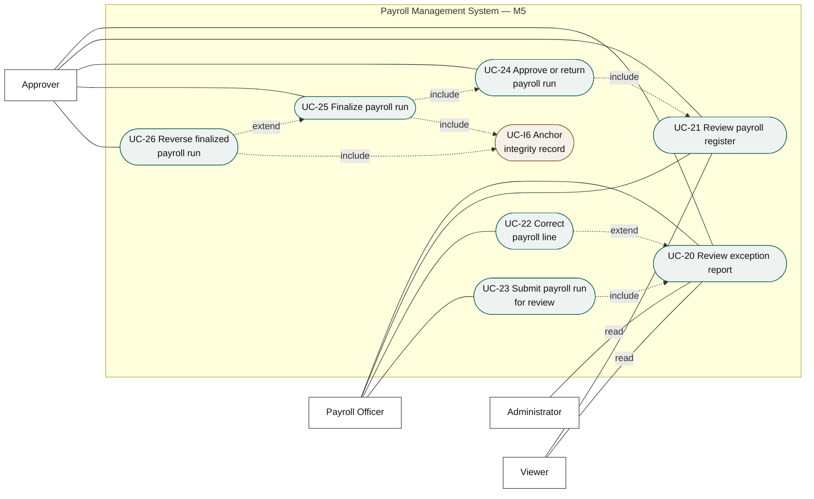
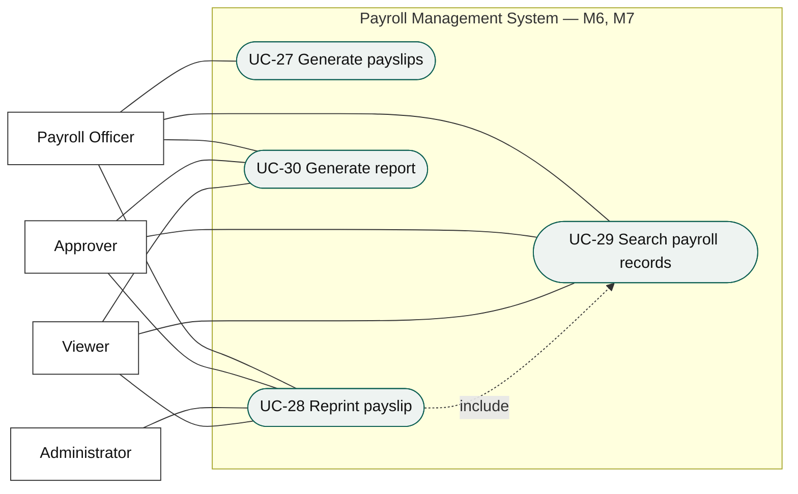
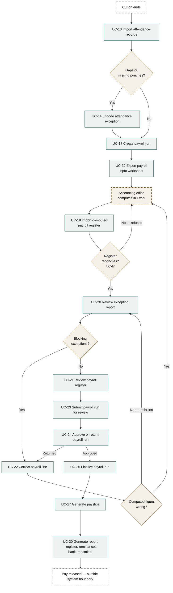

# Use Case Model

**Project:** Payroll Management System
**Document:** Use Case Diagrams and Use Case Specifications
**Version:** 1.2
**Date:** August 30, 2026
**Baseline:** B2 — frozen August 30, 2026 · see [baseline.md](./baseline.md)
**Traces to:** [Functional Requirements Specification](./functional-requirements-specification.md) → [Problem-to-Requirements Matrix](./problem-requirements-matrix.md)
**Change:** [CR-01](./change-request-cr-01.md) — payroll computation retained by the accounting office

---

## Document control

| | |
|---|---|
| Primary use cases | 33 |
| Included use cases | 7 |
| Actors | 4 human, 1 supporting |
| Diagrams | 8 |
| Requirement items traced | 45 of 45 — 32 FR, 8 NFR, 5 DR (§7) |

> ✧ **What changed in 1.2.** The client decided the accounting office continues to perform the payroll computation. `UC-18` is no longer *Compute payroll run* but **Import computed payroll register**; `UC-22` corrects by adjustment or re-import rather than by recomputation; `UC-I5` moved from per-line computation to remittance reporting. Two primary use cases and one included use case were added. **No actor was added** — the accounting office operates the system as the Payroll Officer.

---

# 1. About this model

## 1.1 Purpose

This document expresses the Functional Requirements Specification as user goals. Where the FRS answers *what must the system do*, this model answers *who wants what from the system, and what happens step by step when they ask for it.*

Every use case traces to at least one functional requirement, and §7 verifies the reverse: that every requirement is reached by at least one use case.

## 1.2 Notation

The diagrams follow UML use case notation, rendered in Mermaid so they display in the repository. Actors are rectangles, use cases are rounded shapes, and the system boundary is the labelled box.

| Notation | Meaning |
|---|---|
| Plain line | Association — the actor participates in the use case |
| `«include»` dashed arrow | The base use case always executes the included one; the included use case is not a goal on its own |
| `«extend»` dashed arrow | The extending use case runs only under a stated condition |
| Solid arrow between actors | Generalization — the specialized actor inherits the parent's associations |

> **For the manuscript.** These render as diagrams in VS Code, GitHub, and any Mermaid-aware viewer. Chapter III will need vector redraws in Visio, draw.io, or Lucidchart at the department's required figure format — treat these as the authoritative content and the redraw as a formatting exercise.

## 1.3 Depth of specification

All 33 primary use cases are specified. Depth is proportional to risk rather than uniform: the use cases where an error reaches an employee's pay or a government remittance — UC-13, UC-18, UC-22, UC-24, UC-25, UC-26, UC-27 — carry full alternate and exception flows. Routine maintenance use cases are specified completely but compactly, since their failure modes are contained and their flows are short.

## 1.4 Included use cases

Seven behaviors are invoked by many use cases rather than pursued as goals in themselves. They are specified once in §6 and referenced throughout, and they are drawn only in Figure 3 — repeating their association lines on every diagram would obscure more than it documents. UC-I6 is drawn a second time, in Figure 6, because where a record is anchored is part of the approval lifecycle rather than a detail beneath it.

| ID | Included use case | Invoked by |
|---|---|---|
| UC-I1 | Validate data entry | Every use case that saves user-entered data |
| UC-I2 | Record audit entry | Every state-changing use case |
| UC-I3 | Authorize action | Every use case, at every entry point |
| UC-I4 | Evaluate exception rules | UC-18, UC-22 |
| UC-I5 | Apply statutory schedule | ✧ UC-30 |
| UC-I6 | Anchor integrity record | UC-25, UC-26, and the scheduled audit-segment close |
| UC-I7 | Reconcile imported register | UC-18 |

---

# 2. Actors

## 2.1 Actor catalogue

| Actor | Type | Description | Goals |
|---|---|---|---|
| **Payroll Officer** | Primary, human | Prepares payroll. Maintains employee and attendance data, prepares the inputs used by the accounting office for computation, imports the completed payroll register, resolves exceptions, submits for review, and issues payslips. The system's principal user. | Produce a correct payroll for each period with the least manual work. |
| **Approver** | Primary, human | Reviews, approves, returns, and finalizes payroll runs; approves leave applications. Does not encode payroll data. Typically HR Head, Finance Officer, or owner. | Satisfy themselves the payroll is correct before money moves, and leave evidence that they did. |
| **Administrator** | Primary, human | Maintains user accounts, reference data, statutory schedules, organization profile, and backups. May be an external IT contact. | Keep the system's rules and access current without touching payroll data. |
| **Viewer** | Primary, human | Read-only access to registers, payslips, reports, the exception report, payroll-record search, and the audit log. Sees the **outputs** of payroll, not its inputs: employee master data, attendance records, and leave applications are outside this role (FR-6.2, AC-6.2.5). | Answer a question about payroll without the ability to change anything. |
| **System Clock** | Supporting, non-human | Triggers scheduled behavior: database backup and session timeout. | — |

**Employees are not actors.** They receive payslips from the payroll office. Employee self-service is out of scope for this release (FRS §1.2).

## 2.2 Actor generalization

All four human actors sign in and are subject to authorization, so those associations are inherited from an abstract **System User** rather than drawn four times.

**Figure 1.** *Actor generalization*

Authority is separated deliberately. The Payroll Officer prepares but cannot approve; the Approver approves but cannot encode; the Administrator configures but touches no payroll run. This is BR-28 and FR-6.2 expressed as actor structure, and it is the control that a shared spreadsheet cannot provide.

---

# 3. Use case inventory

**Table 1.** *Primary use cases*

| UC | Name | Module | Primary actor | Traces to | Priority |
|---|---|:---:|---|---|:---:|
| UC-01 | Sign in | M1 | System User | FR-0.1 | Must |
| UC-02 | Manage user accounts | M1 | Administrator | FR-0.2 | Must |
| UC-03 | Configure organization profile and payroll calendar | M1 | Administrator | FR-0.3 | Must |
| UC-04 | Maintain reference data | M1 | Administrator | FR-0.4 | Must |
| UC-05 | ✧ Maintain statutory schedules for remittance | M1 † | Administrator, Viewer (read) | FR-2.3 | Must |
| UC-06 | Review audit log | M1 | Administrator, Approver, Viewer | FR-6.1 | Must |
| UC-07 | Back up and restore database | M1 † | Administrator, System Clock | NFR-5.4 | Must |
| UC-08 | Register employee | M2 | Payroll Officer, Administrator | FR-1.1, FR-1.5 | Must |
| UC-09 | Update employee record | M2 | Payroll Officer, Administrator | FR-1.1, FR-1.5 | Must |
| UC-10 | Deactivate or reactivate employee | M2 | Payroll Officer, Administrator | FR-1.1 | Must |
| UC-11 | Maintain compensation profile | M2 | Payroll Officer, Administrator | FR-1.2 | Must |
| UC-12 | Manage employee loan account | M2 | Payroll Officer, Administrator | FR-1.2 | Must |
| UC-13 | Import attendance records | M3 | Payroll Officer | FR-1.3 | Must |
| UC-14 | Encode attendance exception | M3 | Payroll Officer | FR-1.3 | Must |
| UC-15 | File leave application | M3 | Payroll Officer | FR-1.4 | Must |
| UC-16 | Approve leave application | M3 | Approver | FR-1.4 | Must |
| UC-17 | Create payroll run | M4 ‡ | Payroll Officer | FR-2.6, FR-4.4 | Must |
| UC-32 | ✧ Export payroll input worksheet | M4 | Payroll Officer | FR-2.11 | Must |
| UC-18 | ✧ Import computed payroll register | M4 | Payroll Officer | FR-2.5, 2.6, 2.8, 2.9 | Must |
| UC-33 | ✧ Review import history | M4 | Payroll Officer, Approver, Administrator, Viewer (read) | FR-2.10 | Must |
| UC-19 | ✧ Record payroll adjustment | M4 | Payroll Officer | FR-2.4 | Must |
| UC-20 | Review exception report | M5 | Payroll Officer, Approver, Administrator, Viewer (read) | FR-4.1 | Must |
| UC-21 | Review payroll register | M5 | Payroll Officer, Approver, Viewer | FR-4.2 | Must |
| UC-22 | ✧ Correct payroll line | M5 | Payroll Officer | FR-4.3 | Must |
| UC-23 | Submit payroll run for review | M5 | Payroll Officer | FR-4.4 | Must |
| UC-24 | Approve or return payroll run | M5 | Approver | FR-4.4 | Must |
| UC-25 | Finalize payroll run | M5 | Approver | FR-4.4, FR-4.5 | Must |
| UC-26 | Reverse finalized payroll run | M5 | Approver | FR-4.5 | Must |
| UC-27 | Generate payslips | M6 | Payroll Officer | FR-3.1, 3.2, 3.3 | Must |
| UC-28 | Reprint payslip | M6 | Payroll Officer, Approver, Administrator, Viewer | FR-3.4 | Must |
| UC-29 | Search payroll records | M7 | All roles | FR-5.2 | Must |
| UC-30 | Generate report | M7 | All roles | FR-5.3 | Must |
| UC-31 | Verify payroll record integrity | M1 | Administrator, Approver, Viewer | FR-6.3 | Must |

† **Administered from M1.** ✧ UC-05 maintains the statutory schedules that **M7's remittance reports** consume (FR-2.3) and UC-07 administers the backup that protects M7's records (NFR-5.4). Both are Administrator functions performed from the System Administration module, which is where this model places them; FRS §2.2 and Table 8 state the same split from the requirement side. Before CR-01, UC-05's effect belonged to M4 because the schedules drove computation; they now drive only employer-share derivation for reporting, so the effect moved with them.

‡ **Cross-module trace.** UC-17 belongs to M4 — a run is created and cancelled from the payroll-run screen. Its A2 cancel flow is a transition in the FR-4.4 approval lifecycle, which FRS Table 8 places in M5, so the use case traces to a requirement outside its own module. The module is where the work is done; the requirement is what the work satisfies, and here they differ by design.

**Actor lists follow the FR-6.2 permission matrix.** Where a role appears as `(read)` it may open and export the use case's output but performs none of its state-changing steps. The Administrator's presence on UC-08 through UC-12, UC-20, and UC-33 is a maintenance and support capability, not a payroll one: ✧ AC-6.2.4 still forbids the Administrator from creating a payroll run, importing a register into one, or approving one.

✧ **On the accounting office and the Payroll Officer.** CR-01 moved payroll computation to the accounting office but added no actor. The accounting office performs its computation **outside the system entirely**, in Microsoft Excel, and appears in this model only as the recipient of UC-32's worksheet and the source of UC-18's register. When a member of that office operates the system — exporting, importing, correcting, submitting — they do so as the **Payroll Officer**, holding that role's permissions and appearing in the audit trail under their own account (BR-30, NFR-6.5). No use case has an "Accounting Officer" actor because no system function is performed by one.

**Table 2.** *Included use cases*

| UC | Name | Traces to | Nature |
|---|---|---|---|
| UC-I1 | Validate data entry | FR-1.5 | Invoked on every save of user-entered data |
| UC-I2 | Record audit entry | FR-6.1 | Invoked in the same transaction as every state change |
| UC-I3 | Authorize action | FR-6.2 | Invoked at every function entry point |
| UC-I4 | ✧ Evaluate exception rules | FR-4.1 | Invoked at the end of every import, and in its export-time subset at every worksheet export |
| UC-I5 | ✧ Apply statutory schedule | FR-2.3 | ✧ Invoked per agency when a remittance report needs an employer share the register did not carry — **not** per payroll line, and never for an employee-share figure |
| UC-I6 | Anchor integrity record | FR-6.3 | Invoked when a record becomes immutable — UC-25, UC-26, and audit-segment close |
| UC-I7 | ✧ Reconcile imported register | FR-2.9 | Invoked by UC-18 on every import, before any payroll line is written |

---

# 4. Use case diagrams

## 4.1 System context

**Figure 2.** *System context — actors and functional modules*

## 4.2 M1 — System Administration

This diagram also shows the five included use cases in the one place they are drawn.

**Figure 3.** *M1 System Administration*

UC-31 sits in M1 with the other security functions, FR-6.1 and FR-6.2, because verification is an administrative act rather than a payroll one. Its three actors are the three the FR-6.2 matrix grants — the Payroll Officer is deliberately absent, since the party who prepares payroll should not be the party who certifies that payroll is unaltered. UC-I6 is drawn against the `System Clock`: anchoring is triggered by a record becoming immutable and by the scheduled close of an audit segment, never by a user asking for it.

Every remaining diagram omits the `«include»` lines to UC-I1, UC-I2, and UC-I3. They apply throughout; drawing them everywhere would document nothing further.

## 4.3 M2 and M3 — Employee, Attendance, and Leave

**Figure 4.** *M2 Employee Management and M3 Attendance and Leave*

UC-14 extends UC-13: encoding an exception happens only when the import leaves a gap or a punch is missing. A leave application has no effect on payroll until approved, so UC-15 includes UC-16.

The Administrator is associated with UC-08 through UC-12 because FR-6.2 grants that role write access to employee records — a support and data-migration capability, exercised rarely. The Payroll Officer remains the primary actor for all five, and the Administrator's reach stops at the employee record: it does not extend to attendance, leave, or any payroll run (AC-6.2.4).

## 4.4 M4 — Payroll Intake

**Figure 5.** *✧ M4 Payroll Intake*

✧ **This figure changed more than any other in the model, and one element in it is new in kind.** The **accounting office** is drawn outside the system boundary with heavy dashed edges, because it is neither an actor nor a use case: it is a process step that happens in Microsoft Excel, between two system functions, and no permission, screen, or audit entry belongs to it. Drawing it is a deliberate departure from strict UML — the alternative was a diagram in which a worksheet leaves UC-32 and a register arrives at UC-18 with nothing between them, which would hide the single most important fact about this system's boundary.

UC-17 includes UC-32: a run is created and its input worksheet exported in the same operation, because a run with no worksheet has nothing for the accounting office to work from. UC-18 includes UC-I7 — no register is written to a payroll line before it reconciles — and UC-I4, so exceptions are raised on every import. UC-19 still extends UC-18 because an adjustment is occasional rather than part of every intake; unlike baseline B1, an adjustment no longer triggers a recomputation, since there is none to trigger. It is recorded alongside the imported lines and shown separately (FR-2.4).

**UC-I5 no longer appears here.** It applied a statutory schedule per payroll line during computation. It now derives employer shares for remittance reports and belongs to M7, where Figure 8 draws it.

## 4.5 M5 — Validation and Approval

**Figure 6.** *M5 Validation and Approval*

UC-23 includes UC-20: a run cannot be submitted without its exceptions having been evaluated and blocking ones cleared. UC-26 extends UC-25 as the exceptional path taken only when a finalized run proves wrong before payment.

UC-I6 is drawn here — the one exception to the rule that included use cases appear only in Figure 2 — because the moment a run is anchored is a fact about the approval lifecycle, not an implementation detail. Finalization and reversal are the only two payroll events that make a record immutable, and BR-36 anchors precisely there.

The Administrator and the Viewer reach UC-20 as readers only, per FR-6.2. They may open and export the exception report, which is how a support call or an audit query is answered without a payroll account; they resolve nothing and acknowledge nothing. Every state-changing step of UC-20 belongs to the Payroll Officer and the Approver.

## 4.6 M6 and M7 — Payslip, Records, and Reporting

**Figure 7.** *M6 Payslip and M7 Records and Reporting*

## 4.7 The payroll cycle end to end

The use cases above are goals, not a sequence. This is the order in which they are actually exercised across one pay period.

**Figure 8.** *✧ Payroll cycle — use case sequence for one pay period*

✧ **Read this figure against the version in baseline B1, and against the client's current flowchart.** Three things changed, and they are the whole of CR-01 in one picture.

**One step left the system.** `Accounting office computes in Excel` is drawn in the outside style, between UC-32 and UC-18. In B1 that box was `UC-18 Compute payroll run`, inside the boundary.

**Two arrows now leave and return.** The reconciliation gate refuses a register straight back to the accounting office, and a wrong computed figure found at review goes back the same way. Neither loop existed in B1, because a correction never had to leave the system. This is cost **C4** drawn rather than described.

**What still holds.** The manual review loop that ran through every employee still runs only through the exceptions UC-20 raises; the payslip typing step is still gone; the approval, finalization, payslip, and reporting sequence is untouched. Against the client's current flowchart, thirteen of twenty steps are still absorbed — five fewer than B1 claimed, and the matrix's scope table now says so.

---

# 5. Use case specifications

## M1 — System Administration

### UC-01 · Sign in

| | |
|---|---|
| **Module** | M1 |
| **Primary actor** | System User (any role) |
| **Traces to** | FR-0.1 |
| **Priority** | Must · **Frequency** Daily per user |
| **Rules** | BR-30, BR-31, BR-32 |
| **Verified by** | AC-0.1.1 – AC-0.1.4 |

**Preconditions** — The user has an active account (UC-02).
**Trigger** — The user opens the system.

**Main success scenario**

1. System presents the sign-in screen.
2. User enters username and password.
3. System verifies the credentials against the stored salted hash.
4. System confirms the account is active and not locked.
5. System establishes a session, applies the account's role permissions, and records the sign-in (UC-I2).
6. System presents the landing view appropriate to the role.

**Alternate flows**

- **A1 · First sign-in.** At step 5, if the account still holds its initial password, the system requires a password change before granting access, then resumes at step 6.

**Exception flows**

- **E1 · Invalid credentials.** At step 3, the system denies access with a message that does not disclose which value was wrong, increments the failed-attempt counter, and returns to step 1.
- **E2 · Account locked.** At step 4, if the failed-attempt threshold has been reached, the system refuses access and states that an Administrator must release the account. Correct credentials do not override the lock.
- **E3 · Account deactivated.** At step 4, the system refuses access and directs the user to the Administrator.

**Postconditions** — An authenticated session exists, bound to one role; a sign-in audit entry is written.

---

### UC-02 · Manage user accounts

| | |
|---|---|
| **Module** | M1 · **Primary actor** Administrator |
| **Traces to** | FR-0.2 |
| **Priority** | Must · **Frequency** Occasional |
| **Includes** | UC-I1, UC-I2, UC-I3 |
| **Rules** | BR-30, BR-33 |
| **Verified by** | AC-0.2.1 – AC-0.2.4 |

**Preconditions** — Administrator is signed in.
**Trigger** — A staff member joins, changes role, or leaves; or a password reset is requested.

**Main success scenario**

1. Administrator opens user account management and views the account list.
2. Administrator selects create, edit, deactivate, reactivate, or reset password.
3. For a new account, Administrator enters username, display name, role, and an initial password.
4. System validates the entry (UC-I1), enforcing username uniqueness across active and inactive accounts.
5. System saves the account, marks the initial password as requiring change, and records the action (UC-I2).
6. System confirms and returns to the list.

**Alternate flows**

- **A1 · Deactivate.** At step 2, Administrator deactivates an account. The system prevents future sign-in but retains the account so audit entries remain resolvable. Deletion is not offered.
- **A2 · Reset password.** At step 2, Administrator sets a new initial password. The system requires the user to change it at next sign-in and records the reset.
- **A3 · Change own password.** Any user may change their own password after re-entering the current one; no Administrator action is required.

**Exception flows**

- **E1 · Duplicate username.** At step 4, the system refuses the save and identifies the existing account.
- **E2 · Last Administrator.** At A1, if deactivating the account would leave no active Administrator, the system refuses and states why.

**Postconditions** — The account exists in the intended state with exactly one role; the change is audited.

---

### UC-03 · Configure organization profile and payroll calendar

| | |
|---|---|
| **Module** | M1 · **Primary actor** Administrator |
| **Traces to** | FR-0.3 |
| **Priority** | Must · **Frequency** Once at setup; annually for the calendar |
| **Rules** | BR-02, BR-05, BR-34 |
| **Verified by** | AC-0.3.1 – AC-0.3.4 |

**Preconditions** — Administrator is signed in.
**Trigger** — Initial system setup, a new payroll year, or a change in employer registration details.

**Main success scenario**

1. Administrator opens system configuration.
2. Administrator maintains the organization profile: registered name, address, SSS, PhilHealth, Pag-IBIG, and BIR TIN employer numbers, and the logo used on payslips and reports.
3. Administrator sets the pay frequency, the day factor, and the standard hours per day.
4. Administrator generates the pay periods for a payroll year, each with cut-off start, cut-off end, and pay date.
5. System validates that the generated periods neither overlap nor leave a gap (BR-34).
6. Administrator maintains the holiday calendar, classifying each date as a regular holiday, special non-working day, or local holiday.
7. System saves and records the changes (UC-I2).

**Alternate flows**

- **A1 · Adjust a single period.** At step 4, Administrator edits one generated period's dates. The system re-validates the whole year against BR-34.

**Exception flows**

- **E1 · Overlapping or gapped periods.** At step 5, the system refuses the save and identifies the conflicting periods.
- **E2 · Period already used.** At A1, if a payroll run exists for the period, the system refuses to change its dates.

**Postconditions** — Pay periods exist for the year and can be selected by UC-17; the holiday calendar is available to UC-18.

---

### UC-04 · Maintain reference data

| | |
|---|---|
| **Module** | M1 · **Primary actor** Administrator |
| **Traces to** | FR-0.4 |
| **Priority** | Must · **Frequency** Occasional |
| **Rules** | BR-12, BR-21, BR-25, BR-33 |
| **Verified by** | AC-0.4.1 – AC-0.4.3 |

**Preconditions** — Administrator is signed in.
**Trigger** — A new department, position, leave type, earning type, or deduction type is required.

**Main success scenario**

1. Administrator selects a reference list: departments, positions, employment statuses, leave types, earning types, or deduction types.
2. Administrator adds or edits an entry.
3. For an earning type, Administrator sets the taxable flag and the 13th-month-inclusion flag; neither may be left unset.
4. For a deduction type, Administrator sets the statutory flag and, if non-statutory, whether it participates in the net-pay floor check.
5. For a leave type, Administrator sets the accrual rule, whether it is paid, whether a negative balance is permitted, and the carry-over rule.
6. System validates and saves (UC-I1, UC-I2).

**Alternate flows**

- **A1 · Deactivate an entry.** Administrator deactivates an entry in use. It remains visible on existing records but is not selectable on new ones.

**Exception flows**

- **E1 · Delete in-use entry.** At step 2, the system refuses deletion of any entry referenced by an employee or payroll record and names a referencing record.
- **E2 · Missing taxability flag.** At step 3, the system refuses the save; no earning type may default silently.

**Postconditions** — The reference list is current; dependent records continue to resolve.

---

### UC-05 · Maintain statutory schedules

| | |
|---|---|
| **Module** | M1 (administered from M1; consumed by M4 — see Table 1 †) · **Primary actor** Administrator · **Secondary actor** Viewer (read) |
| **Traces to** | FR-2.3 |
| **Priority** | Must · **Frequency** On each agency circular |
| **Rules** | BR-14, BR-19, BR-20 |
| **Verified by** | AC-2.3.1 – AC-2.3.3 |

**Preconditions** — Administrator is signed in and holds the published schedule from the agency.
**Trigger** — SSS, PhilHealth, Pag-IBIG, or the BIR issues a new contribution or withholding schedule.

**Main success scenario**

1. Administrator selects the agency and opens its schedule list, which shows each version with its effectivity range.
2. Administrator creates a new schedule version and enters its effectivity date.
3. Administrator enters the schedule content in the structure required by the agency — salary brackets with employee and employer shares for SSS; premium rate with floor and ceiling for PhilHealth; contribution rates with compensation cap for Pag-IBIG; compensation-range brackets with base tax and marginal rate, by pay frequency, for withholding tax.
4. System validates that the new effectivity range does not overlap an existing one for the same agency, and that brackets are contiguous with no gap or overlap.
5. System saves the schedule and records the change (UC-I2).
6. System applies the new schedule to computations whose pay date falls in its effectivity range; earlier runs are unaffected.

**Alternate flows**

- **A1 · Correct an unused schedule.** A schedule not yet applied to any run may be edited in place.
- **A2 · End-date a schedule.** Administrator sets an end date to close a superseded version.
- **A3 · Read a schedule.** A Viewer opens the schedule list and any version's content and effectivity range, and may export it, so that a figure on a payslip can be checked against the published schedule without a maintenance account (FR-6.2). No step of the main scenario is available to this actor; every save, edit, and end-date is refused.

**Exception flows**

- **E1 · Overlapping effectivity.** At step 4, the system refuses the save and names the conflicting version.
- **E2 · Non-contiguous brackets.** At step 4, the system refuses and identifies the gap or overlap.
- **E3 · Edit an applied schedule.** At A1, if any finalized run used the schedule, the system refuses the edit and directs the Administrator to create a new dated version instead.

**Postconditions** — The schedule is available to UC-I5 for the periods it governs; historical runs remain reproducible.

---

### UC-06 · Review audit log

| | |
|---|---|
| **Module** | M1 · **Primary actor** Administrator, Approver, Viewer |
| **Traces to** | FR-6.1 |
| **Priority** | Must · **Frequency** Ad hoc |
| **Rules** | BR-26, BR-27 |
| **Verified by** | AC-6.1.2 – AC-6.1.4 |

**Preconditions** — User is signed in with a role permitting audit access.
**Trigger** — A discrepancy is investigated, or an audit is conducted.

**Main success scenario**

1. User opens the audit log.
2. User filters by user account, date range, record type, and action.
3. System lists matching entries with acting user, timestamp, record affected, and action.
4. User opens an entry and views the previous and new values of every changed field.
5. User may open the affected record directly from the entry.

**Alternate flows**

- **A1 · From a payroll run.** User opens the audit history from within a payroll run, filtered to that run's changes.
- **A2 · Export.** User exports the filtered result to PDF or Excel.

**Exception flows**

- **E1 · No matching entries.** The system states plainly that no entries match and repeats the criteria applied.

**Postconditions** — None; the log is unchanged. The system offers no path to edit or delete an entry.

---

### UC-07 · Back up and restore database

| | |
|---|---|
| **Module** | M1 · **Primary actor** Administrator; **Supporting** System Clock |
| **Traces to** | NFR-5.4 |
| **Priority** | Must · **Frequency** Scheduled, plus on demand |
| **Verified by** | NFR-5.4 restore test |

**Preconditions** — Administrator is signed in; a backup destination is configured.
**Trigger** — The scheduled backup time arrives, or the Administrator initiates a backup or restore.

**Main success scenario**

1. System Clock triggers the backup at the configured schedule, or the Administrator initiates one.
2. System creates a complete backup of the payroll database to the configured destination.
3. System verifies the backup completed and records the outcome, size, and timestamp (UC-I2).
4. System lists available backups with their timestamps.

**Alternate flows**

- **A1 · Restore.** Administrator selects a backup and confirms restoration. The system requires explicit confirmation naming the backup's timestamp (NFR-6.3), restores, and records the restoration.

**Exception flows**

- **E1 · Backup fails.** The system records the failure with its reason and notifies the Administrator at next sign-in. A failed backup does not overwrite the last successful one.
- **E2 · Restore during an open run.** At A1, if a payroll run is in progress, the system warns that uncommitted work will be lost and requires a second confirmation.

**Postconditions** — A verified backup exists, or the database is restored to the selected point.

---

## M2 — Employee Management

**On the Administrator as secondary actor.** FR-6.2 grants the Administrator write access to employee records, and UC-08 through UC-12 name that role accordingly. The Administrator performs the same steps as the Payroll Officer in these five use cases — the flows below are not duplicated — and does so rarely: initial data migration (assumption A-01), correcting a record the Payroll Officer cannot reach, or standing in when the payroll account is unavailable. The capability stops at the employee record. It confers nothing in M3, M4, M5, or M6, and AC-6.2.4 continues to forbid the Administrator from creating, computing, or approving a payroll run. Every action is audited under UC-I2 with the acting account named, so an Administrator edit is distinguishable from a Payroll Officer edit after the fact.

### UC-08 · Register employee

| | |
|---|---|
| **Module** | M2 · **Primary actor** Payroll Officer · **Secondary actor** Administrator |
| **Traces to** | FR-1.1, FR-1.5 |
| **Priority** | Must · **Frequency** On each hire |
| **Includes** | UC-I1, UC-I2, UC-I3 |
| **Rules** | BR-06, BR-07 |
| **Verified by** | AC-1.1.1 – AC-1.1.2, AC-1.5.1 – AC-1.5.4 |

**Preconditions** — Payroll Officer is signed in; the required reference data exists (UC-04).
**Trigger** — A new employee is hired.

**Main success scenario**

1. Payroll Officer opens the employee list and selects to register a new employee.
2. Payroll Officer enters personal data: full name, date of birth, sex, civil status, contact details, and address.
3. Payroll Officer enters employment data: employee number, date hired, employment status, department, and position.
4. Payroll Officer enters government identification numbers: SSS, PhilHealth, Pag-IBIG, and TIN.
5. System validates the entry (UC-I1): required fields present, formats correct, date hired not in the future, employee number unique.
6. System saves the employee record and records the action (UC-I2).
7. System offers to continue directly to the compensation profile (UC-11).

**Alternate flows**

- **A1 · Auto-numbered.** At step 3, where automatic numbering is configured, the system assigns the next employee number and the Payroll Officer does not enter one.
- **A2 · Rehire.** At step 5, if the system detects a matching inactive employee by name and date of birth, it offers reactivation of the existing record (UC-10) instead of a new record, preserving history.
- **A3 · Deferred identification numbers.** At step 4, the Payroll Officer may leave a government number blank. The record saves, and FR-4.1 raises warning EX-06 when a report requiring it is due.

**Exception flows**

- **E1 · Duplicate employee number.** At step 5, the system refuses the save and identifies the existing record holding that number.
- **E2 · Probable duplicate person.** At step 5, matching name and date of birth raises a warning the Payroll Officer must explicitly acknowledge before saving.
- **E3 · Validation failure.** At step 5, the system refuses the save and marks each failing field with the specific correction required.

**Postconditions** — The employee exists as one authoritative record, available to all succeeding periods with no re-encoding.

---

### UC-09 · Update employee record

| | |
|---|---|
| **Module** | M2 · **Primary actor** Payroll Officer · **Secondary actor** Administrator |
| **Traces to** | FR-1.1, FR-1.5 |
| **Priority** | Must · **Frequency** Occasional |
| **Rules** | BR-07 |
| **Verified by** | AC-1.1.1, AC-1.1.3, AC-1.5.1 |

**Preconditions** — The employee record exists.
**Trigger** — Personal, contact, or employment details change.

**Main success scenario**

1. Payroll Officer locates the employee by name, number, department, or status.
2. Payroll Officer opens the record and edits the changed fields.
3. System validates the entry (UC-I1).
4. System saves and records the change with previous and new values (UC-I2).

**Alternate flows**

- **A1 · Transfer.** A change of department or position takes effect for payroll from the period containing its effectivity date.

**Exception flows**

- **E1 · Deletion attempted.** The system offers no delete function for an employee holding payroll, attendance, or leave records; only deactivation (UC-10).
- **E2 · Validation failure.** The system refuses the save and names each failing field.

**Postconditions** — The record reflects the change; the change history is complete and attributable.

---

### UC-10 · Deactivate or reactivate employee

| | |
|---|---|
| **Module** | M2 · **Primary actor** Payroll Officer · **Secondary actor** Administrator |
| **Traces to** | FR-1.1 |
| **Priority** | Must · **Frequency** On separation or rehire |
| **Rules** | BR-07 |
| **Verified by** | AC-1.1.3, AC-1.1.4 |

**Preconditions** — The employee record exists.
**Trigger** — An employee separates from the company, or a former employee is rehired.

**Main success scenario**

1. Payroll Officer opens the employee record and selects deactivate.
2. Payroll Officer enters the separation date and reason.
3. System confirms the action, stating that the employee will be excluded from payroll runs for periods after the separation date (NFR-6.3).
4. System deactivates the record and logs the action (UC-I2).

**Alternate flows**

- **A1 · Reactivate.** Payroll Officer reactivates a rehired employee, entering the new date hired. The original record and its full history are preserved; a new compensation profile entry is required (UC-11).
- **A2 · Final pay period.** Where the separation date falls inside an open cut-off, the employee remains included in that run for the days worked.

**Exception flows**

- **E1 · Open payroll run.** ✧ At step 3, if the employee appears in an unfinalized run for a period after the separation date, the system warns and requires a corrected register for that run.

**Postconditions** — The employee is excluded from new runs from the period following separation, and appears unchanged in every prior run and report.

---

### UC-11 · Maintain compensation profile

| | |
|---|---|
| **Module** | M2 · **Primary actor** Payroll Officer · **Secondary actor** Administrator |
| **Traces to** | FR-1.2 |
| **Priority** | Must · **Frequency** On hire, and on each rate or allowance change |
| **Rules** | BR-02, BR-08, BR-22 |
| **Verified by** | AC-1.2.1, AC-1.2.2, AC-1.2.4 |

**Preconditions** — The employee record exists; earning and deduction types exist (UC-04).
**Trigger** — An employee is registered, or their pay, allowances, or standing deductions change.

**Main success scenario**

1. Payroll Officer opens the employee's compensation profile.
2. Payroll Officer selects the pay basis — monthly, daily, or hourly — and enters the basic rate.
3. Payroll Officer adds recurring earnings, each with an earning type, amount, and effectivity date.
4. Payroll Officer adds recurring deductions, each with a deduction type, amount, and effectivity date.
5. Payroll Officer sets the statutory coverage flags for SSS, PhilHealth, and Pag-IBIG.
6. System validates and saves the entry as a new dated version rather than an overwrite (BR-08), and records the change (UC-I2).

**Alternate flows**

- **A1 · Rate increase.** At step 2, entering a new rate with a future effectivity date leaves the current rate in force until that date. Runs already finalized are unaffected.
- **A2 · End a recurring item.** Payroll Officer sets an end date on a recurring earning or deduction; it stops applying from the following period.

**Exception flows**

- **E1 · Overlapping effectivity.** At step 6, overlapping dated entries for the same item are refused.
- **E2 · Retroactive change to a closed period.** At A1, an effectivity date inside a finalized period is accepted for the record but does not alter that run; the system states that a retroactive adjustment in the open period is required (UC-19, BR-24).

**Postconditions** — The profile carries forward to every succeeding run with no re-entry; historical runs remain reproducible.

---

### UC-12 · Manage employee loan account

| | |
|---|---|
| **Module** | M2 · **Primary actor** Payroll Officer · **Secondary actor** Administrator |
| **Traces to** | FR-1.2 |
| **Priority** | Must · **Frequency** On each loan or cash advance |
| **Rules** | BR-23 |
| **Verified by** | AC-1.2.3 |

**Preconditions** — The employee record exists.
**Trigger** — A loan or cash advance is granted, or its terms change.

**Main success scenario**

1. Payroll Officer opens the employee's loan accounts.
2. Payroll Officer creates a loan with a type, principal, amortization amount per period, start period, and term.
3. System computes the expected end period and displays the amortization schedule.
4. System saves and records the loan (UC-I2).
5. On each payroll run, the system deducts the amortization and reduces the outstanding balance.
6. When the balance reaches zero, the system stops the deduction automatically.

**Alternate flows**

- **A1 · Final amortization.** At step 5, when the remaining balance is less than the amortization amount, the system deducts only the balance. Over-deduction does not occur (BR-23).
- **A2 · Suspend.** Payroll Officer suspends a loan deduction for a stated number of periods; the term extends accordingly.
- **A3 · Early settlement.** Payroll Officer records a lump-sum payment; the system reduces the balance and shortens the schedule.

**Exception flows**

- **E1 · Amortization exceeds capacity.** At step 2, if the recorded deduction would make the imported net pay fall below the configured floor, the system warns and requires acknowledgment under BR-25.

**Postconditions** — The loan deducts automatically each period and stops exactly at zero balance; the ledger reconciles to the amounts deducted.

---

## M3 — Attendance and Leave

### UC-13 · Import attendance records

| | |
|---|---|
| **Module** | M3 · **Primary actor** Payroll Officer |
| **Traces to** | FR-1.3 |
| **Priority** | Must · **Frequency** Once or twice per cut-off |
| **Extended by** | UC-14 |
| **Rules** | BR-03, BR-04, BR-09 |
| **Verified by** | AC-1.3.1 – AC-1.3.5 |

**Preconditions** — Employees are registered and active; the cut-off is defined; a timekeeping export or a completed template file is available.
**Trigger** — The cut-off closes and attendance must be loaded for preparation of the payroll input worksheet.

**Main success scenario**

1. Payroll Officer opens attendance import and selects the target cut-off.
2. Payroll Officer downloads the import template, or uses the timekeeping device export in the agreed format.
3. Payroll Officer uploads the file.
4. System reads every row and validates each: employee number exists and is active, date falls within the cut-off, times are valid and correctly ordered.
5. System presents an import preview: rows accepted, rows rejected, and the specific reason for each rejection, with row numbers.
6. Payroll Officer reviews the preview and confirms.
7. System commits the accepted rows and computes, for each, hours worked, late minutes, undertime minutes, night differential hours, and overtime hours against the employee's schedule (BR-03, BR-04).
8. System reports the committed count and records the import (UC-I2).

**Alternate flows**

- **A1 · Cancel at preview.** At step 6, the Payroll Officer cancels. Nothing is committed — not even the accepted rows.
- **A2 · Re-import a cut-off.** At step 4, if attendance already exists for the cut-off, the system states how many existing rows will be replaced and requires confirmation. Confirmed, it replaces rather than duplicates.
- **A3 · Partial import.** At step 6, the Payroll Officer commits the accepted rows and resolves the rejected ones through UC-14.

**Exception flows**

- **E1 · Unrecognized file format.** At step 4, the system refuses the file, states the expected format, and offers the template.
- **E2 · Unknown employee number.** At step 4, the row is rejected and reported with its number; the import continues evaluating remaining rows.
- **E3 · Date outside the cut-off.** At step 4, the row is rejected and reported (BR-09, warning EX-10).
- **E4 · Time out earlier than time in.** At step 4, the row is rejected as invalid; the Payroll Officer resolves it through UC-14.
- **E5 · Every row rejected.** At step 5, the system reports that nothing can be committed and states the most frequent rejection reason.

**Postconditions** — Attendance for the cut-off is loaded with derived hours computed; at least 90% of rows arrived by import rather than manual keying.

---

### UC-14 · Encode attendance exception

| | |
|---|---|
| **Module** | M3 · **Primary actor** Payroll Officer |
| **Traces to** | FR-1.3 |
| **Priority** | Must · **Frequency** Several per cut-off |
| **Extends** | UC-13 |
| **Rules** | BR-03, BR-04, BR-09 |
| **Verified by** | AC-1.3.5 |

**Preconditions** — The cut-off is open and its payroll run is not yet finalized.
**Trigger** — A punch is missing, an import row was rejected, an official business trip occurred, or a correction is required.

**Main success scenario**

1. Payroll Officer opens the attendance record for the employee and date.
2. Payroll Officer adds a missing record, or edits an existing one, entering time in, time out, and a remark stating the reason.
3. System validates the entry (UC-I1) and recomputes the derived hours for that day.
4. System saves and records the change with previous and new values (UC-I2).
5. System does not modify a payroll line at this point; the attendance correction is carried forward through the next payroll input worksheet export (UC-32), and any affected computed register is corrected by re-import (UC-18).

**Alternate flows**

- **A1 · Official business or field work.** Payroll Officer records the day as worked without punches, selecting the applicable attendance type.
- **A2 · Bulk exception.** Payroll Officer applies the same correction to a selected group — for example a company-wide half-day — in one action.

**Exception flows**

- **E1 · Date outside the cut-off.** The system refuses the entry and names the cut-off in effect.
- **E2 · Finalized period.** The system saves the corrected attendance for the record's own accuracy but states that the finalized run is unaffected and a retroactive adjustment is required (BR-24).

**Postconditions** — Attendance for the day is accurate and audited; any dependent payroll line is marked stale.

---

### UC-15 · File leave application

| | |
|---|---|
| **Module** | M3 · **Primary actor** Payroll Officer |
| **Traces to** | FR-1.4 |
| **Priority** | Must · **Frequency** Several per period |
| **Includes** | UC-16 |
| **Rules** | BR-10 |
| **Verified by** | AC-1.4.2, AC-1.4.4 |

**Preconditions** — The employee is active; leave types are configured (UC-04).
**Trigger** — An employee requests leave.

**Main success scenario**

1. Payroll Officer opens leave applications and creates a new one.
2. Payroll Officer selects the employee and leave type, and enters the date range and reason.
3. System computes the number of leave days in the range, excluding rest days and holidays where the leave type is configured to do so.
4. System checks the employee's available balance for the leave type.
5. System saves the application in `Pending` state and routes it to the Approver (UC-16).

**Alternate flows**

- **A1 · Negative balance permitted.** At step 4, where the leave type permits a negative balance, the system accepts the application and flags the resulting deficit.
- **A2 · Cancel.** A pending application may be cancelled by the Payroll Officer before approval.

**Exception flows**

- **E1 · Insufficient balance.** At step 4, where a negative balance is not permitted, the system refuses and states the available balance.
- **E2 · Overlapping leave.** At step 3, an overlap with an existing approved leave for the same employee is refused, naming the conflicting application.
- **E3 · Date range inverted.** At step 3, an end date earlier than the start date is refused (UC-I1).

**Postconditions** — A pending application exists awaiting approval; the balance is not yet reduced.

---

### UC-16 · Approve leave application

| | |
|---|---|
| **Module** | M3 · **Primary actor** Approver |
| **Traces to** | FR-1.4 |
| **Priority** | Must · **Frequency** Several per period |
| **Rules** | BR-10, BR-11 |
| **Verified by** | AC-1.4.1 – AC-1.4.5 |

**Preconditions** — A pending leave application exists.
**Trigger** — The Approver reviews the pending queue.

**Main success scenario**

1. Approver opens the pending leave applications.
2. Approver reviews an application with the employee's current balance and leave history in view.
3. Approver approves the application.
4. System sets the application to `Approved`, reduces the leave balance by the days approved, and records the decision with user and timestamp (UC-I2).
5. The approved leave is included in the next payroll input worksheet covering those dates (UC-32), so the accounting office can reflect the leave in its computation; the resulting payroll figures enter through the completed register import (UC-18).

**Alternate flows**

- **A1 · Return.** Approver returns the application with a reason; the balance is unchanged and the Payroll Officer is notified.
- **A2 · Partial approval.** Approver approves fewer days than requested, stating the reason; the balance reduces by the approved days only.
- **A3 · Cancel an approved leave.** Before the payroll run covering the dates is finalized, the Approver cancels an approved leave; the balance is restored. If a register has already been imported for the covering run, the change is reflected through a corrected input worksheet and superseding register import.

**Exception flows**

- **E1 · Period already finalized.** At A3, if the covering run is finalized, cancellation is refused; a retroactive adjustment is required (BR-24).
- **E2 · Balance changed since filing.** At step 3, if another approval has since consumed the balance, the system refuses and states the current balance.

**Postconditions** — The leave is approved and the balance updated; the leave posts to payroll automatically with no separate encoding.

---

## M4 — Payroll Intake

### UC-17 · Create payroll run

| | |
|---|---|
| **Module** | M4 · **Primary actor** Payroll Officer |
| **Traces to** | FR-2.6, FR-4.4 (cancel transition, A2) |
| **Priority** | Must · **Frequency** Once per pay period |
| **Includes** | UC-18 |
| **Rules** | BR-34 |
| **Verified by** | AC-2.6.3, AC-2.6.5, AC-4.4.7 |

**Preconditions** — The pay period is defined (UC-03); attendance for the cut-off is loaded (UC-13).
**Trigger** — The cut-off closes and payroll must be prepared.

**Main success scenario**

1. Payroll Officer opens payroll runs and selects to create one.
2. Payroll Officer selects the pay period from the defined calendar.
3. Payroll Officer selects the population: all active employees, a department, or a named selection.
4. System creates the run in `Draft` state with one payroll line per included employee.
5. System reports the number of employees included and lists any active employee excluded by the selection.
6. System proceeds to payroll intake (UC-18).

**Alternate flows**

- **A1 · Special run.** At step 3, Payroll Officer selects a run type other than `Regular` — a 13th-month run, or a final-pay run for separated employees — and the population it applies to. The run type determines the expected register/run type; the Payroll Officer does not select them individually. A special run coexists with the regular run for the same period and population, because a period may legitimately carry both (data model §5.1: `PAYROLL_RUN` is unique on period, population, and run type).

- **A2 · Cancel a draft run.** Payroll Officer opens a run in `Draft` and cancels it — a run created for the wrong period, the wrong population, or the wrong run type, where correcting it is less clear than starting again.

  1. Payroll Officer selects to cancel the run and states a reason.
  2. System verifies the run is in `Draft` and has never been approved. A run that has reached `For Review`, `Approved`, or `Finalized` cannot be cancelled; it is returned or reversed instead (UC-24, UC-26).
  3. System requires explicit confirmation, the action being irreversible (NFR-6.3).
  4. System moves the run to `Cancelled`, records the transition with the acting user, timestamp, and reason (UC-I2), and releases the period, population, and run type for a new run.
  5. The cancelled run and its payroll lines remain readable as history. They cannot be edited, computed, submitted, or reopened, and they are excluded from registers, reports, and remittance totals.

  **Postcondition** — The run is in `Cancelled`, terminally. A new run for the same period, population, and run type may be created.

**Exception flows**

- **E1 · Period already run.** At step 4, if an unfinalized run of the same run type exists for the same period and population, the system refuses and opens the existing run. A cancelled run is not an obstacle — it does not hold the period.

- **E4 · Cancel refused.** At A2 step 2, if the run has advanced beyond `Draft` or was previously approved, the system refuses the cancellation and names the path that applies instead: return by the Approver (UC-24) while unfinalized, or reversal (UC-26) once finalized.
- **E2 · Period finalized.** At step 4, if the period's run is finalized, the system refuses creation and states that a reversal (UC-26) or a retroactive adjustment (UC-19) is required.
- **E3 · Undefined period.** At step 2, a period not in the calendar cannot be selected; the system directs the Payroll Officer to UC-03.

**Postconditions** — A `Draft` run exists with one payroll line per included employee, ready for payroll register intake. Under A2, no open run exists for that period, population, and run type, and the cancellation is permanently visible in the run's transition history.

---

### ✧ UC-18 · Import computed payroll register

| | |
|---|---|
| **Module** | M4 · **Primary actor** Payroll Officer |
| **Traces to** | FR-2.5, FR-2.6, FR-2.8, FR-2.9 |
| **Priority** | Must · **Frequency** Once per period when clean; several times when the register needs correction |
| **Includes** | UC-I7, UC-I4 · **Extended by** UC-19 |
| **Rules** | BR-01, BR-06, BR-18, BR-25, BR-37 – BR-41 |
| **Verified by** | AC-2.5.1 – AC-2.5.5, AC-2.6.1 – AC-2.6.5, AC-2.8.1 – AC-2.8.7, AC-2.9.1 – AC-2.9.7, NFR-2.12 |

**✧ Replaces *Compute payroll run*.** In baseline B1 this use case executed the computation of every payroll line in the fixed order of BR-13. The accounting office now performs that computation in Microsoft Excel, and this use case receives its result. The steps below are all verification; **none of them produces a figure.**

**Preconditions** — A run exists in `Draft` or `Returned` state; its input worksheet was exported (UC-32); the accounting office has returned a completed register; a column mapping version exists for that register's layout (BR-41).
**Trigger** — The Payroll Officer imports the completed register into the run.

**Main success scenario**

1. Payroll Officer selects the run, selects the register file, and selects the column mapping version to apply.
2. System resolves the file's columns against the mapping and presents a preview of the resolved fields for confirmation.
3. Payroll Officer confirms.
4. System parses the file, reading every monetary value as a decimal string and converting it directly to the stored decimal type (BR-40, BR-01).
5. System reconciles the register (UC-I7): row arithmetic, file control totals, employee matching, and completeness against the run's population.
6. System writes one payroll line per register row, with its earning lines, deduction lines, and any employer-share columns the register carried, in a single transaction.
7. System records the import as a new version — source file, SHA-256 hash, importing user, timestamp, mapping version, row count, control totals, and the reconciliation result (FR-2.10, BR-39) — and makes it the run's current version.
8. System reduces each referenced loan account's outstanding balance by the amount deducted (BR-23).
9. System evaluates all exception rules (UC-I4).
10. System reports employees loaded, exceptions raised, and elapsed time, and records the import (UC-I2).

**Alternate flows**

- **A1 · ✧ Superseding import.** The Payroll Officer imports a corrected register into a `Draft` or `Returned` run that already holds one. The new version supersedes the current one and replaces every payroll line; the superseded version is retained and remains viewable through UC-33 (BR-39). The system reports which lines changed between versions and which did not.
- **A2 · ✧ Preview only.** The Payroll Officer runs steps 1 through 5 without confirming, to see whether a register would reconcile before committing to it. Nothing is written.
- **A3 · ✧ Employer shares present.** Where the register carries employer-share columns, the system stores those values and derives none (FR-2.3).

**Exception flows**

- **E1 · ✧ Structural failure.** At step 4, a required canonical field is unmapped, a mapped column is absent, a monetary cell is not a number, or an employee number appears on more than one row. **The file is refused in full and nothing is written.** The system reports every failure by row and column (AC-2.8.2, AC-2.8.3).
- **E2 · ✧ Row does not reconcile.** At step 5, a row whose gross, total deductions, or net disagrees with its own line items by any amount refuses the import and raises blocking exception EX-13, naming the employee and the three figures (BR-37).
- **E3 · ✧ Control total disagrees.** At step 5, a file control total that differs from the sum of the loaded rows refuses the import and raises blocking exception EX-14.
- **E4 · ✧ Unmatched employee.** At step 5, a row matching no active employee in the run's population refuses the import and raises blocking exception EX-11, naming the employee number.
- **E5 · ✧ Employee missing from the register.** At step 5, an active employee in the population absent from the register refuses the import and raises blocking exception EX-12, naming the employee. An omission is invisible to every arithmetic check, which is why it blocks.
- **E6 · Net pay at or below the floor.** At step 9, blocking exception EX-03 is raised. **✧ It is resolvable only by a corrected import** — the system offers no path to adjust a stored figure to satisfy the floor.
- **E7 · Deductions exceed gross.** At step 9, blocking exception EX-04 is raised on the affected line.
- **E8 · No compensation profile.** At step 9, blocking exception EX-02 is raised for the affected employee.
- **E9 · Run not in an editable state.** At step 1, an import into a run in `For Review`, `Approved`, or `Finalized` state is refused.
- **E10 · Import interrupted.** If the process fails partway, the system rolls back the entire import. **A run is never left holding part of a register** — import is atomic (AC-2.8.7).

**Postconditions** — Every employee in the run's population has a payroll line whose figures are exactly those of the accepted register, traceable to a named file, a named user, and a stored hash; the exception report is current; the loan balances have moved by exactly the amounts deducted.

**✧ What this use case does not establish.** That the figures are correct. It establishes that they are internally consistent, complete, faithfully carried, and attributable. A register that is wrong in the spreadsheet and consistent within itself completes this use case successfully — which is the limit stated in FRS §1.2 and reported in §10.

---

### ✧ UC-19 · Record payroll adjustment

| | |
|---|---|
| **Module** | M4 · **Primary actor** Payroll Officer |
| **Traces to** | FR-2.4 |
| **Priority** | Must · **Frequency** Several per period |
| **Extends** | UC-18 |
| **Rules** | BR-23, BR-24, BR-33 |
| **Verified by** | AC-2.4.1 – AC-2.4.5 |

**✧ Renamed from *Encode payroll adjustment*.** The change is not cosmetic: an adjustment no longer triggers a recomputation, because there is none to trigger. It is recorded **beside** the imported figures, which stay visible and unaltered.

**Preconditions** — The run is in `Draft` or `Returned` state; the payroll line exists, having been imported under UC-18.
**Trigger** — A one-time earning or deduction applies to an employee for this period that the register did not carry, or a prior period requires retroactive correction.

**Main success scenario**

1. Payroll Officer opens the employee's payroll line from the register.
2. Payroll Officer adds an adjustment line, selecting an earning or deduction type, entering the amount and a remark.
3. For a retroactive correction, the Payroll Officer additionally names the period being corrected (BR-24).
4. System validates and saves the adjustment as a discrete line, recording the user and timestamp (UC-I2).
5. ✧ System recalculates the payroll line's displayed totals as the sum of its imported lines and its adjustment lines. **The imported figures are not altered and remain separately visible** (AC-2.4.5).
6. ✧ System re-evaluates the exception rules (UC-I4) against the adjusted totals.

**Alternate flows**

- **A1 · Remove an adjustment.** While the run is unapproved, the Payroll Officer removes an adjustment; the payroll line reverts to its imported totals.
- **A2 · Bulk adjustment.** The same adjustment is applied to a selected group in one action, each employee receiving a discrete line.
- **A3 · ✧ Adjustment is the wrong instrument.** Where the error is in a computed figure rather than an omission, the system directs the user to the superseding-import path instead (UC-22 step 2). An adjustment that masks a wrong computation would leave two disagreeing figures on one line.

**Exception flows**

- **E1 · Run not editable.** At step 2, an adjustment on an `Approved` or `Finalized` run is refused.
- **E2 · Adjustment drives net below the floor.** At step 6, blocking exception EX-03 is raised and the line cannot be submitted until resolved.
- **E3 · ✧ Loan over-deduction.** An adjustment against a loan account exceeding its remaining balance is refused (BR-23).

**Postconditions** — The adjustment exists as an individually visible, attributable line beside the imported figures — never an unexplained change to a total, and never an overwrite of what was imported.

---

## M5 — Validation and Approval

### UC-20 · Review exception report

| | |
|---|---|
| **Module** | M5 · **Primary actor** Payroll Officer, Approver · **Secondary actor** Administrator (read), Viewer (read) |
| **Traces to** | FR-4.1 |
| **Priority** | Must · **Frequency** After every payroll register import |
| **Extended by** | UC-22 |
| **Rules** | BR-25 |
| **Verified by** | AC-4.1.1 – AC-4.1.4 |

**Preconditions** — The run has an accepted current payroll-register import.
**Trigger** — Payroll register import completes, or the user opens the report on demand.

**Main success scenario**

1. System presents the exception report grouped by severity: blocking first, then warnings.
2. For each exception, the report names the affected employee, the rule code, and the values that triggered it.
3. User opens an exception and follows its link to the record requiring correction.
4. User resolves each blocking exception, correcting the source record and recomputing (UC-22).
5. User acknowledges each warning individually, stating a reason where the system requires one.
6. System records each acknowledgment (UC-I2) and refreshes the report.

**Alternate flows**

- **A1 · No exceptions.** At step 1, the report states that all rules passed and the run may be submitted.
- **A2 · Export.** User exports the report to PDF or Excel for offline review.
- **A3 · Read-only review.** ✧ An Administrator or a Viewer opens the report and performs steps 1, 2, and A2 only — the report is a support and audit artifact as well as a working one, and FR-6.2 grants both roles sight of it. Steps 3 through 6 are refused: neither role may correct a source record, import a register, or acknowledge a warning, and no acknowledgment is attributable to them.

**Exception flows**

- **E1 · Unresolved blocking exception at submission.** The system refuses submission (UC-23) and lists the outstanding blocking exceptions.

**Postconditions** — Every blocking exception is resolved and every warning acknowledged, or the run cannot advance. Manual inspection was directed at flagged lines rather than at all of them. A read-only review under A3 leaves the run's exception state unchanged.

---

### UC-21 · Review payroll register

| | |
|---|---|
| **Module** | M5 · **Primary actor** Payroll Officer, Approver, Viewer |
| **Traces to** | FR-4.2 |
| **Priority** | Must · **Frequency** Once or more per period |
| **Verified by** | AC-4.2.1 – AC-4.2.4 |

**Preconditions** — The run has an accepted current payroll-register import.
**Trigger** — The user reviews the period before submission or approval.

**Main success scenario**

1. User opens the payroll register for the run.
2. System lists every payroll line with employee number, name, department, days and hours, gross pay, each deduction category, and net pay, with column totals.
3. User sorts by any column and filters by department, employment status, exception status, or net pay range.
4. User selects a line and views the full breakdown: every earning line, every deduction line, and the rate and schedule versions applied.
5. User compares the run with the immediately preceding period, viewing the difference per employee.

**Alternate flows**

- **A1 · Export.** User exports the register to PDF or Excel.
- **A2 · Provisional view.** Where the run is not yet finalized, the register and any export are marked provisional.

**Exception flows**

- **E1 · Stale lines present.** At step 2, lines marked stale are visibly flagged and the system states that the register does not yet reflect current inputs.

**Postconditions** — The run has been reviewed in one authoritative view; column totals reconcile to the run totals.

---

### ✧ UC-22 · Correct payroll line

| | |
|---|---|
| **Module** | M5 · **Primary actor** Payroll Officer |
| **Traces to** | FR-4.3 |
| **Priority** | Must · **Frequency** Several per period |
| **Extends** | UC-20 |
| **Includes** | UC-I4 |
| **Rules** | BR-24, BR-39 |
| **Verified by** | AC-4.3.1 – AC-4.3.5 |

**✧ Replaces *Correct and recompute payroll line*.** The system no longer computes, so it cannot recompute. Correction now takes one of three paths depending on where the error is, and the first step of this use case is deciding which.

**Preconditions** — The run is in `Draft` or `Returned` state.
**Trigger** — An exception is raised, or a review finds an incorrect figure.

**Main success scenario**

1. From an exception or a register line, the Payroll Officer opens the payroll line and identifies where the error lies.
2. System states which correction path applies:

   | The error is in | Path |
   |---|---|
   | A system-held input — attendance, leave, compensation profile, loan | Correct the record, re-export the worksheet (UC-32), re-import the corrected register (UC-18 A1) |
   | A computed figure in the register | Return it to the accounting office; re-import the corrected register (UC-18 A1) |
   | An omission or offset that leaves the computed figures right | Record an adjustment line (UC-19) |

3. Payroll Officer follows the path that applies.
4. ✧ Where the path is a superseding import, the system replaces every payroll line and reports which lines changed between the two versions and which did not; the superseded version is retained (UC-33).
5. ✧ Where the path is an adjustment, the system records it as an additional line. The imported figures remain visible and unaltered beside it.
6. System re-evaluates the exception rules (UC-I4) and refreshes the report.
7. System records the correction with previous and new values, and a superseding import with both version identifiers and the stated reason (UC-I2).

**Alternate flows**

- **A1 · ✧ Several lines wrong for one reason.** A single fault in the accounting office's worksheet — a wrong multiplier, a stale rate — affects many employees at once. One corrected register resolves all of them in one import; there is no per-line correction to repeat.
- **A2 · ✧ Correction affects a closed period.** Where the error belongs to a finalized run, it is recorded as a retroactive adjustment in the current open period and never alters the closed one (BR-24).

**Exception flows**

- **E1 · Run no longer editable.** At step 3, if the run has since been submitted or approved, correction is refused; the Approver must return it first (UC-24).
- **E2 · Correction raises a new exception.** At step 6, a newly raised blocking exception is reported and the run remains unsubmittable.
- **E3 · ✧ In-place edit attempted.** At step 3, an attempt to type over an imported figure is refused, and the message names the path that applies instead (AC-4.3.5).
- **E4 · ✧ Corrected register still does not reconcile.** A replacement import that fails UC-I7 is refused in full; the run keeps the version it had, and the accounting office is told exactly which check failed.

**Postconditions** — The error is resolved by a recorded adjustment or a retained superseding import; nothing was edited in place; the exception report is current.

**✧ What this use case gave up.** In baseline B1 it replaced the client's `H → I → F` loop, in which one correction forced the whole payroll to be reworked, by recomputing only the affected employees. A wrong computed figure now leaves the system and returns to the accounting office. What survives is that the correction is bounded, recorded, attributable, and never destructive of what it replaced — and that one corrected register fixes every affected employee at once rather than one at a time. The narrowing is recorded as cost **C4** in [CR-01](./change-request-cr-01.md).

---

### UC-23 · Submit payroll run for review

| | |
|---|---|
| **Module** | M5 · **Primary actor** Payroll Officer |
| **Traces to** | FR-4.4 |
| **Priority** | Must · **Frequency** Once per period, or once per return cycle |
| **Includes** | UC-20 |
| **Rules** | BR-28, BR-29 |
| **Verified by** | AC-4.4.1, AC-4.4.3 |

**Preconditions** — The run is in `Draft` or `Returned` state and has an accepted current payroll-register import.
**Trigger** — The Payroll Officer judges the run ready for review.

**Main success scenario**

1. Payroll Officer selects to submit the run.
2. System verifies that the run has an accepted current payroll-register import and that no unresolved blocking exception remains.
3. System verifies that no blocking exception is unresolved and every warning is acknowledged (UC-20).
4. System transitions the run to `For Review`, recording the submitting user and timestamp (UC-I2).
5. System locks the run against input and adjustment editing.
6. System notifies the Approver that a run awaits review.

**Alternate flows**

- **A1 · Resubmission.** A returned run is corrected and resubmitted; the system records each submission separately in the run's history.

**Exception flows**

- **E1 · Blocking exception outstanding.** At step 3, submission is refused and the outstanding exceptions are listed.
- **E2 · Stale line present.** At step 2, submission is refused and the stale lines are named.
- **E3 · Uncomputed line present.** At step 2, submission is refused and the uncomputed lines are named.

**Postconditions** — The run is in `For Review`, editing is closed, and the submission is attributable.

---

### UC-24 · Approve or return payroll run

| | |
|---|---|
| **Module** | M5 · **Primary actor** Approver |
| **Traces to** | FR-4.4 |
| **Priority** | Must · **Frequency** Once per period, or once per cycle |
| **Includes** | UC-21 |
| **Rules** | BR-28, BR-29 |
| **Verified by** | AC-4.4.1 – AC-4.4.6 |

**Preconditions** — The run is in `For Review`; the Approver is not the user who submitted it (BR-28).
**Trigger** — The Approver reviews the pending run.

**Main success scenario**

1. Approver opens the run and reviews the register (UC-21) and the exception report (UC-20).
2. Approver examines individual payroll lines and the period-over-period comparison.
3. Approver approves the run.
4. System transitions the run to `Approved`, recording the approving user and timestamp (UC-I2).
5. System notifies the Payroll Officer.

**Alternate flows**

- **A1 · Return.** At step 3, the Approver returns the run, entering a reason. The system transitions it to `Returned` — never directly to `Draft` — carries the reason to the Payroll Officer, records the return, and reopens the run for editing as `Returned` resolves to `Draft` (FRS FR-4.4).
- **A2 · Return after approval.** While the run is `Approved` but not yet finalized, the Approver returns it with a reason, and it reopens for correction. The system clears the approving user and timestamp from the run, so that a run open for editing never displays an approver (FRS FR-4.4). The withdrawn approval is not erased — it remains in the run's transition history alongside the return and its reason, which is where the history of a run is kept.

**Exception flows**

- **E1 · Approver is the submitter.** At step 3, the system refuses the approval and states that the preparer of a run may not approve it.
- **E2 · Return without a reason.** At A1, the system refuses the return until a reason is entered.
- **E3 · Run already finalized.** At A2, return is refused; reversal (UC-26) is the only path.

**Postconditions** — The run is `Approved` and ready for finalization, or `Returned` with a recorded reason and no approver recorded on the run. Either outcome is attributable to a named approver at a recorded time through the run's transition history.

---

### UC-25 · Finalize payroll run

| | |
|---|---|
| **Module** | M5 · **Primary actor** Approver |
| **Traces to** | FR-4.4, FR-4.5 |
| **Priority** | Must · **Frequency** Once per period |
| **Includes** | UC-24, UC-I6 · **Extended by** UC-26 |
| **Rules** | BR-24, BR-27 |
| **Verified by** | AC-4.5.1, AC-4.4.4 |

**Preconditions** — The run is in `Approved` state.
**Trigger** — The Approver commits the payroll for payment.

**Main success scenario**

1. Approver selects to finalize the run.
2. System presents a confirmation stating the period, the employee count, and the total net pay, and warns that finalization is not ordinarily reversible (NFR-6.3).
3. Approver confirms.
4. System transitions the run to `Finalized` and makes the run and all its payroll, earning, and deduction lines immutable.
5. System permanently associates the rate and statutory schedule versions used, so the run remains reproducible (C-04).
6. System records the finalization with user and timestamp (UC-I2).
7. System enables payslip generation (UC-27) and non-provisional reporting (UC-30).

**Alternate flows**

- **A1 · Finalize by department.** Where a run was created per department, each is finalized independently.

**Exception flows**

- **E1 · Run not approved.** At step 1, finalization of a run in any state other than `Approved` is refused.
- **E2 · Edit attempted after finalization.** ✧ Any subsequent edit, delete, re-import, or adjustment on the run is refused by the system, with no override available to any role.

**Postconditions** — The run is immutable and reproducible. Payslips may be issued. Corrections require UC-26 or a retroactive adjustment in the open period.

---

### UC-26 · Reverse finalized payroll run

| | |
|---|---|
| **Module** | M5 · **Primary actor** Approver |
| **Traces to** | FR-4.5 |
| **Priority** | Must · **Frequency** Rare |
| **Includes** | UC-I6 · **Extends** UC-25 |
| **Rules** | BR-24, BR-27 |
| **Verified by** | AC-4.5.2, AC-4.5.3 |

**Preconditions** — The run is `Finalized`; payslips have not been issued, or the pay date has not passed.
**Trigger** — A material error is discovered in a finalized run before payment reaches employees.

**Main success scenario**

1. Approver opens the finalized run and selects to reverse it.
2. System verifies that payslips have not been issued and the pay date has not passed (BR-24).
3. System presents a confirmation stating the consequences and requires a written reason (NFR-6.3).
4. Approver enters the reason and confirms.
5. System creates a permanent reversal record holding the original figures, the reason, the acting user, and the timestamp.
6. System returns the run to `Draft`, reopening it for correction.
7. System records the reversal, which remains permanently visible in the run's history and in the audit log (UC-I2).

**Alternate flows**

- **A1 · Retroactive adjustment instead.** Where reversal is not permitted, the Approver directs the Payroll Officer to encode a retroactive adjustment in the current open period referencing the affected period (UC-19, BR-24).

**Exception flows**

- **E1 · Payslips issued and pay date passed.** At step 2, reversal is refused. The system states that a retroactive adjustment is the only available correction.
- **E2 · Reason not provided.** At step 4, the reversal is refused until a reason is entered.
- **E3 · Later period already finalized.** At step 2, if a subsequent period has been finalized, the system warns that reversal will make the sequence inconsistent and requires explicit acknowledgment.

**Postconditions** — Either the run is reopened with a permanent reversal record, or the correction is redirected to a retroactive adjustment. The original figures are never erased.

---

## M6 — Payslip

### UC-27 · Generate payslips

| | |
|---|---|
| **Module** | M6 · **Primary actor** Payroll Officer |
| **Traces to** | FR-3.1, FR-3.2, FR-3.3 |
| **Priority** | Must · **Frequency** Once per period |
| **Rules** | BR-01, BR-21 |
| **Verified by** | AC-3.1.1 – AC-3.3.4, NFR-3.5 |

**Preconditions** — The run is `Finalized`.
**Trigger** — Payslips must be issued for the period.

**Main success scenario**

1. Payroll Officer opens the finalized run and selects to generate payslips.
2. Payroll Officer optionally filters by department.
3. System generates one payslip per payroll line, reading every value from the stored payroll line — no figure is re-entered or re-derived.
4. System renders each payslip in the standard layout: employer header, employee details, itemized earnings, itemized deductions, and net pay.
5. System exports the set as a single multi-page PDF for printing, or as individual PDF files named by employee number and period, as selected.
6. System reports progress and the count produced, and records the generation with user and timestamp (UC-I2).
7. Payroll Officer prints or distributes the set.

**Alternate flows**

- **A1 · Regenerate.** The Payroll Officer regenerates the set; the documents produced are identical to the first generation.
- **A2 · Single payslip.** The Payroll Officer generates one employee's payslip from the register line.

**Exception flows**

- **E1 · Run not finalized.** At step 1, generation is refused and the system states that the run must be finalized first.
- **E2 · Content exceeds the page.** At step 4, where an employee's earning and deduction lines exceed the page, the payslip continues onto a second page rather than truncating.
- **E3 · Export destination unavailable.** At step 5, the system reports the failure and produces nothing partial.

**Postconditions** — Every employee in the run has a payslip whose every figure equals the payroll line, produced within five minutes and with no value typed.

---

### UC-28 · Reprint payslip

| | |
|---|---|
| **Module** | M6 · **Primary actor** Payroll Officer, Approver, Administrator; Viewer (read) |
| **Traces to** | FR-3.4 |
| **Priority** | Must · **Frequency** Ad hoc |
| **Includes** | UC-29 |
| **Verified by** | AC-3.4.1 – AC-3.4.4 |

**Preconditions** — A finalized run exists for the requested period.
**Trigger** — An employee requests a copy, or a payslip is needed for a loan or visa application.

**Main success scenario**

1. User searches by employee, by period, or both (UC-29).
2. User selects the payslip to reissue.
3. System regenerates it from the stored payroll line of that period, applying the rate and schedule versions in force at the time.
4. System marks the document as a reprint and records who reprinted it and when (UC-I2).
5. User prints or exports the payslip.

**Alternate flows**

- **A1 · Range of periods.** User requests all payslips for an employee across a date range — for example a full year — and the system produces them as one document.

**Exception flows**

- **E1 · Period not finalized.** At step 2, a payslip for an unfinalized run cannot be reissued; the system states the run's current state.
- **E2 · No record found.** At step 1, the system states plainly that no payslip exists for the criteria given.

**Postconditions** — A reissued payslip identical to the original is produced; the reprint is recorded.

---

## M7 — Records and Reporting

### UC-29 · Search payroll records

| | |
|---|---|
| **Module** | M7 · **Primary actor** All roles, per FR-6.2 |
| **Traces to** | FR-5.2 |
| **Priority** | Must · **Frequency** Daily |
| **Verified by** | AC-5.2.1 – AC-5.2.3 |

**Preconditions** — The user is signed in.
**Trigger** — A question arises about a past payroll, employee, or period.

**Main success scenario**

1. User opens payroll records search.
2. User enters criteria: employee name or number, pay period or date range, department, or run state. Partial matches on name and number are accepted.
3. System returns matching runs and payroll lines within one minute.
4. User opens a result directly to the record.

**Alternate flows**

- **A1 · Export the result set.** User exports the results to PDF or Excel.
- **A2 · From the employee record.** User opens an employee's full payroll history from the employee record itself.

**Exception flows**

- **E1 · No results.** The system states plainly that nothing matched and repeats the criteria applied.
- **E2 · Result set too large.** The system paginates and states the total count.

**Postconditions** — The record is located by query. No physical or spreadsheet file search was required.

---

### UC-30 · Generate report

| | |
|---|---|
| **Module** | M7 · **Primary actor** All roles, per FR-6.2 |
| **Traces to** | FR-5.3 |
| **Priority** | Must · **Frequency** Monthly and on demand |
| **Rules** | BR-20, BR-21 |
| **Verified by** | AC-5.3.1 – AC-5.3.5 |

**Preconditions** — Payroll data exists for the requested period; for remittance reports, employer identification numbers are configured (UC-03).
**Trigger** — A remittance falls due, management requests a summary, or the bank transmittal is prepared.

**Main success scenario**

1. User opens reports and selects one from the catalogue.
2. User sets the parameters: period or date range, department, employee.
3. System generates the report from stored payroll data, with no manual compilation.
4. System displays the report with its parameters, generation timestamp, and generating user.
5. User exports to PDF or Excel, or prints.

**Alternate flows**

- **A1 · Remittance report.** For SSS, PhilHealth, Pag-IBIG, or BIR, the system includes every employee covered by that agency for the period, with employee and employer shares, and fills the employer numbers from the organization profile without re-entry.
- **A2 · Bank transmittal.** The system produces employee name, account number, and net pay in the client's bank layout.
- **A3 · 13th month report.** The system reports the imported salary for earning types flagged for the 13th-month base, from runs imported as 13th-month run type.
- **A4 · Provisional report.** Where the underlying run is not finalized, the report is generated and visibly watermarked provisional.

**Exception flows**

- **E1 · Missing employee identification number.** At A1, employees lacking the required government number are listed separately in the report so the gap is visible rather than silent (warning EX-06).
- **E2 · No data for the period.** The system states that no payroll data exists for the parameters given.
- **E3 · Bank layout not configured.** At A2, the system states that the transmittal layout must be configured first (OI-06).

**Postconditions** — The report exists, reconciles to the payroll register of the same period, and required no manual compilation.

---

## M1 — Integrity Verification

### UC-31 · Verify payroll record integrity

| | |
|---|---|
| **Module** | M1 · **Primary actor** Administrator · **Secondary actor** Approver, Viewer |
| **Traces to** | FR-6.3 |
| **Priority** | Must · **Frequency** On demand; before an audit or a dispute |
| **Includes** | UC-I2, UC-I3 |
| **Rules** | BR-35, BR-36 |
| **Verified by** | AC-6.3.2 – AC-6.3.4, AC-6.3.7 |

**Preconditions** — The record to be verified exists and has been anchored (UC-I6).
**Trigger** — An audit, a dispute over a past payslip, a suspected alteration, or a periodic assurance check.

**Main success scenario**

1. User opens integrity verification and selects what to verify: a finalized payroll run, a reversal, or a range of the audit trail.
2. System recomputes the hash from the current contents of the payroll database, using the same rule that produced the anchor.
3. System retrieves the anchored hash for that record from the ledger.
4. System compares the two and reports **match**, naming the record, the anchor time, and the ledger reference.
5. System records the verification with the acting user, timestamp, and outcome (UC-I2).

**Alternate flows**

- **A1 · Verify the audit chain.** The user verifies a range of audit entries rather than a run. The system walks the chain from the first entry in range, confirming that each entry's stored predecessor hash matches the actual predecessor (BR-35), and reports the range as intact or names the position at which the chain fails.
- **A2 · Verify an entire period.** The user selects a payroll year; the system verifies every anchored run in it and reports a summary of matches and mismatches rather than each result separately.
- **A3 · Export the verification result.** The user exports the outcome to PDF as evidence for an auditor, including the record identifier, the anchor reference, both hashes, and the timestamp.

**Exception flows**

- **E1 · Mismatch.** At step 4, the recomputed hash differs from the anchored hash. The system reports the mismatch prominently, names the record and its anchor time, records the outcome, and directs the Administrator to the restore procedure (NFR-5.4). **The system never resolves a mismatch automatically and never re-anchors a mismatched record** — doing so would erase the only evidence that something changed.
- **E2 · Not yet anchored.** The record exists but its anchor is still queued or the ledger was unreachable when it was written. The system reports *not yet anchored*, gives the age of the queued anchor, and states that this is not a failure of integrity but an absence of evidence.
- **E3 · Ledger unreachable.** At step 3, the ledger cannot be reached. The system reports that verification is unavailable and distinguishes this from a mismatch. Payroll operations are unaffected (AC-6.3.5).
- **E4 · Record not found.** The identifier names no record in the payroll database, though an anchor exists for it — the strongest signal available that a record was deleted outside the application. Reported as a mismatch, not as a missing record.

**Postconditions** — The verification outcome is recorded and attributable. No payroll record was altered by the verification, which is read-only in every path.

---

# 6. Included use case specifications

### UC-I6 · Anchor integrity record

| | |
|---|---|
| **Invoked by** | UC-25 (finalize), UC-26 (reverse), and the scheduled close of an audit segment |
| **Traces to** | FR-6.3 |
| **Rules** | BR-36 |
| **Verified by** | AC-6.3.1, AC-6.3.5, AC-6.3.6 |

**Purpose** — To place a cryptographic fingerprint of a now-immutable record into the ledger, so that a later alteration of that record becomes detectable.

**Flow**

1. The invoking use case completes and the record becomes immutable (BR-36). Anchoring is never attempted on a record that may still legitimately change.
2. System computes the hash over the record's defined content — for a run, its totals, payroll lines, and bound version references.
3. System writes the queue entry **in the same transaction as the invoking action**, so that a committed action always has a pending anchor and a rolled-back action leaves none.
4. After the transaction commits, the system transmits the hash to the ledger and records the returned reference and confirmation.
5. System records the anchoring event (UC-I2).

**Exception handling**

- **Ledger unreachable.** The queue entry remains pending and transmission is retried. **The invoking use case is neither delayed nor failed** — a payroll run finalizes whether or not the ledger is available (AC-6.3.5). Pending anchors and their age are visible wherever integrity status is shown.
- **Confirmation not returned.** The entry stays pending and is retried. A hash written twice is harmless; a hash never written is the failure this guards against, so the retry is safe.

**What is never sent.** Only the hash, the record type, its identifier, and a timestamp. No name, figure, rate, or any other payroll datum reaches the ledger (AC-6.3.6).

---

### UC-I1 · Validate data entry

| | |
|---|---|
| **Traces to** | FR-1.5 · **Included by** every use case that saves user-entered data |
| **Verified by** | AC-1.5.1 – AC-1.5.4 |

**Flow**

1. System checks required fields for presence.
2. System checks data types, value ranges, and non-negativity of amounts.
3. System checks date logic: valid calendar dates, correct ordering, no future dates where prohibited.
4. System checks format of government identification numbers.
5. System checks uniqueness where required, and raises a warning for probable duplicates.
6. If all checks pass, the save proceeds. If any fails, the save is refused and each failing field is marked with the specific correction required.

**Postconditions** — No record failing validation is persisted; every message names its field and the correction.

---

### UC-I2 · Record audit entry

| | |
|---|---|
| **Traces to** | FR-6.1 · **Included by** every state-changing use case |
| **Rules** | BR-26, BR-27 |
| **Verified by** | AC-6.1.1 – AC-6.1.4 |

**Flow**

1. System captures the acting user, timestamp, record affected, and action performed.
2. For an update, the system captures the previous and new value of every changed field.
3. System writes the entry within the same transaction as the action. If the action rolls back, the entry rolls back with it.

**Postconditions** — Exactly one append-only audit entry exists per state-changing action, resolvable to a named user even after that account is deactivated.

---

### UC-I3 · Authorize action

| | |
|---|---|
| **Traces to** | FR-6.2 · **Included by** every use case, at every entry point |
| **Rules** | BR-28, BR-29 |
| **Verified by** | AC-6.2.1 – AC-6.2.4 |

**Flow**

1. System resolves the signed-in user's role.
2. System checks the requested function against the permission matrix of FR-6.2.
3. System applies the separation rule: the user who submitted a run may not approve it (BR-28).
4. Permitted, the action proceeds. Refused, the system denies it at execution — not merely by hiding the control — and records the refusal.

**Postconditions** — No action outside a role's permissions executes, by any path.

---

### UC-I4 · Evaluate exception rules

| | |
|---|---|
| **Traces to** | FR-4.1 · **Included by** UC-18, UC-22 |
| **Rules** | BR-25 |
| **Verified by** | AC-4.1.1 – AC-4.1.3 |

**Flow**

1. System evaluates rules EX-01 through EX-10 against every payroll line in the run.
2. System classifies each raised exception as blocking or warning.
3. System records for each the affected employee, the rule code, and the triggering values.
4. System links each exception to the record requiring correction.
5. System updates the run's submittability: any unresolved blocking exception prevents submission.

**Postconditions** — The exception report reflects the current state of imported payroll lines.

---

### ✧ UC-I5 · Apply statutory schedule

| | |
|---|---|
| **Traces to** | FR-2.3 · **Included by** UC-30 (remittance reports) |
| **Rules** | BR-14, BR-20 |
| **Verified by** | AC-2.3.3 – AC-2.3.5 |

**✧ Rescoped by CR-01.** This use case previously ran once per payroll line during computation and produced every employee's statutory deductions. It now runs **only when a remittance report needs an employer share the imported register did not carry**, and it produces no employee-facing figure of any kind.

**Flow**

1. ✧ For a remittance report, the system reads each payroll line's employer-share value as imported.
2. ✧ Where that value is absent, the system selects the schedule whose effectivity range contains the pay period's pay date (BR-14) and derives the employer share from the applicable bracket, rate, floor, ceiling, or cap (BR-20).
3. ✧ System marks the figure as **derived** rather than imported, and records which schedule version produced it.
4. ✧ System never reads, replaces, or checks an employee-share figure, a gross pay, a taxable base, or a net pay. Those are imported values and this use case does not touch them.

**Exception** — ✧ Where no schedule is in force for the pay date and the register carried no employer share, the system raises **warning** exception EX-05 naming the agency, and the remittance report is produced with that column marked unavailable. It is a warning rather than a blocking exception because it obstructs one report, not the payroll.

**Postconditions** — ✧ Every employer share on a remittance report is present and labelled as imported or derived; a derived one names its schedule version and remains reproducible after the schedule is superseded. **No employee's pay was affected.**

---

### ✧ UC-32 · Export payroll input worksheet

| | |
|---|---|
| **Module** | M4 · **Primary actor** Payroll Officer |
| **Traces to** | FR-2.11 |
| **Priority** | Must · **Frequency** Once per period, and again after any input correction |
| **Included by** | UC-17 |
| **Includes** | UC-I4 (export-time subset), UC-I2 |
| **Rules** | BR-03, BR-04, BR-08, BR-09 |
| **Verified by** | AC-2.11.1 – AC-2.11.5 |

**✧ Added by CR-01.** This use case is what keeps single-entry true after computation moved outside. Without it the accounting office re-keys employee and attendance data from the system's screens into its own workbook every period, and P1 — the problem the system most clearly solves — returns at a new point in the cycle.

**Preconditions** — A run exists in `Draft` or `Returned` state; attendance for the cut-off is loaded; leave applications covering the cut-off are approved or refused.
**Trigger** — The Payroll Officer exports the run's input worksheet, or creates a run (UC-17), which includes this use case.

**Main success scenario**

1. Payroll Officer selects the run and exports its input worksheet.
2. System evaluates the export-time subset of the exception rules (UC-I4) — EX-01 missing attendance, EX-02 missing compensation profile, EX-10 attendance outside the cut-off — so a gap is found before the accounting office computes on it rather than after.
3. System assembles one row per employee in the run's population: employee number, name, department, position, pay basis, basic rate, and the compensation entry in force on the cut-off end date (BR-08).
4. System adds the attendance summary for the cut-off — days present, hours worked, late minutes, undertime minutes, days absent — derived under BR-03 and BR-04, excluding dates outside the cut-off (BR-09).
5. System adds approved leave days covering the cut-off, each marked paid or unpaid by its leave type.
6. System adds the standing deductions and open loan balances from each employee's compensation profile as reference columns.
7. System writes a header block naming the run, the period, the cut-off dates, and the export timestamp.
8. System produces the spreadsheet file, with monetary and rate columns typed as numbers, and records the export (UC-I2).

**Alternate flows**

- **A1 · Re-export after correction.** An input is corrected (UC-09, UC-11, UC-14, UC-16) and the worksheet is exported again. The new export supersedes the previous one for the accounting office's purposes; both exports are audited.
- **A2 · Departmental export.** The worksheet is exported for one department rather than the whole run, where the accounting office divides the work.

**Exception flows**

- **E1 · Blocking exception at export.** At step 2, an employee with no compensation profile or no attendance is named, and the export proceeds with that employee's row marked incomplete. The exception remains open and will block submission later — the export is not the gate, but it is the earliest warning.
- **E2 · Run not in an editable state.** At step 1, export from an `Approved` or `Finalized` run is permitted for reference but is marked as a copy of a closed period, not an input worksheet.

**Postconditions** — The accounting office holds a worksheet populated entirely from system data, with no column requiring re-keying; the export is audited and attributable.

---

### ✧ UC-33 · Review import history

| | |
|---|---|
| **Module** | M4 · **Primary actor** Payroll Officer, Approver, Administrator, Viewer (read) |
| **Traces to** | FR-2.10 |
| **Priority** | Must · **Frequency** On review, on audit, on dispute |
| **Includes** | UC-I3 |
| **Rules** | BR-27, BR-39 |
| **Verified by** | AC-2.10.1 – AC-2.10.5 |

**✧ Added by CR-01.** Once payroll figures originate outside the system, *which file produced this payroll* becomes the first question an auditor asks, and no other use case can answer it.

**Preconditions** — A run exists and holds at least one accepted import.
**Trigger** — A reviewer, approver, or auditor opens a run's import history.

**Main success scenario**

1. User opens a payroll run and selects its import history.
2. System lists every import version against the run, newest first: version number, source file name, SHA-256 hash, importing user, timestamp, mapping version applied, row count, control totals, and the reconciliation outcome.
3. System marks which version is current and which are superseded.
4. User selects a version and views its stored reconciliation result — every check performed and its outcome — exactly as recorded at import time.
5. User may compare two versions; the system reports which payroll lines differ and by what amount.
6. User may download the retained source file of any version.
7. System records the access under UC-I2 where the role requires it.

**Alternate flows**

- **A1 · From a finalized run.** The history of a finalized run is read-only and names the single version the run was built from, together with the ledger anchor covering it (UC-31).
- **A2 · Verify the retained file.** The user recomputes the hash of the downloaded source file and compares it with the stored value, establishing that the retained file is the one that was imported.

**Exception flows**

- **E1 · Insufficient permission.** A role without sight of payroll outputs is refused at step 1 (UC-I3, BR-29).
- **E2 · Retained file unavailable.** Where a source file cannot be read from storage, the system reports it plainly and does not present the version as verifiable. The version's metadata and reconciliation result remain visible.

**Postconditions** — The provenance of every figure in the run is established: a named file, a named hash, a named user, a named time, and a recorded reconciliation.

---

### ✧ UC-I7 · Reconcile imported register

| | |
|---|---|
| **Traces to** | FR-2.9 · **Included by** UC-18 |
| **Rules** | BR-06, BR-18, BR-37, BR-38 |
| **Verified by** | AC-2.9.1 – AC-2.9.7 |

**✧ Added by CR-01.** This is the single point at which the system decides whether to trust a register. It runs before any payroll line is written, and its refusal is absolute — there is no partial acceptance and no override for any role.

**Flow**

1. **Row arithmetic.** For every row: gross pay equals the sum of its earning columns; total deductions equals the sum of its deduction columns; net pay equals gross less total deductions. Each is compared to the centavo with no tolerance (BR-37, BR-18).
2. **Control totals.** Where the register carries them, each file control total is compared with the sum of the corresponding values across all loaded rows (BR-37).
3. **Employee matching.** Every row is matched to exactly one active employee in the run's population by employee number (BR-06, BR-38).
4. **Completeness.** Every active employee in the population is confirmed present in the register (BR-38).
5. System records the result of every check, with the values compared, against the import version (FR-2.10).

**Exceptions** — A failure at step 1 raises blocking EX-13; at step 2, EX-14; at step 3, EX-11; at step 4, EX-12. **Any failure refuses the whole import**; nothing is written.

**Postconditions** — Either the register is internally consistent and complete and the import proceeds, or nothing was written and the report names every check that failed.

**✧ The limit of this use case.** It proves the register agrees with itself and covers everyone. It cannot prove any figure in it is right — a uniformly wrong multiplier reconciles perfectly. That limit is stated in FRS §1.2, tested against in FRS §10, and must be reported in Chapter IV rather than implied away.

---

# 7. Traceability

## 7.1 Requirement to use case

**Table 3.** *Every functional requirement is reached by at least one use case*

| Requirement | Covered by | |
|---|---|:---:|
| FR-0.1 Authentication | UC-01 | ✔ |
| FR-0.2 User accounts | UC-02 | ✔ |
| FR-0.3 Organization profile and calendar | UC-03 | ✔ |
| FR-0.4 Reference data | UC-04 | ✔ |
| FR-1.1 Employee master file | UC-08, UC-09, UC-10 | ✔ |
| FR-1.2 Compensation profile | UC-11, UC-12 | ✔ |
| FR-1.3 Attendance intake | UC-13, UC-14 | ✔ |
| FR-1.4 Leave administration | UC-15, UC-16 | ✔ |
| FR-1.5 Validation at entry | UC-I1 (in UC-02, 03, 04, 08, 09, 11, 14, 15) | ✔ |
| DR-1.6 Normalized database | *Structural — no user goal; realized by every persisting use case* | ✔ |
| DR-2.1 Retention and reproducibility | UC-29, UC-30 (retrieval over retained data), UC-07 (backup) | ✔ |
| DR-2.2 Version reference on payroll lines | UC-18 (binds import and rate versions), UC-33 (exposes them), UC-25 (fixes them at finalization) | ✔ |
| DR-2.3 Decimal type for money | *Structural — enforced beneath every persisting use case* | ✔ |
| DR-2.4 Deletion as deactivation | UC-10, and the soft-delete rule beneath UC-02, UC-04, UC-05 | ✔ |
| FR-2.3 Statutory tables for remittance | UC-05 (maintain), UC-I5 (derive employer share) | ✔ |
| FR-2.4 Adjustments | UC-19 | ✔ |
| FR-2.5 Net pay integrity check | UC-18, UC-I7 | ✔ |
| FR-2.6 Payroll run | UC-17, UC-18 | ✔ |
| FR-2.8 Register import | UC-18 | ✔ |
| FR-2.9 Reconciliation and completeness | UC-I7 (in UC-18) | ✔ |
| FR-2.10 Import versioning | UC-18 (records), UC-33 (reviews) | ✔ |
| FR-2.11 Input worksheet export | UC-32 | ✔ |
| NFR-2.12 Transcription fidelity | UC-18 (verified by the intake fidelity stage) | ✔ |
| FR-3.1 Payslip generation | UC-27 | ✔ |
| FR-3.2 Payslip layout | UC-27 | ✔ |
| FR-3.3 Batch export | UC-27 | ✔ |
| FR-3.4 Reprint | UC-28 | ✔ |
| NFR-3.5 Turnaround | UC-27 (timed) | ✔ |
| FR-4.1 Exception report | UC-20, UC-I4 | ✔ |
| FR-4.2 Payroll register | UC-21 | ✔ |
| FR-4.3 Targeted correction | UC-22 | ✔ |
| FR-4.4 Approval workflow | UC-17 A2 (cancel), UC-23, UC-24, UC-25 | ✔ |
| FR-4.5 Period locking | UC-25, UC-26 | ✔ |
| FR-5.1 Records storage | *Structural — realized within UC-18 and UC-25* | ✔ |
| FR-5.2 Search and retrieval | UC-29 | ✔ |
| FR-5.3 Report generation | UC-30 | ✔ |
| NFR-5.4 Backup and restore | UC-07 | ✔ |
| NFR-5.5 Retrieval performance | UC-28, UC-29 (timed) | ✔ |
| FR-6.1 Audit trail | UC-06, UC-I2 | ✔ |
| FR-6.2 Role-based access | UC-I3, and the FR-6.2 permission matrix | ✔ |
| FR-6.3 Ledger-anchored integrity | UC-31 (verify), UC-I6 (anchor) | ✔ |
| NFR-6.3 Confirmation and reversal | UC-07, UC-10, UC-17 A2, UC-25, UC-26 | ✔ |
| NFR-6.4 Database integrity | *Structural — enforced beneath every use case* | ✔ |
| NFR-6.5 Security controls | UC-01, UC-02 | ✔ |
| NFR-6.6 ISO/IEC 25010 evaluation | *Verification activity, not a use case* | ✔ |

**Coverage.** ✧ All 45 requirement items are reached — 32 functional, 8 gated non-functional, and 5 data. Six items — DR-1.6, DR-2.3, FR-5.1, NFR-6.4, NFR-6.6, and the structural half of DR-2.4 — have no distinct user goal and are marked as such rather than given an artificial use case. Five are structural properties realized beneath every use case; the sixth, NFR-6.6, is a verification activity in the FRS acceptance plan.

✧ **`FR-2.1`, `FR-2.2`, and `NFR-2.7` are absent because they no longer exist.** [CR-01](./change-request-cr-01.md) retired them; their identifiers are not reused. This table holds the identical set to FRS Table 8 — 45 items — which is the check that keeps the two documents from drifting.

NFR-7.1 – 7.4 are absent from this table by design. The FRS classifies them as ungated quality expectations rather than gated requirements (FRS §5), so they are outside the 45 and are not traced here.

## 7.2 Use case to problem

**Table 4.** *Use cases by originating problem*

| Problem | Use cases | Count |
|---|---|:---:|
| P1 Manual data entry | UC-08, 09, 10, 11, 12, 13, 14, 15, 16, I1 | 10 |
| P2 ✧ Uncontrolled handling of computed payroll | UC-05, 17, 18, 19, 32, 33, I5, I7 | 8 |
| P3 Manual payslip generation | UC-27, 28 | 2 |
| P4 Manual verification | UC-17 (A2 cancel), 20, 21, 22, 23, 24, 25, 26, I4 | 8 + 1 shared |
| P5 Manual record management | UC-07, 29, 30 | 3 |
| P6 Risk of human error | UC-01, 02, 03, 04, 06, 31, I2, I3, I6 | 9 |

Every problem originates at least two use cases. The distribution matches the matrix: P1 and P4 dominate because manual entry and manual verification are where the client's process spends most of its effort. UC-17 is counted once, under P2, and is listed against P4 only because its A2 cancel flow is a transition in the FR-4.4 approval lifecycle; ✧ the thirty-three primary use cases still sum to thirty-three.

---

# 8. Notes for Chapter III

1. **Figures 1–8 need vector redraws** at the department's required format. The content here is authoritative; the redraw is formatting only.
2. **The permission matrix in FRS §FR-6.2 is the companion to Figure 1.** Present them together — the actor diagram shows who exists, the matrix shows what each may do. The actor lists in Table 1 and in every specification are derived from that matrix and agree with it row for row, which is what makes the matrix testable: AC-6.2.2 requires a function absent from a role's permissions to be refused at execution, not merely hidden, and the use cases name exactly the roles the matrix admits.
3. **Figure 8 is the strongest before-and-after evidence in the model.** Place it beside the client's existing workflow flowchart: the same cycle, with the verification loop narrowed to exceptions and the payslip typing step gone.
4. **✧ UC-18 is still the use case to walk the panel through, for a different reason.** It no longer carries a computation order. It carries ten exception flows, every one of which is a way a register can be wrong or incomplete, and together they are the whole of what this system does instead of computing. Present it beside Figure 5, so the accounting office's box outside the boundary is visible while the flows are read.
5. **✧ Be explicit about what left.** A panel that read Chapter I expecting an automated computation module will ask where it went. The answer is in [CR-01](./change-request-cr-01.md) and in the matrix's restated P2: the client decided it stays with the accounting office, the objective was restated rather than quietly kept, and the system's claim is now control and verification over a payroll computed elsewhere. Say it plainly rather than letting the question be asked.
6. **Sequence and activity diagrams** are the natural next artifacts, drawn for UC-18, UC-24, and UC-25. The main success scenarios above are already written as numbered step sequences to make that translation direct.
